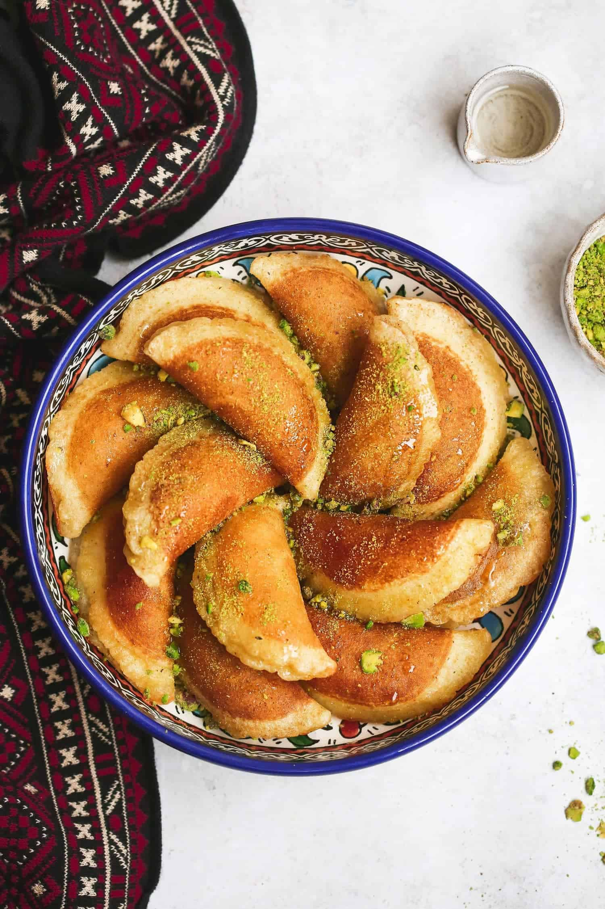

# Atayef

*Small folded pancakes of yeasted semolina batter, stuffed with sweetened cheese or chopped walnuts, fried golden, then drowned in cold rosewater syrup. Eaten across Ramadan in Jordan and the wider Levant; the contrast of the hot crisp pancake against the cool sweet syrup is what makes them.*

**Makes:** 16-18 atayef

**Prep Time:** 25 minutes (plus 1 hour resting batter)

**Cook Time:** 25 minutes

## Overview
A loose batter of fine semolina, plain flour, yeast, sugar and warm water rests until bubbly. Small disks pour onto a hot dry pan and cook one side only — bubbles rise and burst, the top setting porous and lacy. Each disk folds round a filling (sweetened cheese or spiced walnut), pinches into a half-moon, then fries in oil until deep golden. Cold sugar syrup pours over hot pancakes; serve immediately.

## Ingredients

### Batter
- 200 g fine semolina
- 100 g plain flour
- 1 teaspoon fast-action yeast
- 1 tablespoon caster sugar
- ½ teaspoon salt
- 600 ml warm water

### Walnut filling
- 200 g walnuts (chopped fine)
- 4 tablespoons caster sugar
- 1 teaspoon ground cinnamon
- ½ teaspoon ground cardamom
- 1 tablespoon rosewater

### Cheese filling (alternative)
- 250 g akkawi or low-salt halloumi (rinsed of salt; grated)
- 2 tablespoons caster sugar

### Syrup
- 250 g caster sugar
- 150 ml water
- 1 tablespoon lemon juice
- 1 teaspoon rosewater
- 1 teaspoon orange blossom water

### Frying
- Vegetable oil for deep-frying
- Crushed pistachios (to garnish)

## Method

### Stage 1 – Batter
1. Whisk the semolina, flour, yeast, sugar and salt; add the warm water; whisk smooth.
1. Cover and rest 1 hour at room temperature; bubbles will form on the surface.

### Stage 2 – Syrup
1. Combine the sugar, water and lemon juice in a small pan.
1. Simmer 10 minutes until slightly thickened.
1. Off the heat, stir in the rosewater and orange blossom water.
1. Cool fully — this is poured over the hot atayef, so it must be cold.

### Stage 3 – Pancakes (one side only)
1. Heat a non-stick frying pan over medium heat (no oil).
1. Pour 2 tablespoons of batter for each pancake; let spread to about 8 cm circles.
1. Cook 90 seconds without flipping — bubbles will rise and burst across the top, leaving a lattice of holes; the top should set with a matte finish.
1. Lift onto a clean tea towel; cover with another so they don't dry out.

### Stage 4 – Fillings
1. Walnut: mix the walnuts, sugar, cinnamon, cardamom and rosewater.
1. Cheese: mix the grated cheese and sugar.

### Stage 5 – Fold and seal
1. Place a teaspoon of filling on each pancake (cooked side up).
1. Fold in half to a half-moon; pinch the edges firmly to seal — they shouldn't open in the oil.

### Stage 6 – Fry
1. Heat 4 cm of oil in a wide pan to 180°C.
1. Fry 4-5 atayef at a time for 90 seconds, turning, until deep golden.
1. Lift onto kitchen paper to drain briefly.

### Stage 7 – Syrup and serve
1. Dip each hot atayef into the cold syrup for 5 seconds; lift onto a serving plate.
1. Top with crushed pistachios.
1. Eat hot.

## Notes
- **Cold syrup, hot pastry:** This is the rule for everything in this family of Levantine sweets — basbousa, baklava, atayef. The temperature contrast is what makes the syrup soak in without going greasy.
- **One side only:** Atayef are uncooked on top so the filling sticks to the still-doughy surface. Flipping breaks the fold.
- **Pinch firmly:** Filling escaping into hot oil burns and ruins the dish. Pinch the seam hard; double-pinch if dry.

## Storage
- Best eaten same day. The crisp goes within a couple of hours.
