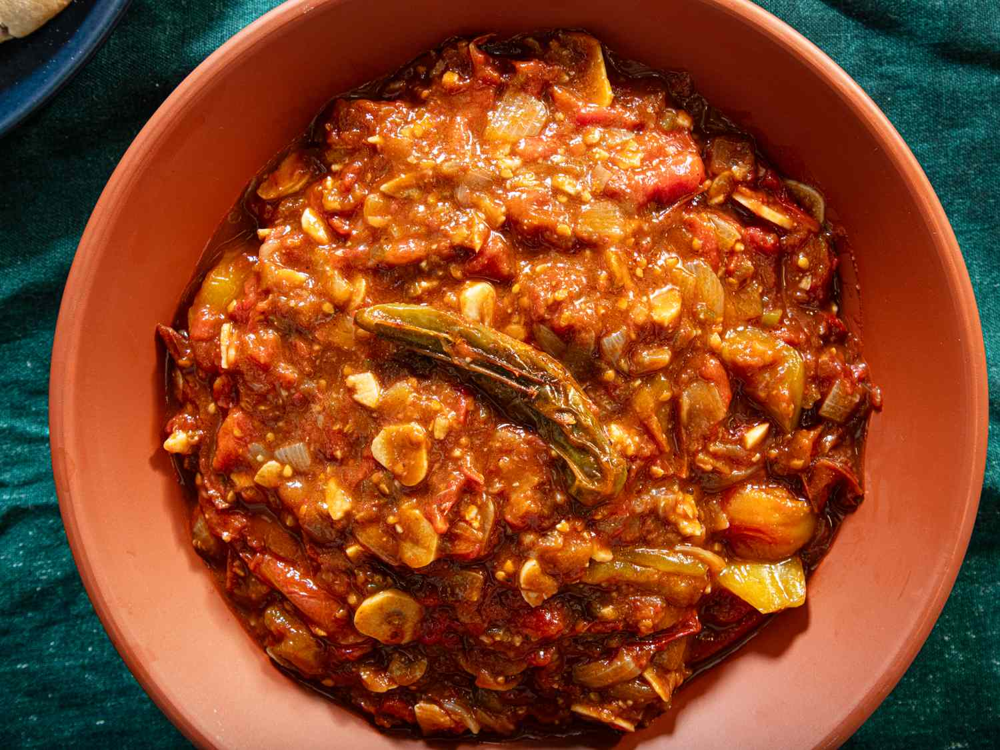

# Galayet Bandora

*Jordan's spiced tomato side: ripe tomatoes pan-fried with garlic, green chilli and olive oil into a rough, jammy stew, eaten with bread or as a side to grilled meats. Three ingredients plus a knife — but timing and good tomatoes are everything.*

**Serves:** 4

**Prep Time:** 10 minutes

**Cook Time:** 25 minutes

## Overview
Whole peeled garlic cloves and chillies fry in a generous pour of olive oil until aromatic. Roughly chopped ripe tomatoes go in; they collapse, release their water, then thicken into a rough stew. Salt at the end; sometimes a sprinkle of dried mint. Eaten warm with khubz (Arabic flatbread) for scooping.

## Ingredients

- 6 large ripe tomatoes (around 800 g)
- 8 garlic cloves (peeled, lightly smashed)
- 2 long green chillies (or 1 jalapeño; sliced)
- 60 ml olive oil
- 1 teaspoon salt (or to taste)
- ½ teaspoon black pepper
- 1 teaspoon dried mint (optional)
- A small handful flat-leaf parsley (chopped)

### To serve
- Warm flatbread (khubz)

## Method

### Stage 1 – Prep tomatoes
1. Score a small X on the bottom of each tomato; dip into boiling water 20 seconds; lift into cold water; peel.
1. Roughly chop into 2-3 cm chunks.

### Stage 2 – Aromatics
1. Heat the olive oil in a wide heavy pan over medium-high heat.
1. Add the garlic cloves and chillies; cook 2-3 minutes, stirring, until the garlic just starts to colour and the chillies blister.

### Stage 3 – Tomatoes
1. Add the tomatoes; reduce the heat to medium.
1. Cook 15-20 minutes, stirring occasionally, breaking the chunks up with a spoon. The tomatoes will release water, then reduce; the mixture will thicken into a rough stew.

### Stage 4 – Finish
1. Stir in the salt, black pepper and dried mint.
1. Off the heat, scatter the parsley.
1. Drizzle with extra olive oil before serving.

### Stage 5 – Serve
1. Pile into a wide bowl with warm flatbread to scoop. Eats well alongside grilled chicken or lamb, or simply with rice.

## Notes
- **Ripe tomatoes only:** Pale, watery tomatoes give a thin, sour result. Use the ripest you can find; a tin of San Marzanos is the best winter substitute.
- **Don't blend:** The dish is rough and chunky; whole garlic cloves and visible tomato pieces. A blender turns it into a sauce, which it isn't.
- **Generous oil:** The pool of oil is the dish's character; don't reduce it.

## Storage
- Keeps 3 days refrigerated; eats well at room temperature.
