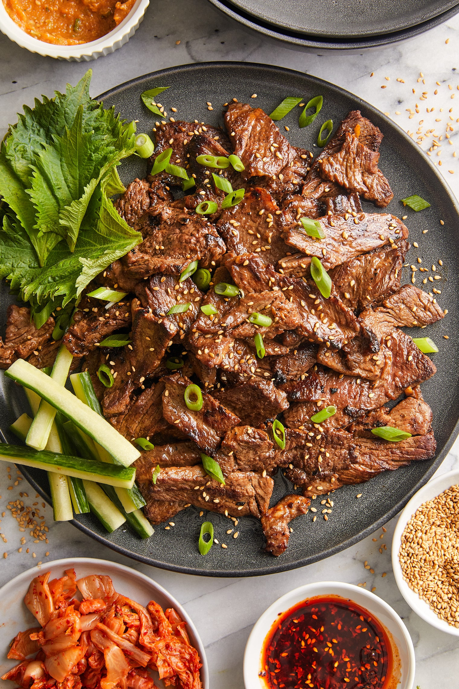

# Bulgogi

*Thinly sliced beef marinated in a sweet-savoury soy-pear-garlic mix, then grilled or stir-fried fast. The Korean barbecue staple; the pear (or apple) is structural, tenderising the meat with natural enzymes.*

**Serves:** 4

**Prep Time:** 20 minutes (plus 1 hour marinade)

**Cook Time:** 8 minutes

## Overview
Rib-eye or sirloin sliced paper-thin sits in a marinade of soy, brown sugar, sesame oil, garlic, ginger and grated Asian pear (or apple), then sears hard in a screaming-hot pan or on a BBQ. Served wrapped in lettuce leaves with rice and ssamjang.

## Ingredients

### Marinade
- 600 g rib-eye or sirloin (paper-thin, butcher-sliced or freezer-sliced)
- 1 ripe Asian pear (or 1 small apple), grated
- 4 tablespoons soy sauce
- 2 tablespoons brown sugar
- 2 tablespoons toasted sesame oil
- 4 garlic cloves (crushed)
- 1 tablespoon grated ginger
- 1 small onion (grated)
- 4 spring onions (chopped)
- 1 tablespoon toasted sesame seeds
- 1 tablespoon mirin or rice wine

### To serve
- Cooked short-grain rice
- 1 head butter lettuce or red-leaf lettuce (separated into whole leaves)
- 1 cucumber (sliced)
- Kimchi
- Ssamjang (Korean dipping sauce; shop-bought is fine)

## Method

### Stage 1 – Marinate
1. Combine all marinade ingredients in a bowl.
1. Toss the sliced beef through; cover and refrigerate at least 1 hour, ideally 4.

### Stage 2 – Cook
1. Heat a heavy frying pan or BBQ over very high heat.
1. Cook the beef in batches for 1-2 minutes a side; don't crowd the pan or you'll steam it.
1. Each batch caramelises quickly because of the sugar in the marinade.

### Stage 3 – Serve
1. Pile the cooked beef on a platter.
1. Set out lettuce leaves, rice, cucumber, kimchi and ssamjang.
1. Diners build their own: lettuce leaf, rice, beef, kimchi, ssamjang, fold and eat.

## Notes
- **Asian pear is the tenderiser:** The fruit's enzymes break down meat fibres; substitute with kiwi (less than half the amount; it works fast and can over-tenderise) or apple in a pinch.
- **Slice thin or freeze and slice:** Butcher-sliced ideal; if doing yourself, freeze the steak 30 minutes for clean cuts.
- **High heat:** Bulgogi is meant to char at the edges. Lukewarm pan = grey beef.

## Storage
- Cooked keeps 2 days refrigerated.
- Marinated raw beef keeps 1 day; freeze for longer.
