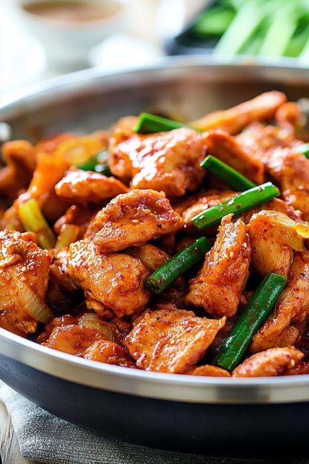

# Dak Galbi

*Korean spicy chicken stir-fry: chicken thighs marinated in gochujang sauce, cooked on a flat hot pan with cabbage, sweet potato and rice cakes. A communal dish in Korea, eaten straight from the central pan with rice and lettuce wraps.*

**Serves:** 4

**Prep Time:** 20 minutes (plus 1 hour marinade)

**Cook Time:** 20 minutes

## Overview
Boneless chicken thighs cube up and marinate in a gochujang-soy-garlic-ginger paste with mirin and sugar. They stir-fry hard with onion, sweet potato chunks, cabbage and Korean rice cakes (tteok). Often finished with cheese melted over for the modern variant; classic version skips it.

## Ingredients

### Marinade
- 800 g boneless chicken thighs (cut into 3 cm chunks)
- 4 tablespoons gochujang
- 2 tablespoons gochugaru
- 3 tablespoons soy sauce
- 2 tablespoons mirin
- 2 tablespoons brown sugar
- 4 garlic cloves (crushed)
- 1 tablespoon grated ginger
- 1 tablespoon toasted sesame oil

### Stir-fry
- 2 tablespoons vegetable oil
- 1 onion (sliced)
- 1 small sweet potato (peeled, cubed; about 200 g)
- ¼ small cabbage (chopped into 3 cm pieces)
- 200 g Korean rice cakes (tteokbokki / tteok), soaked in warm water for 10 minutes if using dried
- 4 spring onions (cut into 4 cm pieces)
- 1 tablespoon toasted sesame seeds
- 100 g mozzarella (optional, for the cheesy variant)

### To serve
- Cooked short-grain rice
- Lettuce leaves (for wraps)

## Method

### Stage 1 – Marinate
1. Combine all marinade ingredients in a bowl.
1. Toss the chicken through; refrigerate at least 1 hour, ideally 4.

### Stage 2 – Pre-cook the sweet potato
1. Boil the cubed sweet potato for 3-4 minutes until just tender. Drain.

### Stage 3 – Stir-fry
1. Heat the vegetable oil in a large heavy pan or wok over high heat.
1. Add the marinated chicken; stir-fry for 4-5 minutes until starting to caramelise.
1. Add the onion and sweet potato; cook another 3 minutes.
1. Add the cabbage and rice cakes; cook 4-5 minutes, tossing, until the cabbage is tender and the rice cakes are soft.
1. Add the spring onions and a splash of water if it looks dry.

### Stage 4 – Optional cheese
1. Push the stir-fry to one side of the pan.
1. Scatter mozzarella in the cleared space; cover briefly until melted.

### Stage 5 – Serve
1. Bring the pan straight to the table.
1. Set out lettuce leaves and rice; diners build wraps with chicken, cheesy melt and rice.
1. Scatter sesame seeds over.

## Notes
- **Hot pan, no overcrowding:** Dak galbi is a high-heat stir-fry. A crowded pan steams; the result is greasy and dull.
- **Rice cakes (tteok):** Cylindrical or sliced; both work. Find at any Korean shop; soak briefly if dried.
- **Cheese is divisive:** Classic Korean diners skip it; the modern Seoul version melts cheese over. Either way works.

## Storage
- Keeps 2 days refrigerated. Reheat in a pan with a splash of water.
