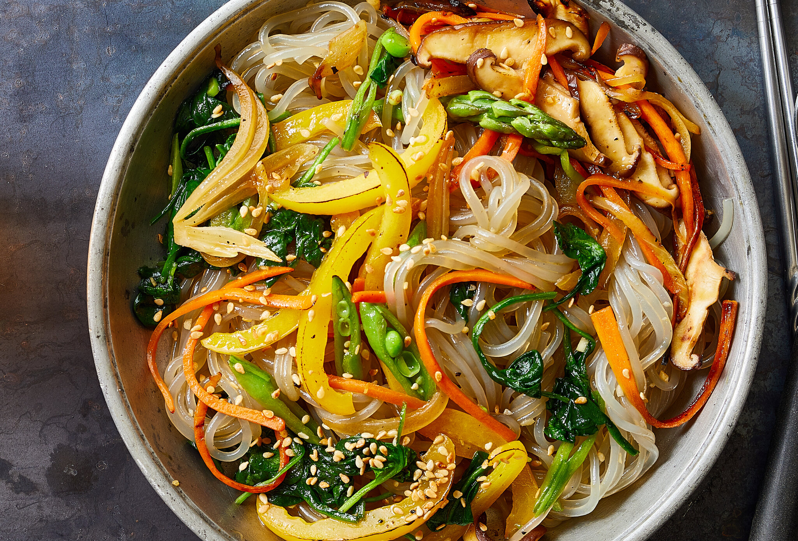

# Japchae

*Korean stir-fried glass noodles with vegetables and beef in a soy-sesame sauce. Sweet-savoury, glossy, served warm or at room temperature. Traditionally a celebration dish; modern households eat it any time.*

**Serves:** 4

**Prep Time:** 25 minutes

**Cook Time:** 15 minutes

## Overview
Sweet potato glass noodles (dangmyeon) boil and toss in a soy-sesame sauce. Vegetables (spinach, carrot, mushrooms, onion, peppers) sauté separately to keep their colour and texture, and beef stir-fries fast. Everything tosses together with the sauced noodles and a final sesame finish.

## Ingredients

### Noodles
- 200 g sweet potato glass noodles (dangmyeon)

### Sauce
- 5 tablespoons soy sauce
- 3 tablespoons brown sugar
- 3 tablespoons toasted sesame oil
- 2 garlic cloves (crushed)
- 1 tablespoon mirin or rice wine

### Stir-fry
- 200 g rib-eye or sirloin (thinly sliced)
- 1 onion (sliced)
- 1 carrot (julienned)
- 1 red pepper (julienned)
- 200 g spinach
- 200 g shiitake or chestnut mushrooms (sliced)
- 4 spring onions (sliced into 4 cm pieces)
- 2 tablespoons vegetable oil (split through cooking)
- Toasted sesame seeds, to finish

## Method

### Stage 1 – Sauce
1. Whisk all the sauce ingredients in a bowl.

### Stage 2 – Noodles
1. Cook the glass noodles in boiling water for 6-7 minutes until soft and translucent.
1. Drain and rinse briefly under cold water to stop them sticking.
1. Cut with kitchen scissors a few times to make them easier to eat.
1. Toss with 2 tablespoons of the sauce; set aside.

### Stage 3 – Vegetables and beef (each separate)
1. Blanch the spinach for 30 seconds; squeeze dry; toss with 1 teaspoon sesame oil and a pinch of salt.
1. Heat 1 teaspoon oil in a wok over high heat. Stir-fry the onion 2 minutes; remove. Repeat with carrot (2 minutes), pepper (1 minute), mushrooms (3 minutes), each going onto the same plate.
1. Add another teaspoon of oil; stir-fry the beef 1-2 minutes until just cooked.

### Stage 4 – Combine
1. Return all the vegetables to the wok; add the beef and noodles.
1. Pour over the remaining sauce; toss vigorously over medium heat for 1-2 minutes until everything is coated and warm.
1. Add the spring onions; toss once more.

### Stage 5 – Serve
1. Pile onto a platter.
1. Drizzle with a little extra sesame oil; scatter sesame seeds.
1. Eat warm or at room temperature.

## Notes
- **Sweet potato noodles, not rice:** Dangmyeon are translucent and chewy; rice vermicelli won't give the same texture.
- **Vegetables separate:** Stir-frying everything together turns soft and homogeneous. Working in batches keeps colour and bite.
- **Don't overcook the noodles:** They go gluey. Drain at the al dente edge.

## Storage
- Keeps 2 days refrigerated. Eat cold or reheat in a pan with a splash of water.
