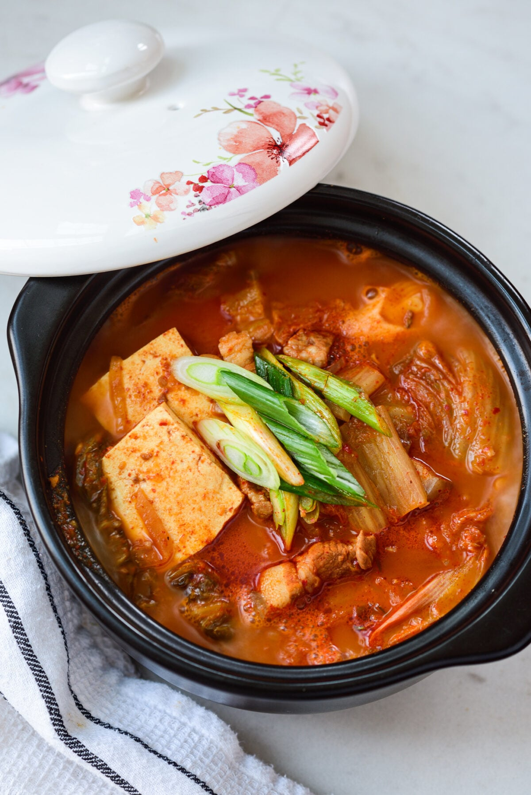

# Kimchi Jjigae

*Korean kimchi stew: aged sour kimchi simmered with pork belly, tofu, gochujang and a touch of doenjang into a fiery red broth. The hangover/comfort/cold-night staple. Better the older the kimchi.*

**Serves:** 4

**Prep Time:** 10 minutes

**Cook Time:** 35 minutes

## Overview
Pork belly slices brown in a heavy pot, joined by chopped sour kimchi (the older the better) and its juice. Stock and gochujang go in; the lot simmers until the pork is tender and the broth is dark and thick. Tofu cubes finish; spring onion scattered. Eaten with rice.

## Ingredients

- 300 g sour kimchi (well-fermented; chopped, juice reserved)
- 200 g pork belly (sliced 5 mm thick) or pork shoulder cubes
- 1 onion (sliced)
- 4 garlic cloves (crushed)
- 1 tablespoon gochujang (Korean fermented chilli paste)
- 1 tablespoon gochugaru (Korean chilli flakes)
- 1 teaspoon doenjang (Korean fermented soybean paste; or miso)
- 1 teaspoon sugar
- 700 ml water or stock (anchovy stock is traditional)
- 200 g firm tofu (cubed)
- 4 spring onions (sliced)
- 2 teaspoons toasted sesame oil
- Cooked short-grain rice, to serve

## Method

### Stage 1 – Brown the pork
1. Heat the sesame oil in a heavy pot over medium-high heat.
1. Cook the pork belly slices for 3-4 minutes until starting to crisp.

### Stage 2 – Build the broth
1. Add the onion and garlic; cook 3 minutes.
1. Add the chopped kimchi (with juice); fry for 5 minutes to deepen flavour.
1. Stir in the gochujang, gochugaru, doenjang and sugar.

### Stage 3 – Simmer
1. Pour in the water or stock.
1. Bring to a simmer; cover loosely and cook 20-25 minutes until the pork is tender and the broth is reduced and dark.

### Stage 4 – Tofu
1. Add the tofu cubes; simmer another 5 minutes (don't stir hard; tofu breaks).

### Stage 5 – Serve
1. Scatter the spring onions over.
1. Bring to the table in the cooking pot; ladle over bowls of rice.

## Notes
- **Old kimchi is the point:** Fresh kimchi gives a flat stew. Kimchi that's been in the fridge 2-3+ weeks is sour and complex; that's what makes the broth.
- **Pork belly fat seasons the broth:** Don't drain the fat after browning; it goes into the stew.
- **Doenjang adds savoury depth:** Korean fermented soybean paste; if you can't find it, substitute white miso 1:1.

## Storage
- Improves overnight. Keeps 4 days refrigerated.
- Freezes 2 months.
