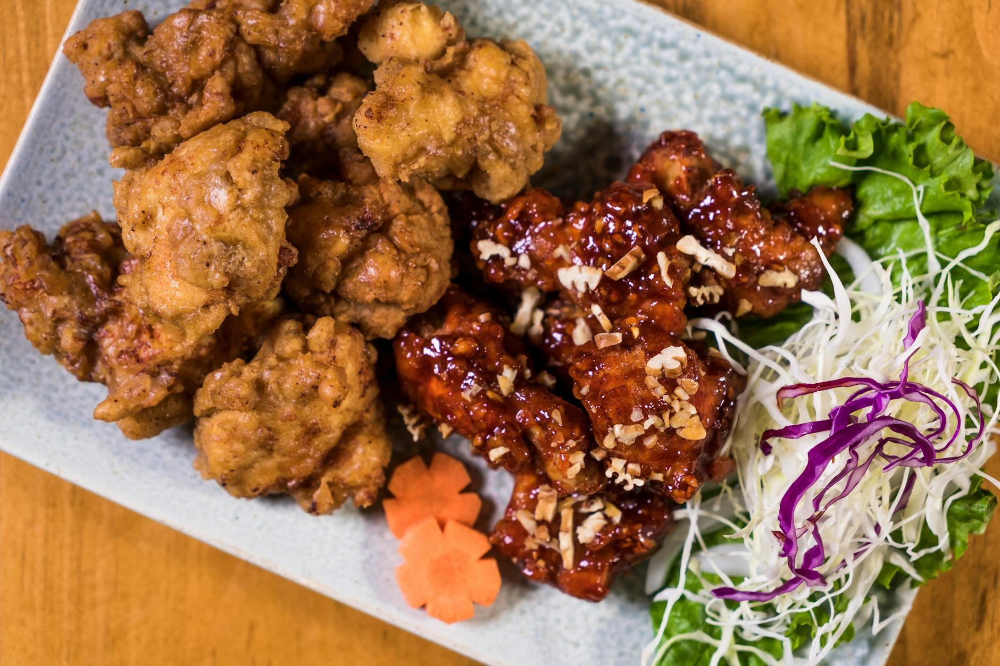

# Korean Fried Chicken

*Twice-fried chicken with a thin shatter-crisp coating and a sticky-spicy gochujang glaze. The Korean version is lighter and crisper than American fried chicken; the second fry is what does it. Sweet, garlicky, hot, addictive.*

**Serves:** 4

**Prep Time:** 20 minutes

**Cook Time:** 25 minutes

## Overview
Chicken wings (or boneless thighs) get a light cornflour-and-flour coating and fry low and slow first to cook through. They cool, then fry hot and fast for the crisp. The sauce is a quick reduction of gochujang, gochugaru, soy, garlic, ginger, honey and rice vinegar; the just-fried chicken tosses in the sauce and gets eaten immediately.

## Ingredients

### Chicken
- 1 kg chicken wings (separated into drumettes and flats) or boneless thighs (cut into chunks)
- 1 teaspoon salt
- 1 teaspoon ground white pepper
- 100 g cornflour
- 50 g plain flour
- Vegetable oil for deep-frying

### Sauce
- 3 tablespoons gochujang
- 1 tablespoon gochugaru (Korean chilli flakes)
- 3 tablespoons soy sauce
- 4 tablespoons honey
- 2 tablespoons rice vinegar
- 4 garlic cloves (crushed)
- 1 tablespoon grated ginger
- 1 tablespoon toasted sesame oil
- 2 tablespoons water

### Garnish
- 1 tablespoon toasted sesame seeds
- 2 spring onions (sliced)

## Method

### Stage 1 – Prep the chicken
1. Pat the wings very dry. Season with salt and white pepper.
1. Mix the cornflour and plain flour in a bowl.
1. Toss the wings in the flour; shake off excess. Let sit 10 minutes (the surface absorbs the flour).

### Stage 2 – First fry
1. Heat the oil to 160°C in a deep pan.
1. Fry the wings in batches for 8-10 minutes until cooked through but pale.
1. Drain on a wire rack; let rest at least 5 minutes.

### Stage 3 – Sauce
1. Combine all sauce ingredients in a small saucepan.
1. Bring to a simmer over medium heat; cook 2-3 minutes until glossy and slightly thickened. Set aside.

### Stage 4 – Second fry
1. Increase the oil to 180°C.
1. Fry the wings again in batches for 4-5 minutes until deep golden and shatteringly crisp.
1. Drain briefly.

### Stage 5 – Toss and serve
1. Place the hot wings in a large bowl; pour the sauce over.
1. Toss to coat completely.
1. Pile onto a plate; scatter sesame seeds and spring onions.
1. Eat immediately.

## Notes
- **Twice-fried, no shortcut:** Single-fry gives soggy or burnt. The first fry cooks through; the second crisps. The rest between fries lets steam escape.
- **Cornflour-heavy coating:** This is what gives the thin, shatter-crisp shell. Too much plain flour gives a heavier, breadier crust.
- **Sauce after the toss:** Coat just before serving; sauce on chicken sitting around goes soggy fast.

## Storage
- Eat immediately. Doesn't reheat well.
