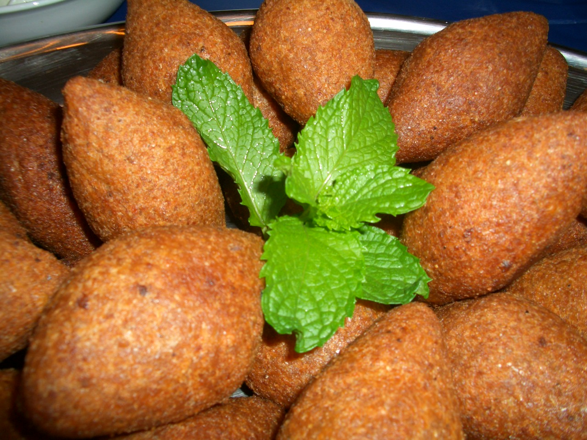

# Kibbeh

*Lebanese fried torpedoes: a shell of bulgur and minced lamb wrapped around a filling of more lamb, onion and toasted pine nuts. Each is hand-shaped to a pointed oval, then deep-fried until shatteringly crisp. The shell is the test — it should be thin enough to almost see the filling through. Eats with yogurt-mint dip and a salad.*

**Makes:** 16 kibbeh

**Prep Time:** 1 hour

**Cook Time:** 25 minutes

## Overview
Fine bulgur soaks until soft. The shell mixture combines bulgur, raw minced lamb, finely-grated onion, salt and spices, then blitzes (or pounds) into a dense, smooth, almost claylike paste. The filling is a separate cooked mince of lamb, onion, pine nuts, allspice and cinnamon. Each kibbeh shell is shaped over a finger; filling stuffs in; the lot pinches closed into a pointed oval. Deep-fries 5 minutes.

## Ingredients

### Shell
- 250 g fine bulgur
- 500 g lean minced lamb (or beef)
- 1 large onion (very finely grated)
- 1 teaspoon ground allspice
- 1 teaspoon ground cumin
- ½ teaspoon ground cinnamon
- ½ teaspoon black pepper
- 1½ teaspoons salt
- 100 ml ice water

### Filling
- 2 tablespoons olive oil
- 1 large onion (finely chopped)
- 300 g minced lamb (or beef)
- 50 g pine nuts
- 1 teaspoon ground allspice
- ½ teaspoon ground cinnamon
- ½ teaspoon black pepper
- 1 teaspoon salt
- A small handful of flat-leaf parsley (chopped)

### Frying
- Vegetable oil for deep-frying

### Yogurt-mint dip
- 300 g plain yogurt
- 2 garlic cloves (crushed)
- 2 tablespoons fresh mint (chopped)
- ½ teaspoon salt

## Method

### Stage 1 – Soak the bulgur
1. Cover the bulgur with cold water; soak 20 minutes; drain through a fine sieve, pressing hard to squeeze out excess water.

### Stage 2 – Filling
1. Heat the oil in a wide pan over medium heat.
1. Cook the onion 6 minutes until softened.
1. Add the pine nuts; cook 2 minutes until lightly golden.
1. Add the lamb; cook 5-6 minutes, breaking it up, until the meat is cooked and any liquid has evaporated.
1. Stir in the allspice, cinnamon, pepper, salt and parsley.
1. Cool fully.

### Stage 3 – Shell
1. Combine the bulgur, raw lamb, grated onion, allspice, cumin, cinnamon, pepper and salt.
1. Blitz in batches in a food processor with a tablespoon of ice water at a time until you have a smooth, dense, paste-like mixture (a pestle-pounded version is more authentic but slower).
1. The mixture should hold its shape and feel slightly tacky but not sticky.
1. Refrigerate 30 minutes (firms up; easier to shape).

### Stage 4 – Shape
1. Wet your hands with cold water.
1. Take a walnut-sized piece of shell mixture; roll into a smooth ball.
1. Press your finger into the centre to make a pocket; rotate to thin the wall, working out toward the rim.
1. The shell should be 5-6 mm thick at most.
1. Place a teaspoon of filling inside.
1. Pinch the opening closed; mould into a pointed oval (lemon shape) about 7 cm long.
1. Smooth any cracks with damp fingers.
1. Lay finished kibbeh on a tray; cover.

### Stage 5 – Yogurt dip
1. Whisk all the dip ingredients; rest 15 minutes.

### Stage 6 – Fry
1. Heat 6 cm of oil in a deep pan to 180°C.
1. Fry kibbeh in batches of 4-5 for 5-6 minutes, turning, until deep mahogany brown and crisp.
1. Drain on kitchen paper.

### Stage 7 – Serve
1. Pile onto a platter while hot.
1. Serve with the yogurt dip and a green salad.

## Notes
- **Cold mixture:** Working ice water into the shell mixture helps it stay cool and binds the bulgur to the meat. A warm mix splits in the fryer.
- **Thin walls:** The defining feature of good kibbeh is a thin, almost translucent shell. Thick-walled kibbeh feels heavy and stodgy.
- **Freeze ahead:** Shaped raw kibbeh freeze well — fry from frozen, adding 2 minutes.

## Storage
- Best eaten hot; re-crisp leftovers at 200°C for 5 minutes.
- Freeze raw shaped kibbeh 3 months.
