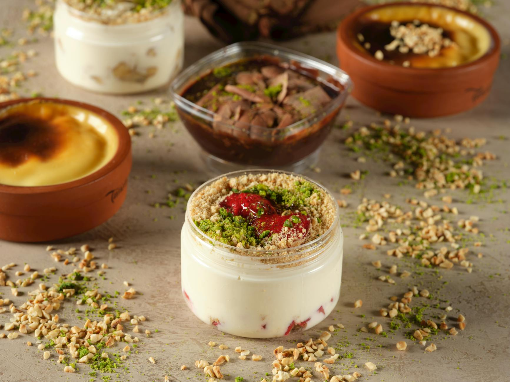

# Mahalabia

*Lebanese milk pudding set with cornflour, scented with rosewater and orange blossom, topped with crushed pistachios and a thin sugar syrup. Lighter than Egyptian malabi (which often gets a heavier pink syrup); silky, restrained, gently floral. Eaten cold from glasses or shallow bowls; an everyday Lebanese dessert.*

**Serves:** 6

**Prep Time:** 10 minutes

**Cook Time:** 12 minutes (plus 3 hours setting)

## Overview
Cornflour mixes with cold milk to a slurry; the rest of the milk warms with cream and sugar; the slurry pours in and the mixture thickens to a thin custard in 4-5 minutes. Off the heat, rosewater and orange blossom water perfume; the lot pours into glasses. Cold; topped at the table with sugar syrup and pistachios.

## Ingredients

### Pudding
- 1 litre whole milk
- 200 ml double cream
- 100 g caster sugar
- 70 g cornflour
- 1 tablespoon rosewater
- 1 tablespoon orange blossom water

### Syrup
- 80 g caster sugar
- 80 ml water
- 1 teaspoon rosewater

### Topping
- 50 g pistachios (chopped)
- A few rose petals (optional)

## Method

### Stage 1 – Slurry
1. Whisk the cornflour into 200 ml of the cold milk until completely smooth.

### Stage 2 – Heat
1. Combine the remaining 800 ml of milk, the cream and sugar in a heavy saucepan.
1. Heat over medium, stirring, until just simmering.

### Stage 3 – Thicken
1. Whisk in the cornflour slurry steadily.
1. Cook 4-5 minutes, whisking constantly, until thickened to a thin custard that coats the back of a spoon.

### Stage 4 – Flavour
1. Off the heat, stir in the rosewater and orange blossom water.

### Stage 5 – Set
1. Strain through a fine sieve into 6 glasses or shallow bowls.
1. Cool 30 minutes; refrigerate at least 3 hours.

### Stage 6 – Syrup
1. Combine the sugar and water in a small pan; simmer 5 minutes; off the heat, stir in the rosewater. Cool.

### Stage 7 – Serve
1. Spoon a thin layer of cool syrup over each pudding.
1. Top with chopped pistachios and rose petals.

## Notes
- **Strain after thickening:** Catches small lumps and gives a silky finish.
- **Don't over-flavour:** A teaspoon too much rosewater turns the pudding perfumey. Start with what's specified; taste before adding more.
- **Serve cold:** Mahalabia is meant to be cold from the fridge. Room temperature mutes the flavours.

## Storage
- Keeps 3 days refrigerated. Top with syrup and nuts only just before serving.
