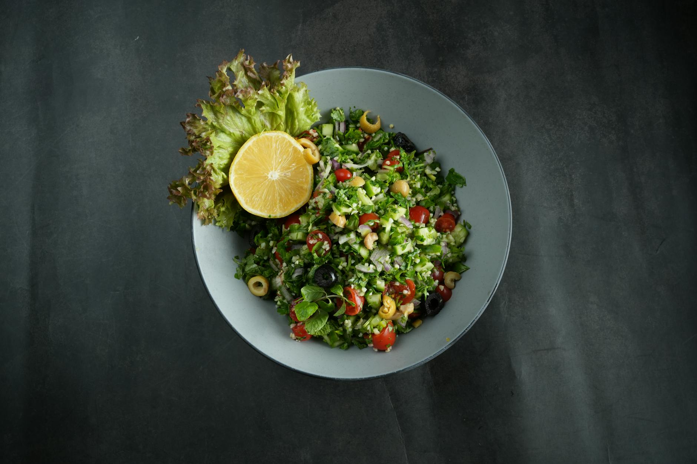

# Tabbouleh

*Lebanon's iconic salad: very finely chopped flat-leaf parsley with a small amount of bulgur, tomato, mint and spring onion, dressed with lemon and olive oil. Mostly herb, never grain-heavy. Bright, sharp, refreshing — a counterpoint to the rich meats it's served alongside. Knife work matters; a food processor wrecks it.*

**Serves:** 4

**Prep Time:** 30 minutes

**Cook Time:** 0 minutes

## Overview
Bulgur soaks briefly in lemon juice — not water — so it tenderises while taking on flavour. Parsley is washed, dried thoroughly, and chopped to fine green confetti. Tomato dices small and drains. Mint and spring onion go in fine. Everything tosses with olive oil, lemon, salt, pepper. No need to rest; eat right away.

## Ingredients

- 50 g fine bulgur
- Juice of 2 lemons (about 6 tablespoons)
- 4 large bunches flat-leaf parsley (around 250 g; leaves only)
- 1 small bunch mint (leaves only; around 30 g)
- 4 spring onions (white and green; finely sliced)
- 4 medium ripe tomatoes (deseeded; very finely diced)
- 6 tablespoons extra-virgin olive oil
- 1 teaspoon salt
- ½ teaspoon black pepper
- ¼ teaspoon ground allspice (optional)
- ¼ teaspoon ground cinnamon (optional)

## Method

### Stage 1 – Soak the bulgur
1. Place the bulgur in a small bowl; pour over half the lemon juice.
1. Rest 20 minutes — the bulgur will plump and soften.

### Stage 2 – Prepare the parsley
1. Pick the leaves from the stems (a tedious but essential step).
1. Wash thoroughly; dry very well in a salad spinner or between tea towels — wet parsley turns the salad mushy.
1. Pile on a board and chop very finely with a sharp knife. Don't blitz in a food processor — the texture matters.

### Stage 3 – Tomato
1. Cut the tomatoes in half; squeeze out the seeds and watery cores.
1. Dice the flesh into 5 mm cubes.

### Stage 4 – Combine
1. Tip the bulgur (with any unabsorbed lemon juice) into a wide bowl.
1. Add the parsley, chopped mint, spring onions and tomato.
1. Pour over the olive oil and the remaining lemon juice.
1. Add the salt, pepper and spices if using.
1. Toss gently with two forks (don't crush the parsley).

### Stage 5 – Serve
1. Taste; adjust lemon and salt. Should be sharp and herbal, with the bulgur in the background.
1. Serve at room temperature, traditionally piled into Romaine lettuce leaves to scoop.

## Notes
- **Mostly parsley, not bulgur:** Lebanese tabbouleh is a herb salad with grain. Many supermarket versions get this backward; the proper ratio is around 5:1 parsley to bulgur.
- **Chop, don't process:** A food processor turns parsley into wet pulp. Knife-chopping keeps the leaves discrete.
- **Dry the parsley well:** Wet parsley dilutes the dressing and the salad goes limp within an hour.

## Storage
- Best within 2 hours of mixing; the parsley wilts and the tomato weeps.
