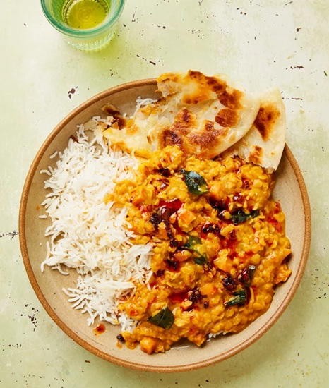

# Malaysian Dhal Curry

*Malaysia's mamak-style dhal: yellow split peas slow-cooked with curry leaves, mustard seeds, turmeric and a spluttering tarka of fried shallot, chilli and dried red chillies. Looser and more spice-fragrant than Indian dhal; eaten with roti canai for breakfast or rice for any meal.*

**Serves:** 4

**Prep Time:** 10 minutes

**Cook Time:** 50 minutes

## Overview
Yellow split peas (chana dal) simmer with onion, turmeric and tomato until very soft. The lentils break down into a thick soup. Right at the end, a tempering of mustard seeds, curry leaves, dried red chillies, garlic and shallots is poured sizzling-hot over the surface. The aromatic oil seeps through; the dish transforms.

## Ingredients

### Dhal
- 250 g chana dal (yellow split peas; rinsed and soaked 30 min)
- 1 large onion (chopped)
- 3 garlic cloves (crushed)
- 2 cm ginger (grated)
- 1 tomato (chopped)
- 1 teaspoon ground turmeric
- 1 teaspoon ground cumin
- 1 teaspoon ground coriander
- 1 long green chilli (sliced)
- 1.2 litres water
- 1½ teaspoons salt

### Tarka
- 4 tablespoons coconut oil or vegetable oil
- 1 teaspoon black mustard seeds
- 1 teaspoon cumin seeds
- 4 dried red chillies
- 15 fresh curry leaves
- 4 garlic cloves (sliced)
- 2 shallots (thinly sliced)
- 1 long red chilli (sliced)

### To finish
- Juice of half a lime
- Fresh coriander
- Hot rice or roti canai (to serve)

## Method

### Stage 1 – Cook the dhal
1. Drain the soaked chana dal.
1. Combine in a large pan with the onion, garlic, ginger, tomato, turmeric, cumin, coriander, green chilli, water and salt.
1. Bring to the boil; reduce to a steady simmer.
1. Cook 40-45 minutes, stirring occasionally, until the dhal is completely soft and broken down — almost a thick soup. Top up with water if it dries.

### Stage 2 – Mash gently
1. Use a wooden spoon or whisk to mash the dhal slightly — leave some texture.
1. Taste; adjust salt.

### Stage 3 – Tarka
1. Heat the oil in a small pan over medium-high heat.
1. Add the mustard seeds; when they pop, add the cumin seeds, dried chillies and curry leaves.
1. Cook 30 seconds; add the garlic, shallots and red chilli.
1. Cook 2-3 minutes until everything is golden and fragrant.

### Stage 4 – Combine
1. Pour the hot tarka — oil and all — directly over the dhal. Listen to it sizzle.
1. Stir once; squeeze in the lime juice.
1. Top with fresh coriander.

### Stage 5 – Serve
1. Eat with hot rice or torn roti canai for dipping.

## Notes
- **Curry leaves:** Fresh ones are non-negotiable for the proper smell; dried are pale imitations.
- **Dhal consistency:** Should be loose and saucy, not thick. If it tightens too much overnight, loosen with water on reheat.
- **Tarka at the end only:** The point is contrast — a hit of crackling, hot, oily aromatics over the soft, mellow dhal. Made earlier, it loses its punch.

## Storage
- Keeps 5 days refrigerated; flavour improves overnight.
- Freezes 3 months.
