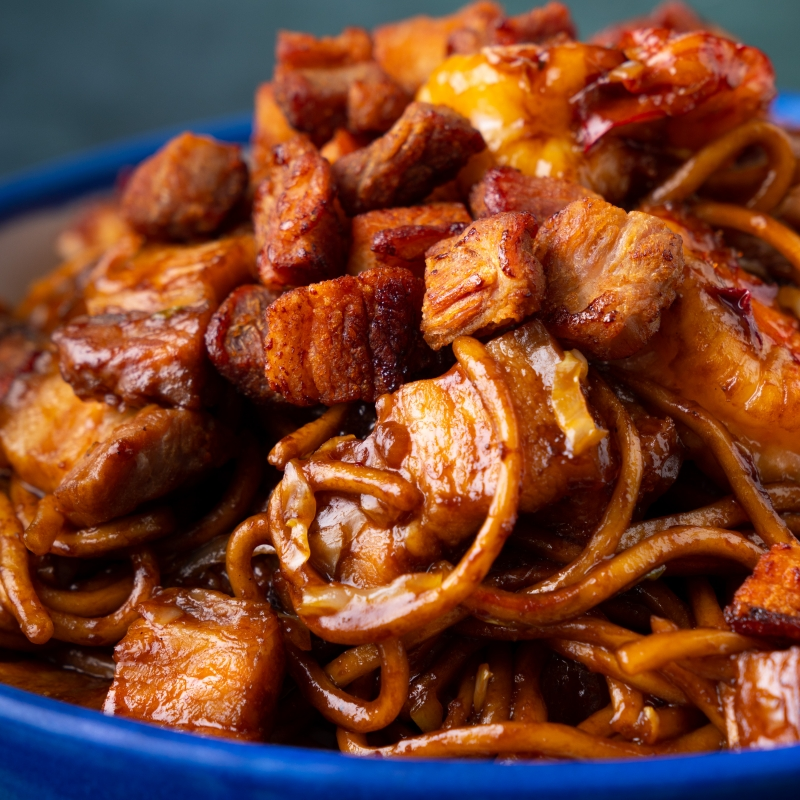

# Hokkien Mee

*KL-style Hokkien mee is a Kuala Lumpur hawker classic, defined by thick yellow noodles braised in a dark, smoky soy gravy and crowned with crisp pork lardons. The dish takes its name from the Hokkien Chinese community who brought wok cooking to the Malay peninsula.*

**Serves:** 4
**Prep Time:** 20 minutes
**Cook Time:** 25 minutes

## Overview
Thick fresh egg noodles are stir-fried hard in rendered pork fat, then braised in a glossy gravy of dark sweet soy, oyster sauce and a touch of sugar. Pork belly, prawns and cabbage round out the wok, with a final shower of crackling pork croutons providing the signature crunch. A fast, intensely flavoured dish that hinges on a hot wok and good kecap manis.

## Ingredients

### Crispy Pork Croutons
- 200 grams skinless pork belly (cut into small dice)

### Marinade
- 1 tablespoon soy sauce
- 1 teaspoon sesame oil
- ¼ teaspoon ground white pepper

### Stir-Fry Sauce
- 2 tablespoons oyster sauce
- 2/3 cup dark sweet soy sauce (e.g. kecap manis)
- 2 tablespoons soy sauce
- 1 teaspoon sugar

### Stir-Fry
- 4 garlic cloves (finely chopped)
- 200 grams pork belly (thinly sliced)
- 8 prawns (peeled and deveined)
- 2 cups sliced cabbage
- 400 grams cooked hokkien noodles
- 1 tablespoon cornflour mixed with 1 tablespoon water

## Method

### Stage 1 – Render the Pork Croutons
1. Place the diced pork belly in a cold frying pan and set over medium heat.
2. Cook for about 10 minutes, stirring occasionally, until the pork is crisp and the fat has rendered.
3. Drain the croutons on paper towel and reserve 1 tablespoon of the rendered pork fat for the wok.

### Stage 2 – Marinate the Pork
1. Combine the sliced pork belly with the soy sauce, sesame oil and white pepper.
2. Set aside while you prepare the rest of the components.

### Stage 3 – Mix the Stir-Fry Sauce
1. In a small bowl, stir together the oyster sauce, kecap manis, soy sauce and sugar until smooth.

### Stage 4 – Stir-Fry & Braise
1. Heat the reserved pork fat in a wok over high heat until shimmering.
2. Add the garlic and stir-fry for 30 seconds, until fragrant.
3. Add the marinated pork slices and stir-fry for 2 to 3 minutes, until the edges colour.
4. Add the prawns and stir-fry for another minute, until they curl and turn pink.
5. Toss in the cabbage and stir-fry briefly to wilt.
6. Add the noodles and pour over the stir-fry sauce. Toss vigorously until the noodles are evenly coated.
7. Stir in the cornflour slurry and continue tossing until the sauce thickens and turns glossy.

### Stage 5 – Serve
1. Divide the noodles between bowls.
2. Top each portion with a generous scattering of the crispy pork croutons.
3. Serve immediately, while the gravy is still glossy and the croutons are crisp.

## Notes
- **Wok hei:** A high heat is essential. The dish lives or dies by the smoky char picked up from a properly heated wok.
- **Kecap manis:** This dark Indonesian sweet soy sauce gives the gravy its near-black colour and treacly sweetness. There is no clean substitute, but a mixture of dark soy and a little brown sugar will do at a pinch.
- **Pork croutons:** Render the pork from a cold pan rather than a hot one, this draws out the fat slowly and gives crisper, less rubbery croutons.
- **Noodle choice:** Fresh thick yellow hokkien noodles are the right shape, holding the gravy in their grooves. Rinse off any oily coating before they hit the wok.

## Variations
**Seafood-only:** Replace the pork belly slices with squid rings or extra prawns; keep the crispy pork croutons or swap them for fried garlic.
**Vegetarian:** Drop the pork and prawns; use mushroom oyster sauce in place of regular oyster sauce, and finish with crispy fried shallots instead of pork croutons.

## Serving
Serve with: A side of pickled green chillies in soy sauce to cut the richness
Garnish with: Sliced spring onion and a wedge of lime

## Storage
- Best eaten straight from the wok, the gravy thickens and the noodles soften on standing
- Leftover crispy pork croutons keep 2 days in an airtight container at room temperature
- Stir-fry sauce keeps 1 week refrigerated in a sealed jar
