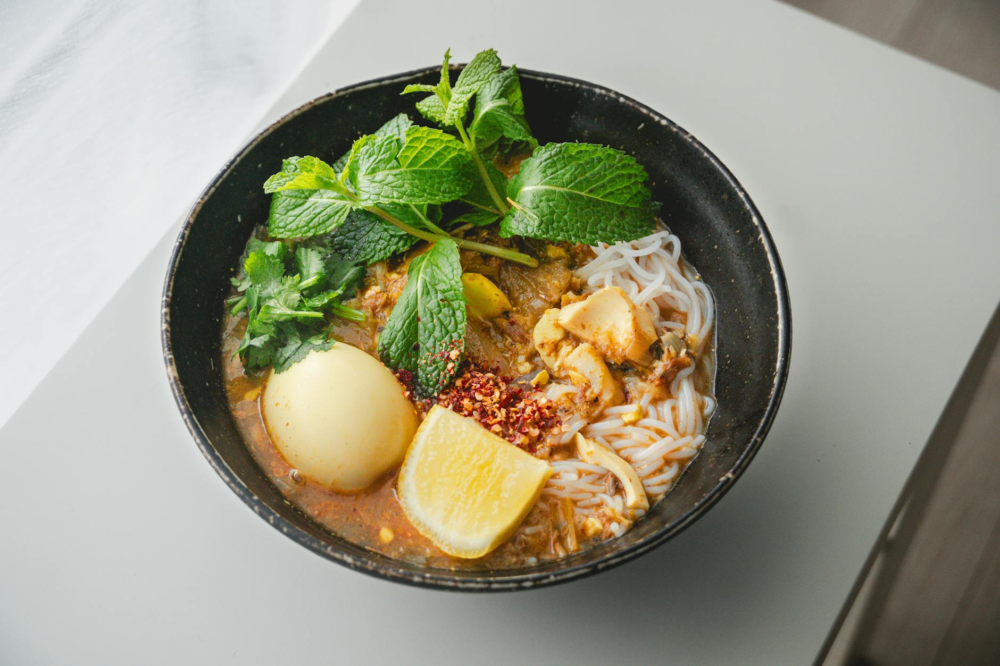

# Malaysian Curry Laksa (Laksa Lemak)

*A quintessential Peranakan (Nyonya) noodle soup, defined by its rich, spicy coconut and curry-paste broth. The "lemak" in laksa lemak refers to the creamy richness coconut milk lends the soup; the dish itself is a multicultural fixture across Malaysia and Singapore.*

**Serves:** 4
**Prep Time:** 15 minutes
**Cook Time:** 1 hour 20 minutes

## Overview
A two-part dish: a deeply concentrated prawn-and-chicken stock built from roasted prawn shells, layered with a freshly pounded laksa paste of dried chilli, galangal, lemongrass and candlenuts. The two are joined with coconut cream to create a glossy, fragrant broth that bathes rice vermicelli, tofu puffs and prawns. Finished at the table with sambal, lime, fresh coriander and bean sprouts.

## Ingredients

### Prawn Stock
- 600 grams whole raw prawns (unpeeled)
- 3 tablespoons vegetable oil
- 8 cups chicken stock
- 2 bone-in chicken thigh pieces

### Laksa Paste
- 8 large dried red chillies
- 1 tablespoon dried shrimp
- 1 tablespoon chopped fresh galangal
- 1 tablespoon chopped ginger
- 1 lemongrass stalk (pale part bruised, finely chopped)
- 4 Asian red shallots (roughly chopped)
- 5 garlic cloves (roughly chopped)
- 3 coriander (cilantro) roots (roughly chopped)
- 5 candlenuts or macadamia nuts
- 1 teaspoon coriander seeds
- ½ teaspoon turmeric
- 1½ teaspoons shrimp paste
- Sea salt

### Broth & Finish
- 2 tablespoons vegetable oil
- 400 ml can coconut cream
- 12 fried tofu puffs (halved)
- 4 tablespoons fish sauce (plus extra to taste)
- 1 teaspoon caster sugar

### To Serve
- 200 grams dried rice vermicelli noodles
- [Sambal oelek](../../base-ingredients/sambal/sambal-oelek.md)
- Lime wedges
- Finely chopped coriander (cilantro)
- Bean sprouts

## Method

### Stage 1 – Roast the Prawn Shells
1. Peel the prawns, reserving the heads and shells. Set the prawn meat aside in the fridge for later.
2. Heat the 3 tablespoons of vegetable oil in a large saucepan over high heat.
3. Add the prawn heads and shells and cook for 10 minutes, until the shells are deep red.
4. Squash the shells and heads with the back of a wooden spoon to release their flavour into the oil.

### Stage 2 – Build the Prawn Stock
1. Pour in the chicken stock and add the bone-in chicken thigh pieces.
2. Bring to a simmer, then reduce the heat to medium-low and cook for 30 minutes.
3. Skim the foam from the surface as it simmers, taking care to leave the red oil behind.
4. Strain the stock through a fine sieve and discard the solids.

### Stage 3 – Pound the Laksa Paste
1. Soak the dried chillies and dried shrimp in hot water for 10 to 15 minutes, until softened.
2. Lift the chillies and shrimp out of the water; reserve the soaking liquid.
3. Roughly chop the chillies and place them in a food processor with the soaked shrimp.
4. Add the galangal, ginger, lemongrass, shallots, garlic, coriander roots, candlenuts, coriander seeds, turmeric, shrimp paste and a generous pinch of salt.
5. Blend to a smooth paste, adding a tablespoon of the chilli soaking liquid at a time if needed to keep it moving.

### Stage 4 – Build the Broth
1. Heat the 2 tablespoons of vegetable oil in a saucepan over medium heat.
2. Add half the laksa paste and cook, stirring, for about 2 minutes until fragrant. Reserve the remaining paste for another batch.
3. Stir in the coconut cream and combine.
4. Pour in the prawn stock and add the fish sauce, sugar and a pinch of salt.
5. Reduce the heat to low and simmer gently for 15 minutes.
6. Stir in the tofu puffs and cook for 10 minutes.
7. Add the reserved prawns and simmer until just cooked through, about 2 minutes.
8. Taste and adjust with extra fish sauce.

### Stage 5 – Cook the Noodles
1. Bring a saucepan of water to the boil.
2. Cook the rice vermicelli until softened but still slightly firm in the centre.
3. Drain and divide between serving bowls.

### Stage 6 – Serve
1. Ladle the hot laksa over the noodles.
2. Top each bowl with a spoonful of sambal oelek, a wedge of lime, a scatter of coriander and a small handful of bean sprouts.

## Notes
- **Prawn shells:** The roasted shells are the soup's secret. Push them around firmly while they cook to bruise them and extract the most flavour.
- **Laksa paste:** This recipe makes more paste than you need. Freeze the unused half in a sealed container for up to 2 months and defrost overnight in the fridge before use.
- **Candlenuts:** Candlenuts thicken and enrich the paste. Macadamia nuts are the closest substitute; raw cashews also work.
- **Coconut cream vs milk:** Coconut cream gives the broth its glossy richness. Coconut milk works in a pinch but the broth will be thinner.

## Variations
**Mixed protein:** Add poached chicken (shredded from the stock thighs), cockles or fish balls alongside the prawns for a more traditional spread.
**Vegetarian:** Replace the prawn stock with a strong mushroom stock, swap the prawns and dried shrimp for extra tofu puffs and fried tempeh, and use light soy in place of fish sauce.

## Serving
Serve with: A bowl of fried shallots, sliced fresh chilli and a hard-boiled egg on the side
Garnish with: A tangle of bean sprouts and a generous wedge of lime

## Storage
- Broth keeps 3 days refrigerated; store noodles separately so they don't go soft
- Laksa paste freezes well up to 2 months
- Reheat gently to avoid splitting the coconut cream; do not boil hard
