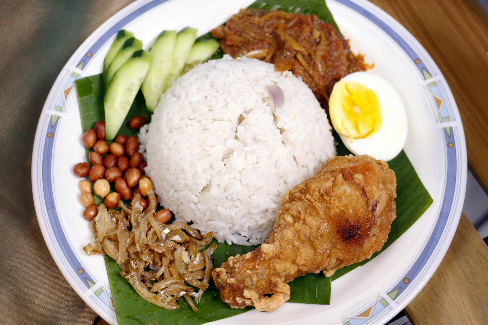

# Nasi Lemak

*Nasi lemak originated in Malay cuisine and is widely considered the national dish of Malaysia. The name translates as "rich rice", a reference to the coconut milk it is cooked in. It is eaten at all hours, from breakfast wrapped in banana leaf to a sit-down dinner.*

**Serves:** 4
**Prep Time:** 20 minutes
**Cook Time:** 50 minutes

## Overview
A platter built around fragrant coconut and lemongrass rice, served with a fiery sambal of dried anchovies and rehydrated chillies, then ringed with hard-boiled egg, sliced cucumber and fried peanuts. The sambal does most of the heavy lifting, sweet, sour, smoky and hot. The rice itself is gentle, designed to be a calming counterpoint to everything else on the plate.

## Ingredients

### Coconut Rice
- 2 cups jasmine rice
- 400 ml can coconut milk
- 1 lemongrass stalk (bruised)
- Water (to top up, see method)

### Spicy Ikan Bilis Sambal
- 10 dried long red chillies
- 2 fresh long red chillies
- 2 red shallots (roughly chopped)
- 1 garlic clove (chopped)
- 1 teaspoon shrimp paste
- ¼ cup peanut oil
- 1 cup dried anchovies (ikan bilis)
- 1 small red onion (sliced into rings)
- 1 tablespoon brown sugar
- 1 tablespoon tamarind puree

### To Serve
- Fried peanuts
- 2 hard-boiled eggs (halved)
- Sliced cucumber
- [Ayam goreng (Malaysian fried chicken)](malaysian-fried-chicken.md), optional

## Method

### Stage 1 – Cook the Coconut Rice
1. Place the rice, coconut milk and lemongrass in a saucepan and settle the rice evenly across the base.
2. Rest a finger on top of the rice and top up with water until the liquid reaches the first knuckle.
3. Set over medium-high heat and simmer for 10 minutes, or until most of the liquid has evaporated.
4. Cover with a lid, reduce the heat to low, and cook for a further 2 minutes.
5. Turn off the heat and leave the rice to sit, covered, for 10 minutes.

### Stage 2 – Soak the Dried Chillies
1. Soak the dried chillies in hot water for 15 minutes to soften.
2. Drain, squeezing out the excess liquid.
3. Reserve the soaking liquid for later in the sambal.

### Stage 3 – Pound the Sambal Paste
1. Place the soaked chillies in a small food processor with the fresh chillies, shallots, garlic and shrimp paste.
2. Process to a coarse paste.

### Stage 4 – Build the Sambal
1. Heat the peanut oil in a wok over high heat.
2. Add the dried anchovies and stir-fry for about 5 minutes, until crisp.
3. Lift out with a slotted spoon and drain on paper towel.
4. Add the sliced onion to the same wok and cook, stirring occasionally, for 5 minutes.
5. Transfer the onion to the plate with the anchovies.
6. Add the chilli paste to the wok and reduce the heat to low.
7. Cook, stirring often, for 5 minutes, until red oil rises to the surface.
8. Stir in the brown sugar, tamarind puree and 2 tablespoons of the reserved chilli soaking liquid.
9. Simmer for 5 minutes, until reduced.
10. Fold the crispy anchovies and onion back into the sambal and tip into a serving bowl.

### Stage 5 – Plate Up
1. Use a fork to fluff up the coconut rice and lift out the lemongrass stalk.
2. Spoon the rice onto plates and arrange the sambal alongside.
3. Add the peanuts, halved eggs, cucumber and ayam goreng (if using) around the rice.

## Notes
- **Pandan vs lemongrass:** Traditional nasi lemak uses pandan leaves to perfume the rice. If you can't find pandan, lemongrass or a few slices of ginger work well. Plain coconut milk is acceptable too.
- **Ikan bilis:** Dried anchovies are sold at Asian grocers, either frozen and raw (cook as in Stage 4) or shelf-stable and pre-fried (skip the frying and stir straight into the sambal).
- **Sambal heat:** Adjust by increasing or reducing the dried chillies. The fresh chillies add aromatic heat; the dried ones build the smoky base.
- **Knuckle method:** The first-knuckle water level is a long-standing rice-cook's trick. It only works if the rice sits in an even layer first.

## Variations
**Banana-leaf wrap:** Wrap individual portions of rice, sambal, peanuts, egg and cucumber in banana leaves before serving for a traditional handheld presentation.
**Vegetarian:** Replace the ikan bilis with crisp-fried tofu or roasted cashews and use a teaspoon of light soy sauce in place of shrimp paste.

## Serving
Serve with: [Ayam goreng](malaysian-fried-chicken.md), beef rendang, or a piece of grilled fish to make it a full meal
Garnish with: A wedge of lime and extra crispy ikan bilis on top of the sambal

## Storage
- Coconut rice keeps 2 days refrigerated; revive in the microwave with a splash of water to loosen
- Sambal keeps 1 week refrigerated in a sealed jar and improves after a day
- Best assembled fresh on the plate; do not pre-mix the components
