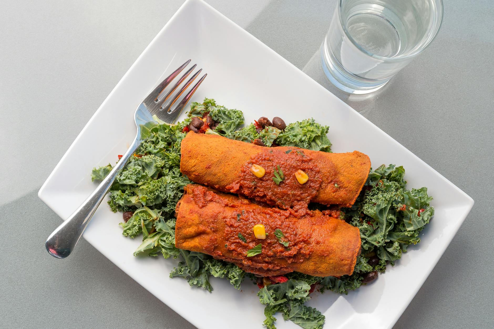

# Beef Enchiladas

## Overview
This Tex-Mex-inspired beef enchilada recipe is richly seasoned, easy to make, and always such a crowd favourite. Tender flour tortillas are filled with seasoned ground beef and black beans, rolled, and smothered in homemade red enchilada sauce, then topped with melted cheese and fresh coriander for a comforting, flavourful dish.

**Serves:** 8
**Prep Time:** 15 minutes
**Cook Time:** 25 minutes

## Ingredients

### Beef Filling
- 680g lean ground beef
- 1 white onion (small, peeled and diced)
- 4 garlic cloves (minced)
- 1 teaspoon ground cumin
- 4 green chillies (deseeded and diced)
- 439g black beans (rinsed and drained)
- Salt and pepper to taste
- 1 tablespoon oil

### Tortillas & Cheese
- 8 large flour tortillas
- 339g shredded cheese (Mexican-blend)

### Sauce & Garnish
- 350ml red enchilada sauce (homemade or store-bought)
- 4g fresh coriander (chopped)
- Sour cream (optional, for serving)

## Method

### Stage 1 – Prepare the Beef Filling
1. Heat 1 tablespoon oil in a large sauté pan over medium-high heat.
2. Add the diced onion and minced garlic, and sauté for 3 minutes, stirring occasionally.
3. Add the ground beef and ground cumin, and sauté for 5 minutes until completely browned, crumbling the beef with a wooden spoon as it cooks.
4. Stir in the diced green chillies and black beans until combined.
5. Season with salt and pepper to taste.
6. Remove from heat and let cool slightly.

### Stage 2 – Assemble the Enchiladas
1. Preheat the oven to 180°C.
2. Spread a thin layer of red enchilada sauce (approximately 60ml) on the bottom of a large baking dish.
3. Warm the flour tortillas slightly (in the oven or microwave) to make them pliable.
4. Place each tortilla flat and add a heaping spoonful of the beef filling to the centre.
5. Sprinkle approximately 1 tablespoon of shredded cheese over the filling.
6. Roll the tortilla tightly around the filling and place seam-side down in the prepared baking dish.
7. Repeat until all 8 tortillas are filled and arranged in the baking dish.

### Stage 3 – Cover & Bake
1. Pour the remaining red enchilada sauce evenly over the rolled enchiladas.
2. Sprinkle the remaining shredded cheese over the top.
3. Bake uncovered for 20–25 minutes until the cheese is melted and bubbly, and the sauce is heating through.
4. Remove from the oven and garnish with fresh coriander.
5. Serve immediately while hot.

## Notes
- **Enchilada sauce:** Use the Authentic Enchilada Sauce recipe for best results; homemade is far superior to store-bought.
- **Tortilla warmth:** Warm tortillas before rolling to prevent cracking and make them more pliable.
- **Make-ahead:** Assemble enchiladas up to 24 hours ahead; cover and refrigerate, then bake as directed (may need an extra 5 minutes baking time if cold).
- **Tex-Mex vs. authentic:** This version is Tex-Mex style (with flour tortillas and cheese). Traditional Mexican enchiladas use corn tortillas and are often saucier.

## Variations
**Chicken enchiladas:** Replace ground beef with shredded cooked chicken (approximately 680g)
**Cheese & vegetable:** Omit meat and replace with sautéed peppers, mushrooms, and extra cheese
**Spicier version:** Add diced jalapeños to the filling or use a spicier enchilada sauce
**Black bean only:** Replace ground beef with an additional 439g black beans for a vegetarian version

## Serving
Serve with: Mexican rice, refried beans, guacamole, and sour cream on the side. Lime wedges add freshness.

## Storage
- Keeps 3 days refrigerated
- Freezes well up to 3 months (assemble before freezing, thaw before baking)
- Reheats well in a 160°C oven, covered, for 15–20 minutes