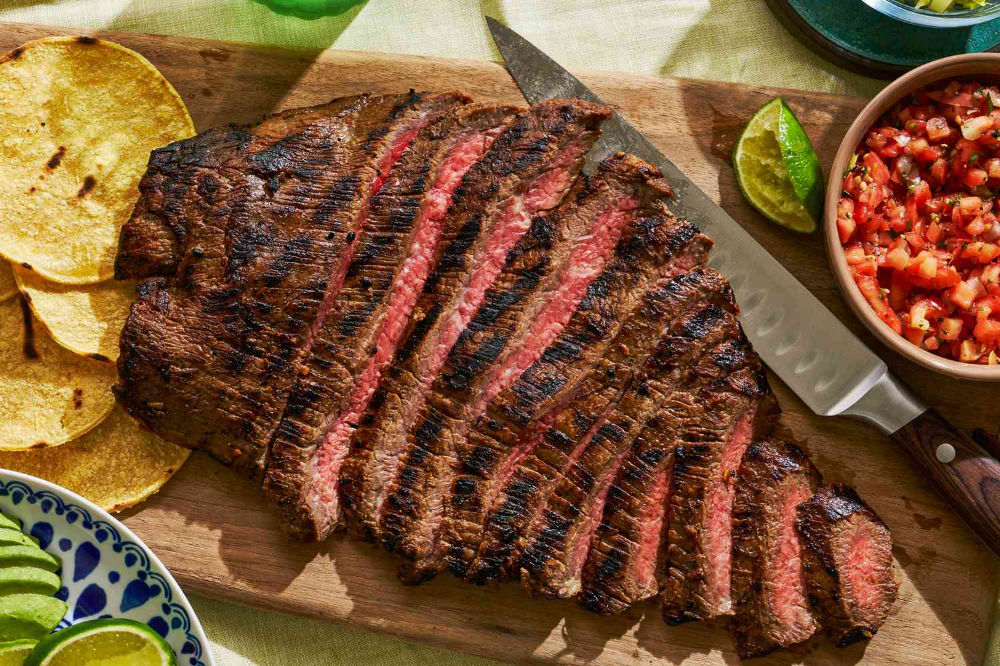

# Carne Asada

*Mexican grilled steak: skirt or flank marinated in lime, citrus juices, garlic, chilli and coriander, then grilled hot over high heat and sliced against the grain. The classic taqueria filling; equally good as a steak with rice, beans and tortillas.*

**Serves:** 4-6

**Prep Time:** 15 minutes (plus 2 hours marinade)

**Cook Time:** 8 minutes

## Overview
Skirt or flank steak (cuts that take a marinade well and grill fast) sit in a punchy marinade of lime, orange, garlic, jalapeño, cumin, oregano and coriander for 2-4 hours, then grill quick over high heat. Sliced thin against the grain so the long fibres become tender bites.

## Ingredients

### Marinade
- 1 kg skirt steak (or flank)
- Juice of 4 limes
- Juice of 1 large orange
- 4 garlic cloves (crushed)
- 1 jalapeño (seeded, finely chopped)
- A handful of fresh coriander (chopped, stems included)
- 2 tablespoons soy sauce
- 1 teaspoon ground cumin
- 1 teaspoon dried oregano
- 4 tablespoons olive oil
- 1 teaspoon salt
- ½ teaspoon black pepper

### To serve
- Warm corn or flour tortillas
- Charred salsa (or pico de gallo)
- Lime wedges
- Sliced avocado
- Chopped coriander

## Method

### Stage 1 – Marinate
1. Whisk all the marinade ingredients in a bowl.
1. Place the steak in a dish or zip-lock bag; pour the marinade over.
1. Refrigerate 2-4 hours (don't go beyond 6; lime juice "cooks" the surface).

### Stage 2 – Bring to room temperature
1. Take the steak out 20 minutes before cooking; pat dry (a wet steak doesn't sear).

### Stage 3 – Grill
1. Heat a griddle pan or BBQ over very high heat until smoking.
1. Cook the steak for 3-4 minutes a side for medium-rare (skirt and flank are best at medium-rare; well-done turns them rubbery).
1. Lift onto a board; rest 5-8 minutes (essential).

### Stage 4 – Slice and serve
1. Identify the grain (the direction the muscle fibres run).
1. Slice the steak against the grain into 5 mm strips. This is non-negotiable for tenderness.
1. Pile onto a board with warm tortillas, salsa, lime wedges, avocado and coriander; serve family-style.

## Notes
- **Against the grain or it's chewy:** Skirt and flank have long fibres. Slicing with the grain leaves them long and tough; against the grain shortens them into bite-sized pieces.
- **Don't over-marinate:** Citrus acids start to cure the meat past 6 hours; the surface goes mushy.
- **Smoking-hot pan:** These cuts want a hard sear. Mid-temperature grilling gives grey meat with no crust.

## Storage
- Best fresh from the rest. Sliced leftovers keep 2 days; eat cold in salads or quesadillas.
