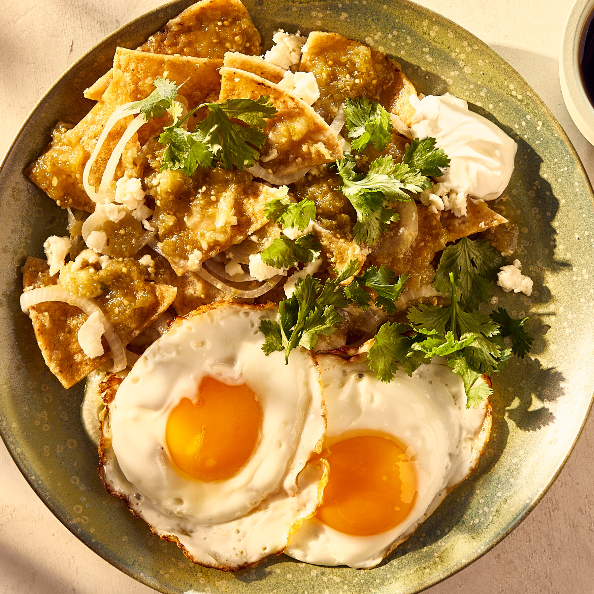

# Chilaquiles Verdes

*Mexican breakfast: leftover tortilla chips simmered in green salsa until just softened but not soggy, topped with a fried egg, crumbled queso fresco, sour cream and onion. The hangover food of central Mexico; the leftover-tortilla redemption arc.*

**Serves:** 4

**Prep Time:** 15 minutes

**Cook Time:** 15 minutes

## Overview
Tomatillos, jalapeño, onion and garlic blitz into a green salsa, briefly cooked. Crisp tortilla chips toss into the simmering salsa for 2 minutes — long enough to coat, short enough that they keep some crunch. Topped with eggs and the standard creamy garnishes.

## Ingredients

### Salsa verde
- 500 g tomatillos (papery husks removed, rinsed)
- 1 jalapeño (seeded for milder heat)
- 1 small onion (halved)
- 3 garlic cloves
- 1 tablespoon olive oil
- A handful of fresh coriander
- ½ teaspoon salt
- 200 ml chicken or vegetable stock

### To assemble
- 4 cups tortilla chips (about 200 g, ideally lightly stale)
- 4 eggs
- 1 tablespoon vegetable oil
- 100 g queso fresco (or feta), crumbled
- 4 tablespoons crema or sour cream
- ½ red onion (very finely sliced)
- 2 tablespoons chopped coriander

## Method

### Stage 1 – Salsa verde
1. Heat the oil in a wide pan over medium heat.
1. Add the tomatillos, jalapeño, onion and garlic. Cook for 8 minutes, turning, until charred in spots and softened.
1. Tip into a blender with the coriander, salt and stock; blitz to a smooth sauce.
1. Pour back into the pan; bring to a gentle simmer.

### Stage 2 – Fry the eggs
1. Heat the oil in a non-stick pan; fry the eggs sunny-side up (or to your preference). Set aside.

### Stage 3 – Combine
1. Add the tortilla chips to the simmering salsa.
1. Toss for 1-2 minutes; the chips should soften slightly but still have texture in the centre.
1. Don't simmer longer; they go to mush.

### Stage 4 – Plate
1. Pile the chips with salsa onto warm plates.
1. Top each with a fried egg.
1. Scatter with queso fresco, drizzle with crema, scatter red onion and coriander.

## Notes
- **Tomatillos, not green tomatoes:** They look similar but tomatillos have a bright tartness that defines the salsa. Find them in Latin grocers or larger supermarkets.
- **Slightly stale tortilla chips:** Fresh ones go soggy too fast. A day-old bag is ideal.
- **Don't oversaturate:** The chip should be coated, not soaked. Toss for 2 minutes max, then plate.

## Storage
- Eat immediately; chilaquiles loathe sitting around.
- Salsa verde keeps 3 days refrigerated, freezes 2 months.
