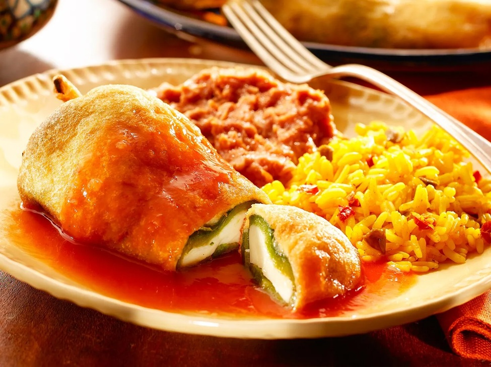

# Chiles Rellenos

*Poblano peppers stuffed with cheese, dipped in egg-white batter and fried until golden, served in a tomato-onion broth. The puffy, soft, smoky-sweet pepper holds the molten cheese; the broth ties everything together. Worth the production.*

**Serves:** 4

**Prep Time:** 40 minutes

**Cook Time:** 25 minutes

## Overview
Poblanos are charred and skinned, slit and stuffed with melting cheese. They get a coating of egg-white batter (whites whipped to stiff peaks, yolks folded in), fry in shallow oil until puffy and golden. Served in a simple roasted-tomato salsa.

## Ingredients

### Peppers
- 8 poblano peppers
- 400 g Oaxaca cheese, queso fresco, or mozzarella (grated or sliced)

### Tomato sauce
- 6 ripe tomatoes (cored)
- 1 onion (halved)
- 2 garlic cloves
- 1 tablespoon olive oil
- 1 teaspoon dried oregano
- 1 teaspoon salt
- 200 ml chicken stock

### Batter and frying
- 4 large eggs (separated)
- 4 tablespoons plain flour (for dusting peppers)
- A pinch of salt
- Vegetable oil for shallow-frying (about 200 ml)

## Method

### Stage 1 – Char and peel the poblanos
1. Char the peppers directly over a gas flame, under a hot grill, or on a griddle pan, turning, until the skin is blackened all over (5-8 minutes).
1. Place in a plastic bag or covered bowl for 10 minutes to steam (loosens the skin).
1. Peel off the blackened skin with your fingers (don't rinse; you'll wash off the flavour).
1. Make a slit lengthwise; carefully scoop out seeds and core, keeping the pepper intact.

### Stage 2 – Stuff
1. Stuff each pepper with cheese (about 50 g per pepper).
1. Press the slit closed; if it won't hold, secure with a toothpick.

### Stage 3 – Tomato sauce
1. Char the tomatoes, onion and garlic on a hot griddle until blackened in spots and softened.
1. Blend with the oil, oregano, salt and stock to a smooth sauce.
1. Strain into a saucepan; simmer 10 minutes to thicken slightly.

### Stage 4 – Batter
1. Whip the egg whites with a pinch of salt to stiff peaks.
1. Whisk the yolks lightly; fold into the whites gently (don't deflate).

### Stage 5 – Fry
1. Heat 1 cm of oil in a wide frying pan to 180°C.
1. Roll each stuffed pepper in flour (shake off excess), dip into the batter to coat completely, and lower carefully into the oil.
1. Fry 2-3 minutes a side until deep golden and puffy.
1. Drain on a wire rack.

### Stage 6 – Serve
1. Ladle the tomato sauce into shallow bowls.
1. Place a chile relleno on top; spoon a little extra sauce over.
1. Eat immediately; the batter softens fast.

## Notes
- **Char the poblanos hard:** A pale char gives raw, bitter flavour. Black blistered skin all over.
- **Folded egg batter:** This isn't a standard batter; whipping the whites and folding in yolks gives the puffy crust.
- **Peppers must be dry inside:** Wet from skinning gives a flabby coating. Pat the inside before stuffing.

## Storage
- Best eaten fresh; the batter softens within 30 minutes.
- Sauce keeps 3 days refrigerated.
