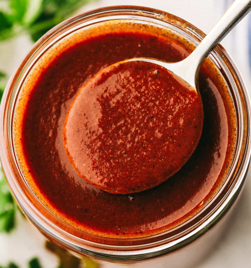

# Authentic Enchilada Sauce

## Overview
Rich, robust, and a thousand times better than store-bought, this authentic enchilada sauce packs serious flavour. Made from dried Mexican chillies, roasted aromatics, and traditional spices, this sauce is the foundation of great enchiladas and tacos. The balance of heat, depth, and subtle sweetness creates a versatile sauce that elevates any Mexican dish.

**Makes:** Approximately 600ml (enough for 8 enchiladas)
**Prep Time:** 10 minutes
**Soaking time:** 20–30 minutes
**Cook Time:** 35 minutes

## Ingredients

### Dried Chillies & Aromatics
- 85g dried ancho peppers
- 85g dried guajillo peppers
- 2–3 dried arbol peppers (optional, for extra heat)
- 1 medium white onion (peeled and halved)
- 2 ripe tomatoes (halved)
- 4 garlic cloves (peeled)

### Broth & Seasonings
- 1 litre boiling water or chicken broth (for deeper flavour)
- 1 teaspoon sea salt
- 1 teaspoon dried Mexican oregano
- 1 teaspoon ground cumin
- Small piece of semi-sweet chocolate (optional)
- Pinch of brown sugar (if needed)

### Cooking
- 1 tablespoon oil (for simmering)

## Method

### Stage 1 – Toast the Peppers & Aromatics
1. Heat a heavy non-stick skillet (cast iron is ideal) over medium-high heat. Do not add any oil.
2. Lay the dried ancho and guajillo peppers on the skillet and toast for 1–2 minutes on each side, just until they become very fragrant.
3. Be careful not to scorch them or they will become bitter. It's better to under-toast than over-toast.
4. Remove the peppers to a bowl and set aside.
5. Place the onion halves, tomato halves, and peeled garlic cloves on the hot skillet.
6. Toast until lightly browned on the surfaces (about 3–5 minutes total, turning occasionally).
7. Remove and set aside.

### Stage 2 – Prepare the Peppers for Soaking
1. Using gloves (especially if using hot arbol peppers), remove the stems from all the toasted peppers.
2. Slice each pepper open lengthways.
3. Remove and discard all seeds and membranes (note: the membranes, not the seeds, contain the heat; seeds are bitter).
4. Place the prepared peppers in a medium bowl.

### Stage 3 – Soak the Peppers
1. Pour the boiling water or broth over the peppers.
2. Cover the bowl with plastic wrap or a plate.
3. Let sit for 20–30 minutes until the peppers are completely soft and pliable.

### Stage 4 – Blend into Sauce
1. Pour the peppers and their soaking liquid into a blender.
2. Add the roasted onion, tomatoes, garlic, and all remaining seasonings (oregano, cumin, salt) except the chocolate and sugar.
3. Blend on high speed until completely smooth and no pepper solids remain (about 2 minutes).
4. Strain the blended sauce through a fine-meshed sieve into a bowl, pressing gently with the back of a spoon to extract all liquid. Discard any fibrous solids.

### Stage 5 – Simmer & Finish
1. Heat 1 tablespoon oil in a large saucepan over medium heat.
2. Carefully pour the strained sauce into the hot oil (it will splatter initially, so be cautious).
3. Simmer uncovered for approximately 30 minutes, stirring occasionally, until the sauce darkens slightly and thickens.
4. The sauce should reach the consistency of heavy cream. Add more water if too thick, or simmer longer if too thin.
5. **Optional:** Add a small piece of semi-sweet chocolate and stir until melted for added depth and subtle sweetness.
6. **If too bitter:** Add a tiny pinch of brown sugar and taste again.
7. Taste and adjust seasoning with salt if needed.

## Notes
- **Chilli selection:** Ancho peppers add mild, fruity flavour; guajillo peppers add depth. Arbol peppers add significant heat. Adjust to your preference.
- **Membrane removal:** The membranes (not seeds) contain capsaicin and create heat. Remove as many as possible for milder sauce.
- **Texture:** Straining after blending ensures a silky, restaurant-quality sauce without grittiness.
- **Chocolate:** A traditional Mexican technique that adds subtle richness without tasting sweet. Use sparingly, less than ½ teaspoon.
- **Make-ahead:** This sauce freezes beautifully up to 3 months, so make a larger batch.

## Variations
**Extra spicy:** Add 3–4 arbol peppers or leave some membranes intact
**Green sauce:** Use dried poblano or green chile peppers instead of ancho/guajillo
**Smoky version:** Add 1 chipotle pepper in adobo sauce to the blender
**Thicker sauce:** Simmer longer (45 minutes total) to reduce further
**Thinner sauce:** Add more broth or water to desired consistency

## Storage
- Keeps 4 days refrigerated in an airtight container
- Freezes well up to 3 months in ice cube trays or freezer bags
- Use within 1 week after thawing
- Reheat gently on the stovetop over low heat