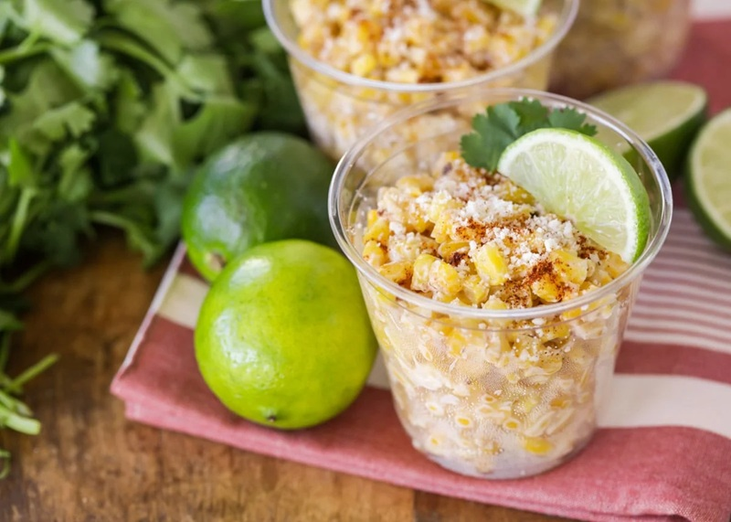

# Esquites

*Mexican street-corn salad: charred corn kernels tossed with mayo, lime, chilli powder, cotija (or feta) and coriander. The dish elote becomes when you take it off the cob — same flavours, in a cup, eaten with a spoon. Smoky, spicy, salty, tangy all at once.*

**Serves:** 4

**Prep Time:** 10 minutes

**Cook Time:** 15 minutes

## Overview
Corn kernels — fresh in season, frozen the rest of the year — char in a hot dry pan with a bit of oil until many kernels are blackened. Off the heat: mayo, sour cream, lime, garlic, chilli powder and cheese fold through. Coriander and more cheese top each bowl.

## Ingredients

- 600 g corn kernels (fresh from 4 cobs, or thawed frozen)
- 2 tablespoons vegetable oil
- 30 g unsalted butter
- 4 spring onions (sliced)
- 2 garlic cloves (crushed)
- 1 long green chilli (finely chopped) or jalapeño
- 100 g mayonnaise
- 100 g soured cream (or Mexican crema)
- 100 g cotija cheese (crumbled), or feta as substitute
- Juice of 2 limes
- 1 teaspoon chilli powder (or Tajín seasoning)
- ½ teaspoon smoked paprika
- ½ teaspoon salt
- Black pepper
- A small bunch of coriander (chopped)
- Lime wedges (to serve)

## Method

### Stage 1 – Char the corn
1. Heat the oil and butter in a large heavy skillet over medium-high heat.
1. Add the corn in a single layer; let it sit undisturbed 3-4 minutes — kernels should char.
1. Stir; cook another 4-5 minutes, stirring occasionally, until many kernels are deeply blackened in spots and the rest are golden.

### Stage 2 – Aromatics
1. Reduce the heat to medium; add the spring onions, garlic and chilli.
1. Cook 1 minute until fragrant.

### Stage 3 – Combine
1. Off the heat, stir in the mayonnaise, soured cream, lime juice, chilli powder, smoked paprika, salt and pepper.
1. Fold in three-quarters of the cotija and most of the coriander.

### Stage 4 – Serve
1. Spoon into small bowls or cups.
1. Top with the remaining cotija and coriander; dust with extra chilli powder.
1. Serve with lime wedges to squeeze over.

## Notes
- **Char the corn properly:** Pale yellow corn tossed with mayo is just creamed corn. The dish needs the smoky, blistered kernels.
- **Cotija substitute:** True cotija — Mexican aged cow's milk cheese, salty and crumbly — is sold at Latin grocers. Feta is the closest UK supermarket substitute; pecorino works in a pinch.
- **Tajín:** A Mexican seasoning of chilli, lime and salt; sold at Latin grocers and now many supermarkets. Sprinkle on top in addition to or instead of plain chilli powder.

## Storage
- Best fresh. Refrigerated keeps 2 days but the corn loses crispness; eat cold from the fridge.
