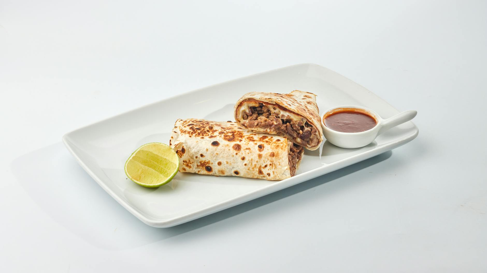

# Fiery Beef Burrito

## Overview
The combination of already flavourful spiced beef with the particularly fiery salsa makes this burrito a force to be reckoned with. This specific burrito variation combines crunchy tortilla chips, creamy nacho cheese sauce, and a bold chile de árbol red salsa to create a complex, heat-forward flavour profile that packs a punch.

**Serves:** 1
**Prep Time:** 5 minutes
**Cook Time:** 7 minutes

## Ingredients

### Tortilla & Base
- 1 extra-large flour tortilla

### Protein & Rice
- 1 portion cooked spiced minced beef (warmed)
- 1 portion spiced rice (cooked)

### Fillings & Toppings
- 1 handful fried tortilla chips (lightly crushed)
- 40ml (½ portion) nacho cheese sauce
- 2 tablespoons chile de árbol red salsa
- 1 tablespoon sour cream

## Method

### Stage 1 – Prepare Equipment & Heat Oven
1. Preheat the oven to its lowest setting (or the 'keep warm' setting if your oven has one).
2. Tear off a large piece of tinfoil and place it on a clean work surface.

### Stage 2 – Warm the Beef
1. Place the cooked spiced minced beef in a pot over medium heat.
2. Heat for 2–3 minutes, stirring occasionally, until sizzling and piping hot.
3. Set aside to keep warm.

### Stage 3 – Warm the Tortilla
1. Heat a dry frying pan over medium heat.
2. Add the flour tortilla and warm for 15 seconds on each side until pliable and warm.
3. Place the warmed tortilla onto the tinfoil on the work surface.

### Stage 4 – Assemble the Burrito
1. Top the bottom half of the tortilla with the warmed spiced beef in an even layer.
2. Add the spiced rice in a line across the beef.
3. Sprinkle the lightly crushed tortilla chips over the rice.
4. Drizzle the nacho cheese sauce evenly over the chips.
5. Add the chile de árbol red salsa.
6. Top with sour cream.

### Stage 5 – Roll & Wrap
1. Lift the bottom third of the tortilla over the fillings.
2. Fold in the left-hand side of the tortilla tightly.
3. Fold in the right-hand side of the tortilla tightly.
4. Continue rolling upward towards the top until a tight wrap is formed.
5. Wrap the burrito completely in the tinfoil.

### Stage 6 – Warm & Serve
1. Place the foil-wrapped burrito into the warm oven for 1–2 minutes to heat through.
2. Carefully unwrap and serve immediately with extra salsas on the side.

## Notes
- **Chile de árbol salsa heat:** This salsa is notably spicy (approximately 15,000–30,000 Scoville units). Adjust quantity or choose a milder salsa if heat sensitivity is a concern.
- **Tortilla chips placement:** Crushing the chips prevents them from breaking through the tortilla. Add them just before serving to maintain crunch.
- **Nacho cheese sauce:** Homemade is preferable, but jarred versions work in a pinch.
- **Beef temperature:** Ensure the beef is hot throughout before wrapping to maintain heat in the final burrito.
- **Rolling technique:** Roll tightly to prevent fillings from spilling out when eating.

## Variations
**Milder version:** Replace chile de árbol salsa with a mild salsa roja or pico de gallo
**Smoky heat:** Use chipotle salsa instead of chile de árbol for a different heat profile
**Extra protein:** Add a layer of refried beans beneath the beef for extra substance
**With vegetables:** Add sautéed peppers and onions between the beef and rice

## Serving
Serve with: Extra chile de árbol red salsa, sour cream, lime wedges, and cold beverages to cool the heat

## Storage
- Best eaten immediately while warm and crispy
- Can be wrapped in foil and refrigerated up to 2 days (reheat in foil at 160°C for 10 minutes)
- Does not freeze well (tortilla becomes tough and cheese sauce separates)