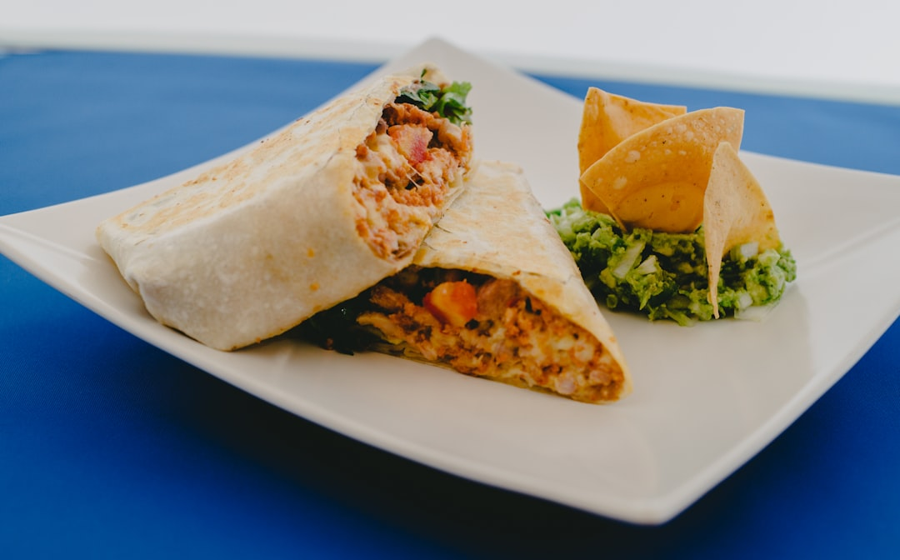

# Fully Loaded Burrito

## Overview
The fully loaded burrito is where all of your hard work and efforts come together to repay you in full. Packed with your choice of seasoned meat or vegetables, flavourful rice, smooth and filling beans, cheese, salsa and more, it's an entire meal wrapped up to go. This customizable template allows you to build your perfect burrito based on available ingredients and personal preference.

**Serves:** 1
**Prep Time:** 5 minutes
**Cook Time:** 5 minutes

## Ingredients

### Tortilla & Base
- 1 extra-large flour tortilla
- 1–2 tablespoons refried pinto beans (homemade or tinned)

### Protein (Choose One)
- 1 portion cooked pork, beef, chicken, or additional beans as desired

### Fillings & Toppings
- 1 portion spiced rice (cooked)
- 1 portion fresh tomato salsa
- 1 handful grated cheese (Cheddar, Monterey Jack, mozzarella, or a mix)
- 1 tablespoon sour cream
- Optional: guacamole, jalapeños, lettuce, diced tomatoes

## Method

### Stage 1 – Prepare Equipment & Heat Oven
1. Preheat the oven to its lowest setting (or the 'keep warm' setting if your oven has one).
2. Tear off a large piece of tinfoil and place it on a clean work surface.

### Stage 2 – Warm the Tortilla
1. Heat a dry frying pan over medium heat.
2. Add the flour tortilla and warm for 15 seconds on each side until pliable and warm.
3. Place the warmed tortilla onto the tinfoil on the work surface.

### Stage 3 – Assemble the Burrito
1. Spread the refried beans evenly over the warmed tortilla, covering approximately the bottom half.
2. Layer the protein of your choice on top of the beans.
3. Add the spiced rice in a line across the fillings.
4. Top with fresh tomato salsa, grated cheese, and sour cream.
5. Add any optional toppings (guacamole, jalapeños, lettuce, diced tomatoes) as desired.

### Stage 4 – Roll & Wrap
1. Lift the bottom third of the tortilla over the fillings.
2. Fold in the left-hand side of the tortilla tightly.
3. Fold in the right-hand side of the tortilla tightly.
4. Continue rolling upward towards the top until a tight wrap is formed.
5. Wrap the burrito completely in the tinfoil.

### Stage 5 – Warm & Serve
1. Place the foil-wrapped burrito into the warm oven for 1–2 minutes to heat through.
2. Carefully unwrap and serve immediately with your favourite salsas on the side.

## Notes
- **Tortilla size:** Extra-large tortillas (approximately 25cm diameter) work best to contain all fillings without tearing.
- **Bean temperature:** Use warm beans to prevent cooling down the other components.
- **Rolling technique:** Roll tightly to prevent fillings from spilling out when eating.
- **Customization:** This template is flexible, choose proteins and toppings based on preference and availability.
- **Make-ahead:** Assemble the burrito but don't wrap in foil; refrigerate for up to 4 hours, then warm as directed.

## Variations
**Vegetarian:** Omit meat and use extra beans, sautéed peppers, and mushrooms
**Seafood burrito:** Use seasoned shrimp or fish instead of traditional meat
**Breakfast burrito:** Replace fillings with scrambled eggs, bacon or sausage, hash browns, and mild salsa
**Extra creamy:** Add guacamole and extra sour cream or crema

## Serving
Serve with: Refried beans on the side, extra salsa, guacamole, lime wedges, and Mexican rice

## Storage
- Best eaten immediately while warm
- Can be wrapped in foil and refrigerated up to 2 days (reheat in foil at 160°C for 10 minutes)
- Does not freeze well (tortilla becomes tough)