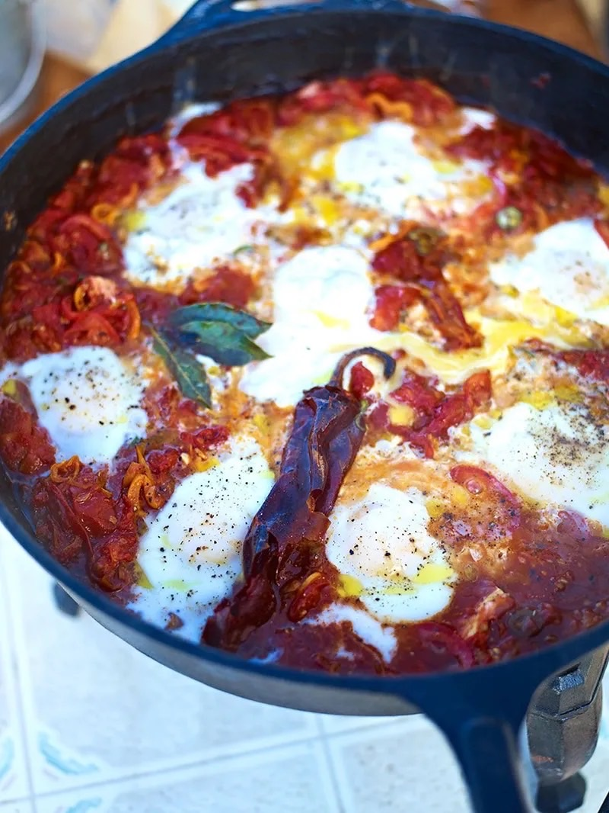

# Huevos Rancheros

## Overview
Huevos rancheros is a classic Mexican breakfast dish featuring eggs poached in a rich, spiced tomato sauce with peppers and chillies. This rustic, flavourful dish is traditionally served with warm tortillas for scooping, allowing diners to customize their own wraps. The combination of runny egg yolks with the thick, delicious tomato stew creates a truly memorable dish.

**Serves:** 4
**Prep Time:** 15 minutes
**Cook Time:** 25 minutes

## Ingredients

### Aromatics & Vegetables
- 1 large onion (peeled and finely sliced)
- 2 garlic cloves (peeled and finely sliced)
- 2 red peppers (deseeded and finely sliced)
- 2 fresh red or orange chillies (finely sliced)
- 1 large dried chilli
- 3 fresh bay leaves
- 2 large ripe tomatoes (sliced)

### Sauce Base
- 2 × 400g tins quality plum tomatoes
- Several good lugs of olive oil
- Sea salt and black pepper to taste

### Eggs & Tortillas
- 6 large eggs
- 6 flour tortillas
- Cheddar cheese (for grating, optional)

## Method

### Stage 1 – Prepare Ingredients
1. Peel and finely slice the onions and garlic.
2. Deseed and finely slice the red peppers and fresh chillies.
3. Have all ingredients ready and within arm's reach (this dish moves quickly once you start cooking).

### Stage 2 – Build the Tomato Base
1. Place a large frying pan (with a lid) on medium-high heat and add several good lugs of olive oil.
2. Add the sliced onion, garlic, red peppers, fresh chillies, dried chilli, and bay leaves.
3. Season with sea salt and black pepper.
4. Cook for 15 minutes, stirring regularly, until softened and caramelised.
5. The mixture should darken and intensify in flavour.

### Stage 3 – Add Tomatoes & Reduce
1. Pour in the tinned plum tomatoes.
2. Using the back of a spoon or a potato masher, break up the tomatoes as they fall into the pan.
3. Bring to a boil, then reduce to medium heat.
4. Cook for a further 5 minutes to reduce the sauce.
5. You should have a nice thick tomato stew consistency.
6. Taste and adjust seasoning with salt and pepper as needed.

### Stage 4 – Prepare for Poaching
1. Lay the sliced fresh tomatoes over the top of the tomato mixture.
2. Using the back of a spoon, create small wells in the tomato stew (you need 6 wells for the 6 eggs).

### Stage 5 – Warm Tortillas
1. While preparing to poach the eggs, warm the tortillas.
2. You can pop them into an oven at 180°C for a few minutes, microwave for a few seconds, or lay them over the lid of the pan so they heat as the eggs cook.

### Stage 6 – Poach the Eggs
1. Crack the 6 eggs into the wells you created in the tomato stew.
2. Crack them in as quickly as you can so they all cook for roughly the same amount of time.
3. Season the eggs from a height with sea salt and black pepper.
4. Place the lid on the pan and reduce heat to medium-low.
5. Cook for 3–4 minutes, or until the eggs are cooked to your liking (runny yolks are traditional).

### Stage 7 – Finish & Serve
1. Remove the lid and check the eggs by gently poking them with your finger.
2. Once cooked to your liking, turn off the heat.
3. Take the pan to the table with the warmed tortillas, grated Cheddar cheese, and a grater.
4. Each diner can assemble their own: grate cheese onto a warm tortilla, spoon an egg and tomato stew on top, wrap up, and eat.

## Notes
- **Egg consistency:** Runny yolks are traditional, the yolk mixes with the tomato stew to create a delicious sauce. Cook longer if you prefer firmer yolks.
- **Dried chilli:** Adds depth and smokiness without overwhelming heat. Remove it before serving if preferred.
- **Fresh vs. tinned tomatoes:** The combination of both creates more complex flavour; use only tinned if fresh tomatoes are out of season.
- **Make-ahead:** Prepare the tomato sauce up to 2 hours ahead; reheat gently before adding eggs.
- **Interactive meal:** Traditional service allows each diner to customize their wrap, this is part of the appeal.

## Variations
**Vegetarian/vegan:** Omit eggs or replace with crumbled tofu for a plant-based version
**With chorizo:** Add 100g diced chorizo sausage to the aromatics in Stage 2 for extra flavour and protein
**Spicier version:** Add jalapeños or increase the dried chilli quantity
**With black beans:** Layer in 1 tin (400g) rinsed black beans before adding eggs
**Breakfast burritos:** Wrap the cooked eggs and tomato stew inside warmed flour tortillas with cheese and sour cream

## Serving
Serve at the table while warm, with tortillas on the side. Each diner grates cheese onto a tortilla, adds an egg and tomato stew, and wraps to eat. Serve with lime wedges, sour cream, and hot sauce on the side.

## Storage
- Keeps 2 days refrigerated (store eggs and sauce separately)
- The tomato sauce freezes well up to 3 months (reheat gently before adding fresh eggs)
- Best eaten immediately while eggs are warm and yolks are runny