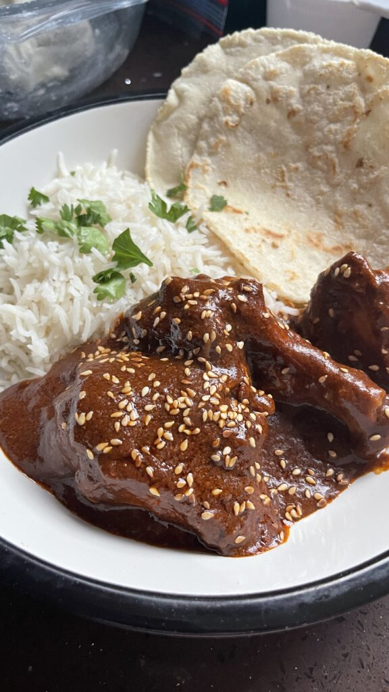

# Mole Poblano

*Puebla's complex sauce of dried chillies, chocolate, nuts, seeds and spices, served over chicken or turkey. Twenty-plus ingredients; days of work in restaurants; here a faithful weekend version. The most labyrinthine sauce in Mexican cooking, and the one most worth the effort.*

**Serves:** 6

**Prep Time:** 1 hour

**Cook Time:** 1½ hours

## Overview
Multiple dried chillies (mulato, ancho, pasilla) toast and rehydrate, then blend with toasted nuts, seeds, dried fruit, spices, fried onion and garlic, plantain, dark chocolate and a slice of toasted bread or tortilla into a thick paste. The paste cooks down with chicken stock into a glossy mahogany sauce, served over poached chicken with rice and warm tortillas.

## Ingredients

### Mole base
- 4 dried mulato chillies
- 4 dried ancho chillies
- 4 dried pasilla chillies
- 2 dried chipotle chillies
- 100 ml vegetable oil
- 1 onion (chopped)
- 6 garlic cloves
- 1 ripe plantain (peeled, sliced)
- 50 g blanched almonds
- 50 g raw peanuts
- 30 g pumpkin seeds
- 30 g sesame seeds
- 100 g raisins
- 1 corn tortilla (torn)
- 1 thick slice white bread
- 1 ripe tomato (chopped)
- 2 tomatillos (quartered) (or another tomato)
- 1 stick cinnamon
- 4 cloves
- 1 teaspoon black peppercorns
- 1 teaspoon dried oregano
- ¼ teaspoon ground anise (or 1 star anise)
- 60 g good-quality dark chocolate (70%)
- 1 litre chicken stock
- Salt
- 1 tablespoon caster sugar

### Chicken
- 1 whole chicken (1.6 kg) or 8 thighs/legs
- 1 onion (halved)
- 4 garlic cloves
- 1 bay leaf
- Salt

### To serve
- Cooked rice
- Warm tortillas
- A scatter of sesame seeds

## Method

### Stage 1 – Poach the chicken
1. Place the chicken in a large pot with the onion, garlic and bay leaf. Cover with cold water; salt generously.
1. Bring to a simmer; poach 35-40 minutes until cooked through.
1. Lift out; reserve the broth (use as your chicken stock for the mole).

### Stage 2 – Prep the chillies
1. Wipe the dried chillies with a damp cloth. Slit each open and remove stems and seeds.
1. Toast in a dry pan over medium heat for 30 seconds a side until fragrant. Don't burn.
1. Soak in just-boiled water for 20 minutes to soften.

### Stage 3 – Toast and fry
1. In a heavy pan, heat 3 tablespoons of oil. Fry the nuts, seeds and raisins separately until golden, transferring each to a blender as done.
1. Fry the bread and tortilla until golden; add to the blender.
1. Fry the onion, garlic and plantain until golden; add to the blender.
1. Briefly toast the cinnamon, cloves, peppercorns, oregano and anise in the dry pan; grind to powder; add to the blender.
1. Add the soaked chillies (drained), tomato and tomatillos to the blender.

### Stage 4 – Blend the paste
1. Pour in 200 ml of the chicken broth.
1. Blitz everything to as smooth a paste as possible (in batches if needed).
1. Pass through a sieve, pressing hard on the solids; the texture should be silky.

### Stage 5 – Cook the mole
1. Heat the remaining oil in a large pan; fry the mole paste for 5 minutes, stirring (it spits).
1. Pour in 800 ml chicken broth; stir to combine.
1. Drop in the broken chocolate; stir until melted.
1. Simmer 30 minutes, stirring often. The sauce should thicken to a glossy, lava-like consistency.
1. Season with salt and sugar; the chillies need a touch of sweetness.

### Stage 6 – Combine and serve
1. Shred or cut the cooked chicken into pieces.
1. Add to the mole and warm through 5 minutes.
1. Serve over rice with warm tortillas. Scatter sesame seeds on top.

## Notes
- **Three chillies minimum:** Mulato (raisin-fruity), ancho (sweet-mild), pasilla (deep-bitter). Replacing all three with one type gives a flat sauce.
- **Toast everything:** Every ingredient — chillies, nuts, seeds, spices, bread — gets briefly toasted or fried. This is what builds the layered flavour.
- **Chocolate is the binder:** A small amount, and not the dessert kind. 70% dark, no added flavours.

## Storage
- Improves over 2-3 days. Keeps 5 days refrigerated.
- Mole paste freezes 6 months; thaw and add chicken stock to revive.
