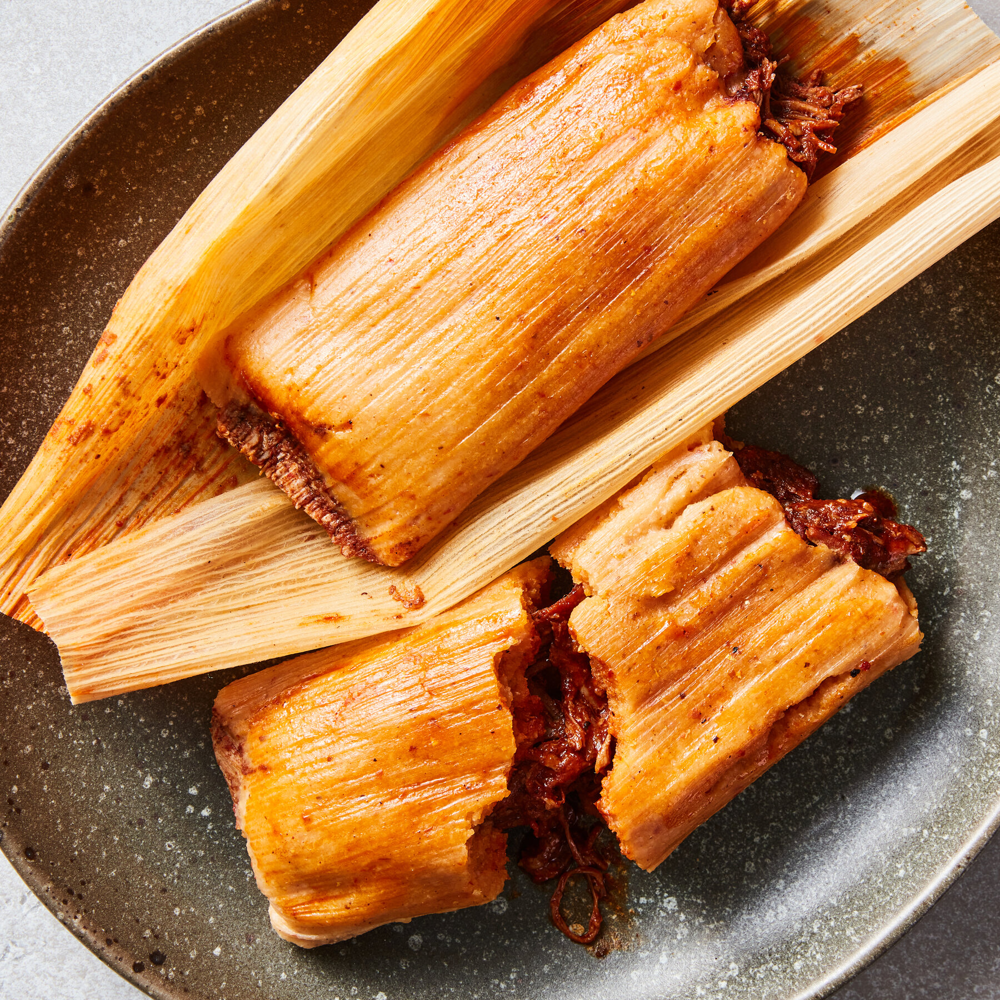

# Pork Tamales

*Steamed parcels of seasoned masa wrapped in corn husks: a base layer of fluffy corn dough holds a chilli-pork filling, all bound up and steamed for an hour. The labour-intensive Mexican Christmas dish; freezes brilliantly so a marathon batch lasts weeks.*

**Makes:** 24 tamales

**Prep Time:** 1½ hours

**Cook Time:** 1½ hours

## Overview
Masa harina mixes with lard or butter, baking powder and stock into a fluffy dough. A red-chilli pork shoulder filling has been simmered separately. Soaked corn husks get a layer of dough, a spoon of filling, fold and tie. Steamed standing upright for an hour.

## Ingredients

### Pork filling
- 1 kg pork shoulder (cut into 4 cm pieces)
- 4 dried guajillo chillies (stems and seeds removed)
- 2 dried ancho chillies (stems and seeds removed)
- 4 garlic cloves
- 1 onion (halved)
- 1 teaspoon ground cumin
- 1 teaspoon dried oregano
- 1 teaspoon salt
- 600 ml water

### Masa
- 500 g masa harina
- 200 g lard (room temperature) or unsalted butter
- 1 teaspoon baking powder
- 1 teaspoon salt
- 750 ml warm chicken stock or pork cooking liquid

### Wrapping
- 30 dried corn husks (soaked in hot water 30 minutes until pliable)

## Method

### Stage 1 – Cook the pork
1. Place the pork, halved onion, garlic and water in a heavy pot. Bring to a simmer.
1. Cook 1½ hours until the pork is tender. Reserve the cooking liquid.

### Stage 2 – Chilli sauce
1. Toast the dried chillies in a dry pan for 30 seconds a side.
1. Soak in just-boiled water for 15 minutes; drain.
1. Blend with the cumin, oregano, 200 ml of pork cooking liquid and salt to a smooth sauce.

### Stage 3 – Combine pork and sauce
1. Shred the pork with two forks.
1. Pour the chilli sauce over and stir to coat.
1. Cook in a frying pan over medium heat for 5 minutes to thicken slightly. Set aside.

### Stage 4 – Masa dough
1. Beat the lard with a wooden spoon (or stand mixer) for 5 minutes until fluffy.
1. Mix the masa harina, baking powder and salt; add to the lard with the warm stock.
1. Beat for 5 minutes until the dough is fluffy enough that a small spoonful floats in cold water (test it).

### Stage 5 – Assemble
1. Place a soaked corn husk on the work surface, smooth side up, wide end at the top.
1. Spread 2 tablespoons of masa across the upper centre of the husk in a 5 mm thick rectangle, leaving 2 cm clear at the top and sides.
1. Spoon a tablespoon of pork filling along the centre of the dough.
1. Fold the long sides of the husk to overlap; fold the pointed bottom up to seal (the top stays open).
1. Tie the parcel with a strip of soaked husk if it doesn't hold its shape.

### Stage 6 – Steam
1. Stand the tamales open-end up in a large steamer.
1. Pour water into the bottom (don't let it touch the tamales).
1. Cover and steam for 1¼-1½ hours, topping up water as needed.
1. Test by unwrapping one: the masa should pull cleanly away from the husk.

### Stage 7 – Serve
1. Serve hot in their husks; diners unwrap their own.
1. Serve with extra salsa or chilli sauce on the side.

## Notes
- **Lard tastes traditional:** Vegetable shortening or butter work; lard gives the classic flavour.
- **Float test for the dough:** Drop a half-teaspoon in cold water. Sinks = beat more; floats = ready.
- **Corn husks need full soaking:** Dry husks crack when folded; 30 minutes in hot water makes them pliable.

## Storage
- Steamed tamales keep 3 days refrigerated; reheat by re-steaming for 15 minutes.
- Freeze (wrapped, after cooking) for 3 months. Steam from frozen for 30 minutes.
