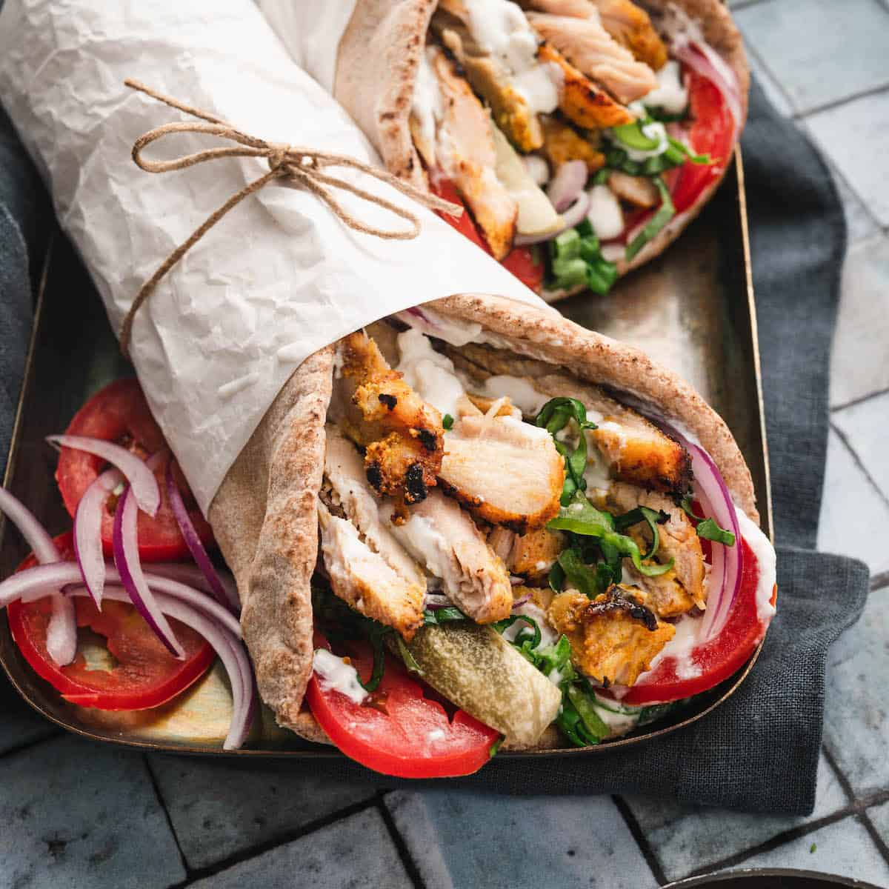

# Chicken Shawarma

*Levantine spiced grilled chicken: thighs marinated in yogurt, garlic, lemon and a heavy spice mix, grilled hard and sliced thin. Wrap in flatbread with garlic sauce and pickles, or eat from a plate with rice and tabbouleh.*

**Serves:** 4-6

**Prep Time:** 15 minutes (plus 4 hours marinade)

**Cook Time:** 25 minutes

## Overview
Boneless chicken thighs swim in a yogurt-spice marinade for at least 4 hours. They roast hard at high heat for char, then rest and slice thin. The standard accompaniments are toum (garlic sauce), pickled turnips, parsley and warm pita.

## Ingredients

### Marinade
- 1 kg boneless chicken thighs (skin on or off)
- 200 g Greek yogurt
- Juice of 1 lemon
- 4 tablespoons olive oil
- 6 garlic cloves (crushed)
- 2 teaspoons ground cumin
- 2 teaspoons ground coriander
- 2 teaspoons sweet paprika
- 1 teaspoon smoked paprika
- 1 teaspoon ground turmeric
- 1 teaspoon ground cinnamon
- ½ teaspoon ground allspice
- ½ teaspoon black pepper
- 1 teaspoon salt
- A pinch of cayenne

### To serve
- Warm pita or flatbread
- Toum (garlic sauce) or tahini sauce
- Pickled turnips or red onion
- A small bunch of parsley
- Lemon wedges

## Method

### Stage 1 – Marinate
1. Whisk all marinade ingredients in a bowl.
1. Toss the chicken thighs through; refrigerate at least 4 hours, ideally overnight.

### Stage 2 – Roast
1. Heat the oven to 220°C (200°C fan).
1. Spread the chicken in a single layer on a baking tray (don't pile or it'll steam).
1. Roast for 20-25 minutes until cooked through and charred at the edges.
1. If the surface isn't dark enough, finish under a hot grill for 2-3 minutes.

### Stage 3 – Rest and slice
1. Rest the chicken on a board for 5 minutes.
1. Slice thinly across the grain.

### Stage 4 – Build wraps
1. Warm the pitas. Smear with toum or tahini.
1. Pile sliced chicken on top.
1. Top with pickles, parsley and a squeeze of lemon.
1. Roll up tightly.

## Notes
- **Yogurt tenderises:** The dairy lactic acid breaks down chicken proteins gently; gives juicy meat with deep marinade penetration.
- **Roast hot, in a single layer:** Crowding the tray steams the chicken. The dark edges are non-negotiable.
- **Spice blend is the soul:** Cumin and coriander as the base; cinnamon and allspice are the signature warmth. Don't shortcut.

## Storage
- Cooked keeps 3 days refrigerated. Reheats well in a hot pan.
- Marinated raw chicken keeps 1 day refrigerated; freeze for longer.
