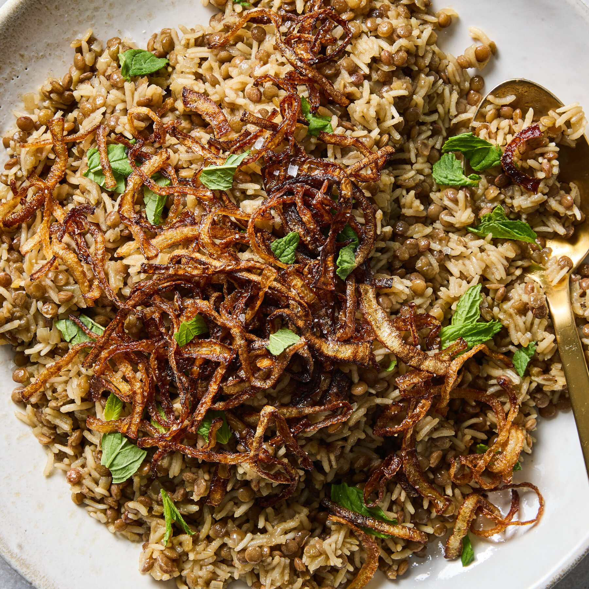

# Mujadara

*Levantine lentils and rice topped with deeply caramelised crisp onions. Vegan, frugal, profoundly satisfying. The crisp onions are non-negotiable; they're 70% of the flavour.*

**Serves:** 4

**Prep Time:** 15 minutes

**Cook Time:** 1 hour

## Overview
Brown lentils boil until almost tender; long-grain rice and water join them along with cumin and a touch of cinnamon. While they finish cooking, sliced onions fry slow in olive oil until they're deep brown and crisp. The crisp onions and their dark oil go on top.

## Ingredients

- 200 g brown or green lentils (rinsed)
- 200 g long-grain rice (rinsed)
- 1 teaspoon ground cumin
- ½ teaspoon ground cinnamon
- 1 teaspoon salt
- ¼ teaspoon black pepper

### Caramelised onions
- 3 large onions (very thinly sliced)
- 6 tablespoons olive oil
- ½ teaspoon salt

### To serve
- Greek yogurt (optional)
- Lemon wedges
- A small bunch of parsley (chopped)

## Method

### Stage 1 – Cook the lentils
1. Cover the lentils with 1 litre of cold water in a heavy pan; bring to a simmer.
1. Cook 20-25 minutes until almost tender (still has some bite).
1. Drain, reserving the cooking liquid.

### Stage 2 – Caramelised onions
1. While the lentils cook, heat the olive oil in a wide heavy pan over medium heat.
1. Add the sliced onions and salt.
1. Cook, stirring often, for 25-30 minutes until deeply browned and the edges are crisp. Don't rush; the colour is the dish.
1. Lift half the onions onto kitchen paper to crisp; reserve the rest with their oil for stirring through.

### Stage 3 – Combine and finish
1. Return the drained lentils to the pan; add the rice, cumin, cinnamon, salt and pepper.
1. Pour in 500 ml of the reserved lentil cooking liquid (top up with water if you don't have enough).
1. Stir in half the soft onions and 2 tablespoons of their oil.
1. Bring to a simmer; cover and cook on very low heat for 15-18 minutes until the rice is tender and the liquid absorbed.
1. Off the heat, leave covered for 10 minutes.

### Stage 4 – Serve
1. Fluff with a fork.
1. Top with the crisp onions and a drizzle of the onion oil.
1. Yogurt and lemon wedges on the side; scatter parsley.

## Notes
- **Onions are the flavour:** Half-caramelised onions are flat-tasting. 25-30 minutes minimum, until they're really dark.
- **Lentils almost-cooked first:** Cook them past the rice and they go to mush; behind the rice and they stay chalky.
- **Reserve the lentil water:** It's full of flavour; cook the rice in it.

## Storage
- Keeps 4 days refrigerated. Crisp onions soften but the dish still tastes great.
- Freezes 2 months.
