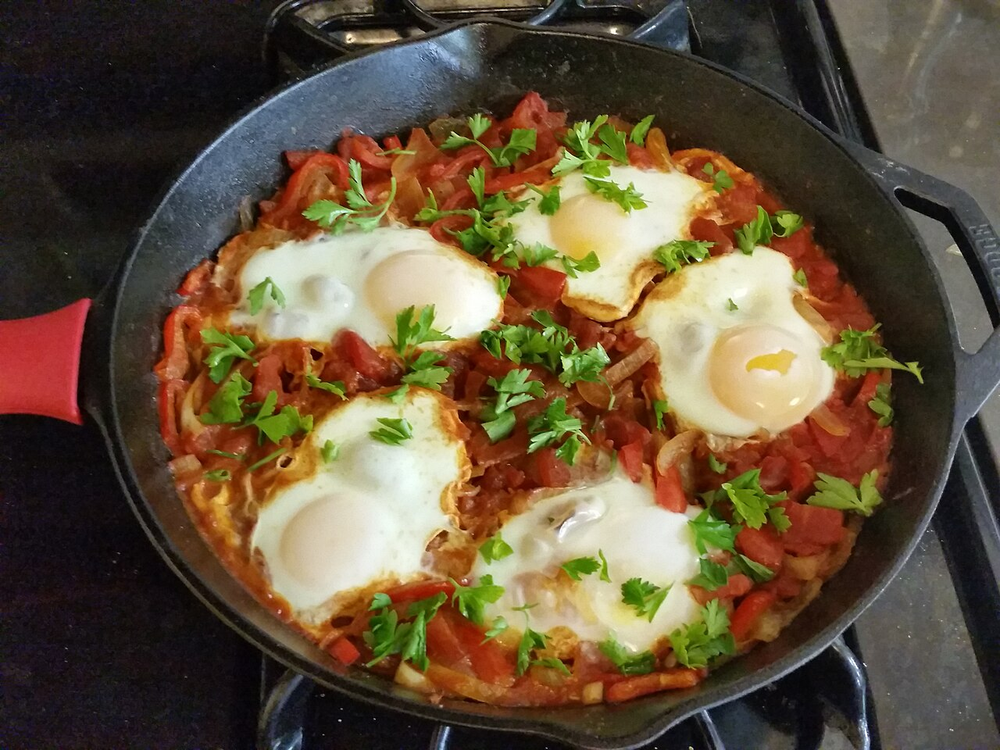

# Shakshuka

*North African and Levantine breakfast: eggs poached in a spiced tomato-and-pepper sauce, served straight from the pan with bread to mop. Originally from Tunisia or Libya; widespread across Israel, Palestine, Egypt and the broader region.*

**Serves:** 4

**Prep Time:** 10 minutes

**Cook Time:** 25 minutes

## Overview
A pepper-onion sofrito gets cumin, paprika and chilli, then tomatoes simmer down into a thick sauce. Eggs crack into wells in the sauce; the pan covers and the eggs steam-poach until the whites are set but the yolks remain runny.

## Ingredients

- 3 tablespoons olive oil
- 1 onion (sliced)
- 1 red pepper (sliced)
- 4 garlic cloves (sliced)
- 1 small red chilli (chopped, optional)
- 2 teaspoons ground cumin
- 1 teaspoon sweet paprika
- 1 teaspoon smoked paprika
- 1 teaspoon caraway seeds (optional)
- 2 tablespoons tomato purée
- 800 g tinned chopped tomatoes (2 tins)
- 1 teaspoon caster sugar
- Salt and freshly ground black pepper
- 6 large eggs
- 100 g feta (crumbled, optional)
- A small handful of flat-leaf parsley or coriander (chopped)
- Crusty bread, to serve

## Method

### Stage 1 – Sofrito
1. Heat the oil in a wide heavy frying pan (about 28 cm) over medium heat.
1. Cook the onion and red pepper for 10 minutes until soft and starting to caramelise.
1. Add the garlic, chilli, cumin, both paprikas and caraway; cook 1 minute.

### Stage 2 – Sauce
1. Stir in the tomato purée; cook 1 minute.
1. Add the chopped tomatoes and sugar. Season generously.
1. Simmer for 12-15 minutes until thickened.

### Stage 3 – Eggs
1. Make 6 wells in the sauce with the back of a spoon.
1. Crack an egg into each well.
1. Cover the pan; reduce heat to low.
1. Cook 5-7 minutes, until the whites are just set but the yolks are still runny.

### Stage 4 – Serve
1. Scatter the feta and herbs over.
1. Bring the pan to the table; serve with crusty bread for dipping.

## Notes
- **Reduce the sauce well:** Wet sauce makes wet eggs. Get it thick first.
- **Cover, don't stir:** Once the eggs are in, the lid steams them through. Stirring breaks the yolks.
- **Smoked + sweet paprika:** Both. Just smoked is one-note; just sweet lacks depth.

## Storage
- Sauce keeps 3 days refrigerated; cook fresh eggs into it on demand.
- Whole shakshuka with eggs doesn't reheat well.
