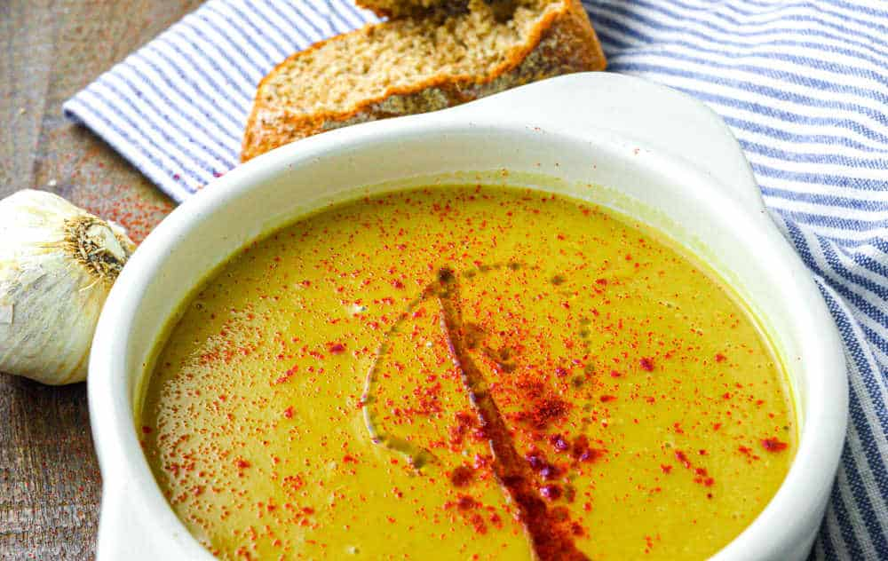

# Bissara

*Northern Moroccan dried fava bean soup: cooked down to a thick, smooth, almost porridge-like texture, served with a deep slick of olive oil, cumin and chilli on top. Street-food breakfast in Chefchaouen and Fez; eaten with bread for dipping.*

**Serves:** 4

**Prep Time:** 10 minutes (plus overnight soak)

**Cook Time:** 1 hour

## Overview
Skinned dried fava beans (or split peas as a substitute) simmer with garlic, cumin and a small amount of paprika until they completely break down. The soup is blended smooth, thinned to taste, and served with each bowl getting a generous topping of olive oil, ground cumin, paprika and chilli flakes. Bread is essential.

## Ingredients

### Soup
- 350 g dried split fava beans (skinned; soaked overnight) or yellow split peas
- 1.5 litres water
- 6 garlic cloves (crushed)
- 1 tablespoon ground cumin
- 1 teaspoon sweet paprika
- 1 teaspoon salt
- 4 tablespoons olive oil
- Juice of 1 lemon

### To finish (per bowl)
- Extra-virgin olive oil
- A pinch of ground cumin
- A pinch of paprika
- Chilli flakes (optional)
- Crusty bread

## Method

### Stage 1 – Cook the beans
1. Drain the soaked beans.
1. Place in a heavy pan with the water, garlic, cumin, paprika and salt.
1. Bring to the boil; reduce to a simmer; cover loosely.
1. Cook 50-60 minutes until the beans have completely fallen apart (or longer for older beans). Top up with water if it threatens to dry out.

### Stage 2 – Blend
1. Blend the soup smooth with a stick blender (or in batches in a jug blender).
1. The soup should be thick — porridge-like — but pourable. Add hot water to thin to your preferred consistency.

### Stage 3 – Season
1. Stir in the olive oil and lemon juice.
1. Taste; adjust salt, cumin and lemon.

### Stage 4 – Serve
1. Ladle into wide bowls.
1. Top each with a deep slick of olive oil, a pinch of cumin, a pinch of paprika and chilli flakes if using.
1. Serve with warm bread for dipping.

## Notes
- **Skinned fava beans:** "Split fava beans" or "split broad beans" — sold dried at North African and Middle Eastern grocers. Whole favas need their tough skins removed; not worth the effort here.
- **Yellow split peas as substitute:** Give a milder, paler bissara — still good but not authentic.
- **Olive oil at the end:** Drizzle generously. The oil is the second main ingredient in flavour terms.

## Storage
- Keeps 4 days refrigerated; thickens to almost solid in the fridge — loosen with hot water on reheat.
- Freezes 3 months.
