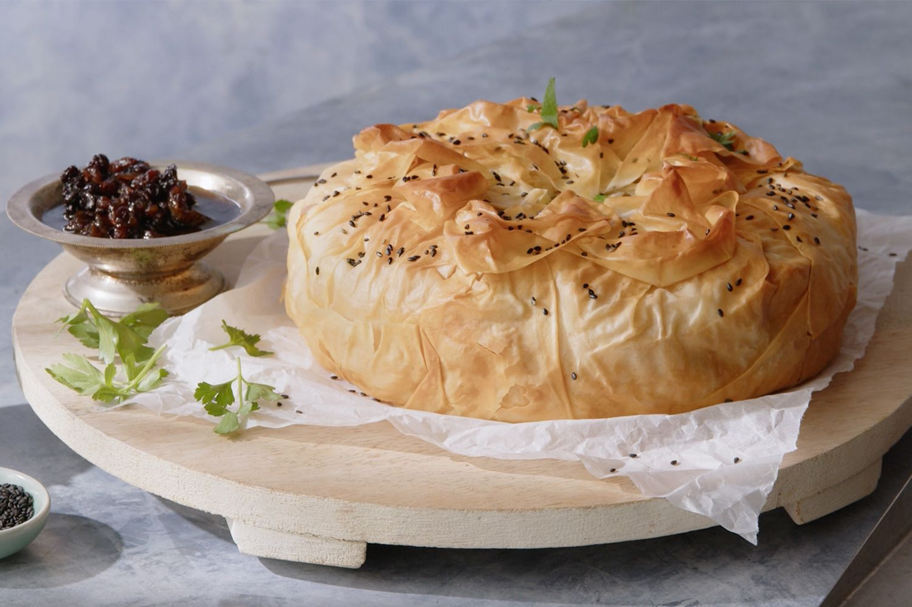

# B'stilla

*Moroccan layered pie: spiced shredded chicken (or pigeon), almonds and saffron-lemon eggs, encased in crisp filo and dusted with icing sugar and cinnamon. The unusual sweet-savoury topping is the dish's signature; sounds wrong, tastes incredible.*

**Serves:** 6-8

**Prep Time:** 45 minutes

**Cook Time:** 50 minutes

## Overview
Chicken poaches in a heavily spiced broth (saffron, ginger, cinnamon, lemon). The shredded meat returns to a reduced sauce thickened with beaten eggs to make a soft set. Toasted almonds with sugar and cinnamon form a layer. Everything wraps in butter-brushed filo, baked golden, and dusted with icing sugar and cinnamon.

## Ingredients

### Chicken layer
- 1 kg chicken thighs (bone-in, skin on)
- 1 onion (chopped)
- 4 garlic cloves
- 1 thumb fresh ginger (grated)
- 1 large pinch saffron threads
- 1 cinnamon stick
- 1 teaspoon ground ginger
- 1 teaspoon turmeric
- ½ teaspoon black pepper
- 100 g unsalted butter (split)
- 600 ml chicken stock
- A small bunch of fresh coriander
- A small bunch of flat-leaf parsley
- Juice of 1 lemon
- 4 large eggs (beaten)
- Salt

### Almond layer
- 200 g blanched almonds (toasted)
- 4 tablespoons icing sugar
- 1 teaspoon ground cinnamon
- 1 tablespoon orange-blossom water (optional)

### Pastry
- 8-10 sheets filo pastry
- 100 g unsalted butter (melted)

### To finish
- Icing sugar
- Ground cinnamon

## Method

### Stage 1 – Cook the chicken
1. Melt 50 g butter in a heavy pot. Cook the onion for 8 minutes.
1. Add the garlic, ginger, saffron, cinnamon stick, ground ginger, turmeric and pepper.
1. Add the chicken; pour in the stock.
1. Simmer covered for 35 minutes until the chicken is tender. Lift out; cool.

### Stage 2 – Reduce and egg-bind
1. Discard the cinnamon stick from the pot.
1. Add the chopped coriander and parsley to the broth; reduce over high heat to about 200 ml of thick sauce.
1. Off the heat, slowly stir in the beaten eggs (whisking continuously).
1. Return to low heat; cook 3-4 minutes, stirring, until the eggs set into a soft scramble. Off the heat; cool slightly.

### Stage 3 – Shred the chicken
1. Discard skin and bones; shred the meat finely.
1. Stir into the egg mixture along with the lemon juice. Season; cool fully.

### Stage 4 – Almond layer
1. Pulse the toasted almonds with the icing sugar and cinnamon in a food processor to a coarse meal.
1. Stir in the orange-blossom water if using.

### Stage 5 – Assemble
1. Heat the oven to 180°C (160°C fan).
1. Brush a 25 cm round oven-proof dish or springform pan generously with melted butter.
1. Lay 5 filo sheets in the dish, brushing each with butter, letting the edges hang over.
1. Spread half the almond mixture across the base.
1. Spoon the chicken-egg mixture on top.
1. Scatter the remaining almonds over.
1. Lay 3-5 more filo sheets over the top, brushing each.
1. Tuck or fold the overhanging edges in to seal.
1. Brush the top with butter.

### Stage 6 – Bake
1. Bake 35-40 minutes until deep golden and crisp.
1. Cool 10 minutes.

### Stage 7 – Finish
1. Dust the top generously with icing sugar.
1. Run a cinnamon-stick lattice across (sprinkle ground cinnamon in lines).

## Notes
- **Sweet-savoury sounds wrong, isn't:** The icing sugar and cinnamon dust on top is what makes this b'stilla. Don't skip.
- **Reduce the broth WELL:** Loose broth makes a wet pie. Get it thick before the eggs go in.
- **Filo dries fast:** Keep unused sheets covered with a damp cloth as you work.

## Storage
- Best fresh; keeps 2 days refrigerated. The filo softens; re-crisp at 180°C for 10 minutes.
- Freezes 2 months.
