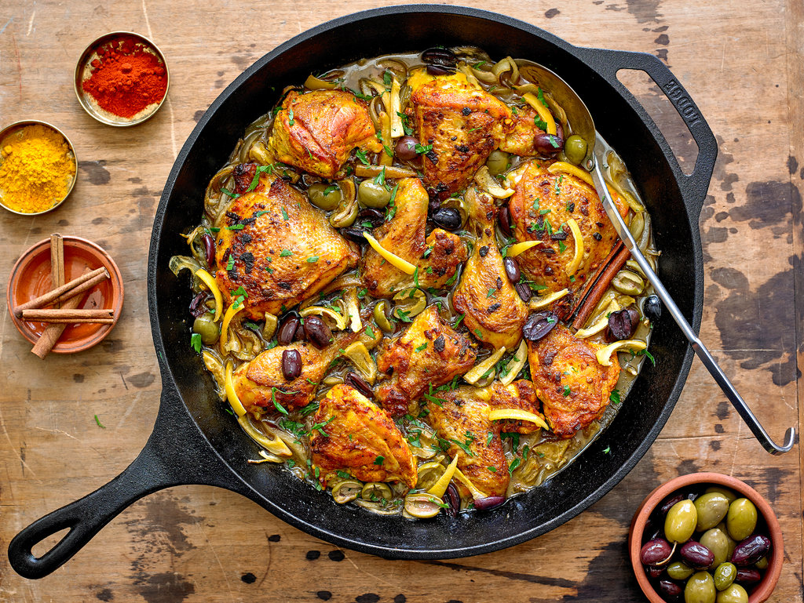

# Chicken Tagine with Preserved Lemon and Olives

*Moroccan classic: chicken legs braised slow in saffron-spiced broth with preserved lemon and green olives. The intensely savoury preserved lemon and salty olives play against the gentle saffron-cumin warmth.*

**Serves:** 4-6

**Prep Time:** 20 minutes

**Cook Time:** 1 hour

## Overview
Bone-in chicken thighs and drumsticks rub with a saffron-cumin-ginger-paprika paste, then braise gently with onion, garlic and stock in a tagine or heavy casserole. Preserved lemon and green olives go in toward the end so they don't disintegrate. Coriander finishes.

## Ingredients

- 8 bone-in chicken thighs and drumsticks
- 1 large onion (sliced)
- 4 garlic cloves (crushed)
- 1 large pinch saffron threads (about 0.5 g)
- 1 teaspoon ground ginger
- 2 teaspoons ground cumin
- 1 teaspoon sweet paprika
- ½ teaspoon ground cinnamon
- ½ teaspoon ground turmeric
- 4 tablespoons olive oil
- 500 ml chicken stock
- 1 large preserved lemon (quartered, pulp scooped out and discarded, peel sliced)
- 150 g pitted green olives
- A small bunch of coriander (chopped)
- A small bunch of flat-leaf parsley (chopped)
- Salt and freshly ground black pepper
- Couscous, to serve

## Method

### Stage 1 – Spice rub
1. Bloom the saffron in 2 tablespoons of warm water for 5 minutes.
1. In a bowl, mix the ginger, cumin, paprika, cinnamon, turmeric, half the chopped coriander, half the parsley, 2 tablespoons olive oil, the saffron and water, salt and pepper.
1. Rub thoroughly over the chicken pieces.

### Stage 2 – Brown and braise
1. Heat 2 tablespoons of olive oil in a heavy casserole or tagine.
1. Brown the chicken on all sides for 6-8 minutes; set aside.
1. Cook the onion 8 minutes until soft; add the garlic for 1 minute.
1. Return the chicken; pour in the stock.
1. Bring to a simmer, cover, and braise on low heat for 35-40 minutes (or in a 160°C oven).

### Stage 3 – Add lemon and olives
1. Add the preserved lemon peel and olives.
1. Cover and cook another 15 minutes.
1. The chicken should be falling-tender; the sauce should be reduced and glossy.

### Stage 4 – Finish
1. Taste; the preserved lemon and olives bring salt, so check before adding more.
1. Scatter the remaining herbs over.

### Stage 5 – Serve
1. Serve in the tagine if you have one (visually beautiful), with couscous on the side.

## Notes
- **Preserved lemon, peel only:** The pulp is too salty and bitter; rinse and discard. The peel is the prize.
- **Saffron must bloom:** Direct in the pot gives less colour; the warm-water steep releases full pigment.
- **Don't skimp on the spice rub:** This is a 5-spice blend; each contributes. Reducing them simplifies the dish into a single-note braise.

## Storage
- Improves overnight. Keeps 3 days refrigerated.
- Freezes 2 months.
