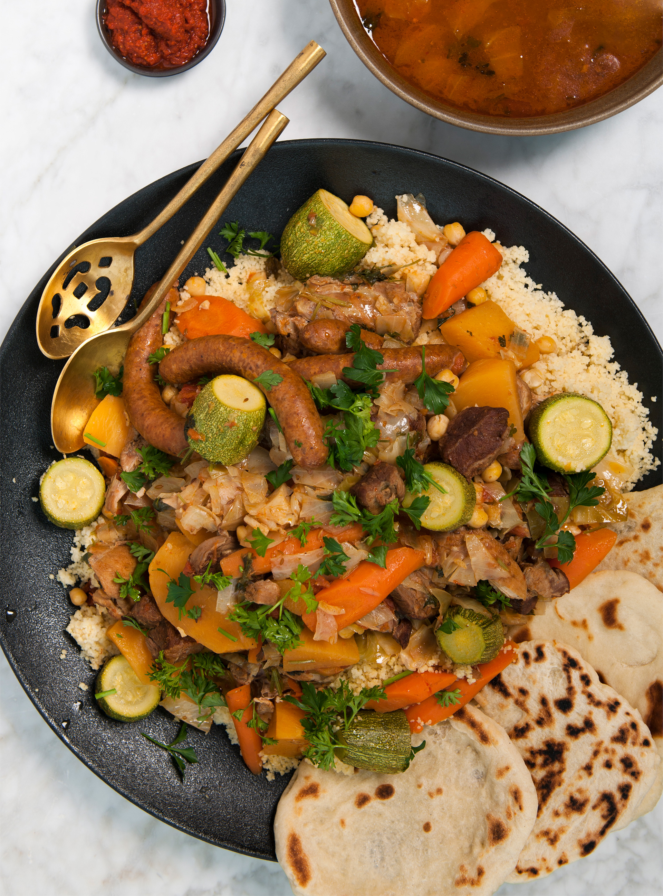

# Couscous Royale

*The festive Moroccan-Maghreb couscous: fluffy semolina topped with merguez sausages, lamb shoulder, chicken, and a vegetable-rich broth (carrots, courgette, turnips, chickpeas) with harissa on the side. The full Sunday-lunch version of North African couscous; a single platter feeds a crowd.*

**Serves:** 6-8

**Prep Time:** 30 minutes

**Cook Time:** 2 hours

## Overview
Lamb and chicken poach slowly in a saffron-tomato broth with chunks of root vegetables and chickpeas. Merguez sausages grill or fry separately. Couscous steams (or is rehydrated quickly with hot broth and butter). Everything plates separately on a vast platter; diners build their own bowls and slick with harissa.

## Ingredients

### Broth and meat
- 600 g lamb shoulder (cut into 4 cm cubes)
- 600 g chicken thighs and drumsticks
- 2 tablespoons olive oil
- 2 onions (sliced)
- 4 garlic cloves (crushed)
- 1 thumb fresh ginger (grated)
- 1 large pinch saffron threads
- 1 teaspoon ground turmeric
- 1 teaspoon ground cumin
- 1 teaspoon ras el hanout
- 2 tablespoons tomato purée
- 800 g tinned chopped tomatoes (2 tins)
- 1.5 litres chicken stock
- 4 carrots (peeled, halved lengthways)
- 2 turnips (peeled, quartered)
- 2 courgettes (cut into thick chunks)
- 200 g tinned chickpeas (drained)
- A small bunch of coriander (chopped)
- Salt and freshly ground black pepper

### Merguez
- 8 merguez sausages

### Couscous
- 500 g couscous
- 50 g unsalted butter
- 1 teaspoon salt
- 600 ml just-boiled water

### To serve
- 4 tablespoons harissa
- Lemon wedges

## Method

### Stage 1 – Brown the meat
1. Heat the oil in a large heavy pot.
1. Brown the lamb in batches; set aside.
1. Brown the chicken; set aside.

### Stage 2 – Build the broth
1. Cook the onions in the same pot for 10 minutes.
1. Add the garlic, ginger, saffron, turmeric, cumin and ras el hanout; cook 1 minute.
1. Stir in the tomato purée and tomatoes.
1. Return the lamb; pour in the stock; season.
1. Simmer covered for 1 hour.

### Stage 3 – Add chicken and vegetables
1. Add the chicken, carrots and turnips.
1. Cover and simmer 30 minutes.
1. Add the courgette chunks and chickpeas; simmer 20 more minutes.

### Stage 4 – Cook the couscous
1. Place the couscous in a large bowl with the salt.
1. Pour over the boiling water; immediately cover with cling film.
1. Leave 8 minutes; uncover, fork through, and stir in the butter.

### Stage 5 – Cook the merguez
1. Pan-fry or grill the merguez sausages for 8-10 minutes until cooked through and crisp at the edges.

### Stage 6 – Plate
1. Mound the couscous on a large platter.
1. Arrange the meats and vegetables on top, drawing them out from the broth.
1. Spoon some broth over to moisten.
1. Place a small bowl of harissa whisked with a ladle of broth on the side; lemon wedges alongside.
1. Pass the rest of the broth in a jug for ladling.

## Notes
- **Saffron and ras el hanout together:** Different but complementary. The saffron is the colour and floral note; the ras el hanout is the warm complexity.
- **Merguez separately:** Cooked in the broth they bleed and turn it greasy. Grill or fry on the side.
- **Harissa whisked with broth:** Diluting harissa in a ladle of broth makes it more spoonable on the plate.

## Storage
- Improves overnight. Components keep 3-4 days refrigerated separately.
- Cooked couscous keeps 2 days; loosen with a splash of water and a knob of butter when reheating.
