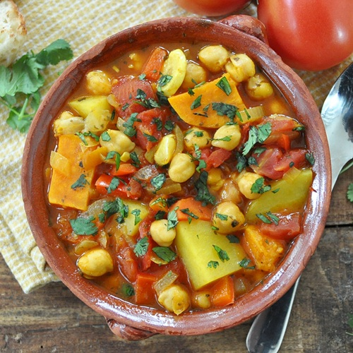

# Vegetable Tagine

*Moroccan slow-cooked stew of root vegetables, chickpeas and dried apricots, fragrant with ras el hanout, cinnamon and preserved lemon. The tagine pot's tall conical lid traps moisture; everything inside softens into something sweet, savoury, fragrant and slightly thick. Ladled over couscous; eaten with bread.*

**Serves:** 4-6

**Prep Time:** 20 minutes

**Cook Time:** 1 hour

## Overview
Onions soften with garlic and ras el hanout. Carrots, parsnips, potato and squash join in stages — root first, fast-cooking last. Chickpeas, tomatoes, stock and apricots simmer everything together. At the end, preserved lemon, fresh coriander and toasted almonds finish; honey rounds out the spice if needed.

## Ingredients

- 3 tablespoons olive oil
- 2 onions (sliced)
- 4 garlic cloves (crushed)
- 2 cm fresh ginger (grated)
- 2 tablespoons ras el hanout
- 1 teaspoon ground cinnamon
- ½ teaspoon ground turmeric
- 2 medium carrots (cut into 3 cm chunks)
- 2 parsnips (cut into 3 cm chunks)
- 300 g butternut squash (peeled and cubed)
- 2 medium potatoes (peeled and cubed)
- 1 x 400 g tin chickpeas (drained)
- 1 x 400 g tin chopped tomatoes
- 100 g dried apricots (halved)
- 600 ml vegetable stock
- 1 small preserved lemon (rind only, finely chopped)
- 1 tablespoon honey (optional)
- Salt and black pepper
- 50 g flaked almonds (toasted)
- A small bunch of coriander (chopped)
- A small bunch of mint (chopped)

## Method

### Stage 1 – Aromatics
1. Heat the oil in a heavy casserole or tagine over medium heat.
1. Cook the onions 8-10 minutes until soft and golden.
1. Stir in the garlic, ginger, ras el hanout, cinnamon and turmeric; cook 1 minute.

### Stage 2 – Vegetables
1. Add the carrots, parsnips, squash and potatoes; toss to coat in the spices.
1. Cook 3-4 minutes.

### Stage 3 – Simmer
1. Add the chickpeas, tomatoes, apricots and stock.
1. Season with salt and black pepper.
1. Bring to the boil; reduce to a steady simmer; cover.
1. Cook 35-40 minutes until the root vegetables are tender and the sauce has reduced to a thick stew.

### Stage 4 – Finish
1. Stir in the preserved lemon and honey if using.
1. Taste; adjust salt.
1. Top with toasted almonds, coriander and mint.

### Stage 5 – Serve
1. Serve over couscous or with warm flatbread.

## Notes
- **Ras el hanout quality:** A good blend has 15-30 spices; cheap mixes are mostly cumin and turmeric. Worth seeking out from a North African grocer.
- **Preserved lemon:** Use just the rind, not the flesh — it's the rind that has the floral, salty flavour. The flesh is too salty/bitter.
- **Apricots not cranberries:** Apricots melt slightly into the sauce and balance the spice. Cranberries are a sharper, less authentic substitute.

## Storage
- Keeps 5 days refrigerated; tastes even better the next day.
- Freezes 3 months.
