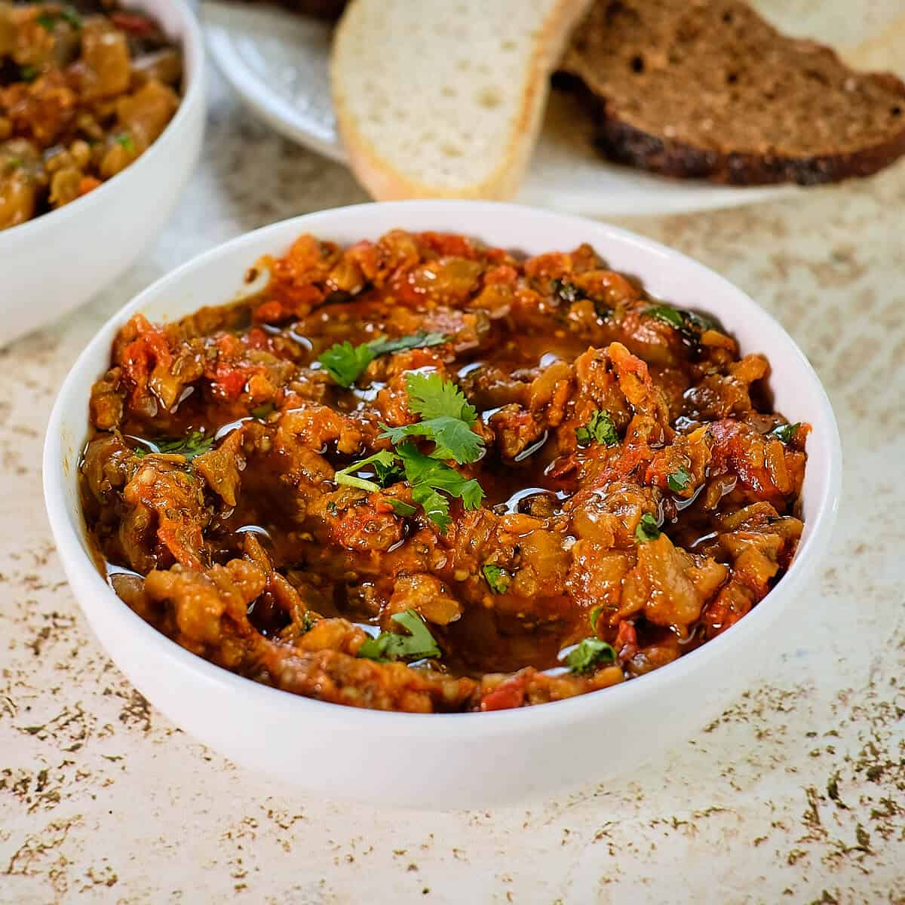

# Zaalouk

*Moroccan smoky aubergine and tomato salad: aubergines roasted until collapsed, mashed coarsely with stewed tomatoes, garlic, paprika and cumin. Eaten warm or cold, scooped with bread; smoky, garlicky, just enough fresh herb to keep it bright.*

**Serves:** 4 as a side, 2 as a main

**Prep Time:** 15 minutes

**Cook Time:** 45 minutes

## Overview
Aubergines are charred whole over a flame or roasted until collapsed; their flesh is scooped out and chopped. Tomatoes, garlic and spices stew in olive oil to a thick base; the aubergine joins; everything cooks down to a coarse, oily, deep-flavoured purée. Lemon and coriander finish.

## Ingredients

- 2 large aubergines (around 800 g total)
- 4 tablespoons olive oil
- 6 garlic cloves (crushed)
- 4 ripe tomatoes (skinned and chopped) or 1 x 400 g tin chopped tomatoes
- 1 tablespoon sweet paprika
- 1 teaspoon ground cumin
- ½ teaspoon hot paprika or pinch of cayenne
- 1 teaspoon salt
- Juice of half a lemon
- A small bunch of coriander (chopped)
- A small bunch of flat-leaf parsley (chopped)
- Black pepper
- Extra olive oil and bread (to serve)

## Method

### Stage 1 – Cook the aubergines
1. Char the aubergines whole over a gas flame, turning, until the skins are blackened all over and the flesh feels collapsed (10-12 minutes). Or roast at 220°C for 40-45 minutes until very soft.
1. Cool slightly; peel off the skin; chop the flesh roughly.

### Stage 2 – Tomato base
1. Heat the olive oil in a wide pan over medium heat.
1. Add the garlic; cook 1 minute.
1. Add the tomatoes, paprika, cumin, hot paprika and salt; cook 12-15 minutes, stirring, until thick and jammy.

### Stage 3 – Combine
1. Stir in the chopped aubergine; cook 8-10 minutes more, mashing with a spoon, until the mixture is thick, oily and coarse-textured.

### Stage 4 – Finish
1. Off the heat, stir in the lemon juice, half the coriander and half the parsley; grind in black pepper.
1. Taste; adjust salt and lemon.

### Stage 5 – Serve
1. Spoon onto a flat plate; spread to about 2 cm thick.
1. Top with the remaining herbs and a generous drizzle of olive oil.
1. Eat warm or cold with crusty bread or flatbread for scooping.

## Notes
- **Char for the smoke:** The flame-cooked aubergine is the soul of zaalouk. Oven-roasting works but tastes plainer.
- **Texture:** Should be coarse, not smooth. Mash with a spoon; never blend.
- **Olive oil:** Be generous — Moroccan zaalouk is properly oily, almost glossy on the plate. The oil is the carrier for everything.

## Storage
- Keeps 5 days refrigerated; flavour deepens. Eat at room temperature; cold mutes the spices.
