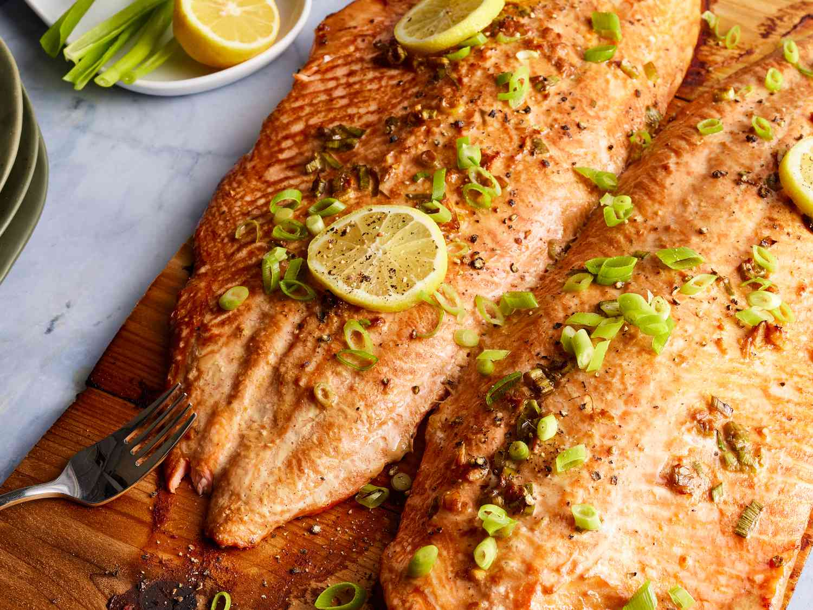

# Cedar-Planked Salmon

*A Pacific Northwest indigenous technique adapted for the home grill: salmon fillet rests on a soaked cedar plank set over high heat. The plank smokes slowly; the salmon picks up its woody, slightly sweet aroma and steam-cooks gently from underneath. Brown sugar, maple syrup and a little salt cure the fish briefly before grilling — the glaze caramelises on top.*

**Serves:** 4

**Prep Time:** 15 minutes (plus 1 hour plank soak + 30 min cure)

**Cook Time:** 18 minutes

## Overview
A food-safe cedar plank submerges in water for an hour. The salmon (skin on, one side) gets a brief dry cure of brown sugar, salt and crushed juniper. Maple syrup and lemon zest go on at the end of the cure. The hot grill cooks the plank from below while the salmon cooks from the slow heat radiating up — a steam-smoke method, neither pure grilling nor pure baking. The result is a salmon that tastes faintly of forest, cured-cured-not-curried.*

## Ingredients

- 1 large salmon fillet (around 800 g), skin on, pin bones removed
- 1 untreated cedar plank (around 30 x 15 cm)

### Cure
- 3 tablespoons light brown sugar
- 1 tablespoon flaky sea salt
- 1 tablespoon crushed juniper berries (around 8 berries)
- 1 teaspoon black pepper

### Glaze
- 4 tablespoons pure maple syrup
- Zest of 1 lemon
- 1 teaspoon Dijon mustard

### To finish
- A small bunch of dill (chopped)
- Lemon wedges
- Flaky salt

## Method

### Stage 1 – Soak the plank
1. Submerge the cedar plank in cold water; weight with a heavy plate.
1. Soak at least 1 hour, ideally 2-4 hours. A dry plank ignites; a soaked one smokes.

### Stage 2 – Cure
1. Mix the brown sugar, salt, juniper and pepper.
1. Pat the salmon dry; rub the cure all over the flesh side (not the skin).
1. Cover; refrigerate 30 minutes — the cure draws moisture and tightens the flesh.

### Stage 3 – Glaze
1. Whisk the maple syrup, lemon zest and mustard.
1. Pat any drawn-out moisture off the salmon with kitchen paper.
1. Brush the glaze generously over the cured salmon.

### Stage 4 – Heat the grill
1. Preheat a charcoal or gas barbecue to medium-high (around 200°C).
1. Lift the soaked plank out of the water; pat the surface dry.

### Stage 5 – Grill
1. Lay the plank directly on the grates; close the lid.
1. After 3-4 minutes, check the plank — it should be smoking but not flaming. (If flame appears, mist with water from a spray bottle.)
1. Lay the salmon skin-side down on the plank; close the lid.
1. Cook 14-18 minutes — the salmon is done when the centre is just-set (a knife slides in easily) and the surface is glossy and slightly caramelised.
1. The plank may char around the edges; this is desirable.

### Stage 6 – Rest and serve
1. Lift the entire plank off the grill onto a heatproof board (handle with tongs and a towel; the plank's edges are hot).
1. Rest 5 minutes.
1. Sprinkle with dill and flaky salt.
1. Serve from the plank with lemon wedges. The salmon lifts off the plank in clean pieces, leaving the skin behind.

## Notes
- **Untreated cedar only:** Don't use treated lumber — it leaches chemicals. Buy "grilling planks" (cedar, alder, cherry are all good) at hardware or barbecue stores.
- **Soak hard:** A plank that hasn't soaked long enough will catch fire. An hour is the minimum.
- **Don't overcook:** Salmon stays moist when just-set in the centre; overcooked it goes dry and flaky in the wrong way.

## Storage
- Best fresh; cooked salmon refrigerates 2 days; eats well cold over salad.
