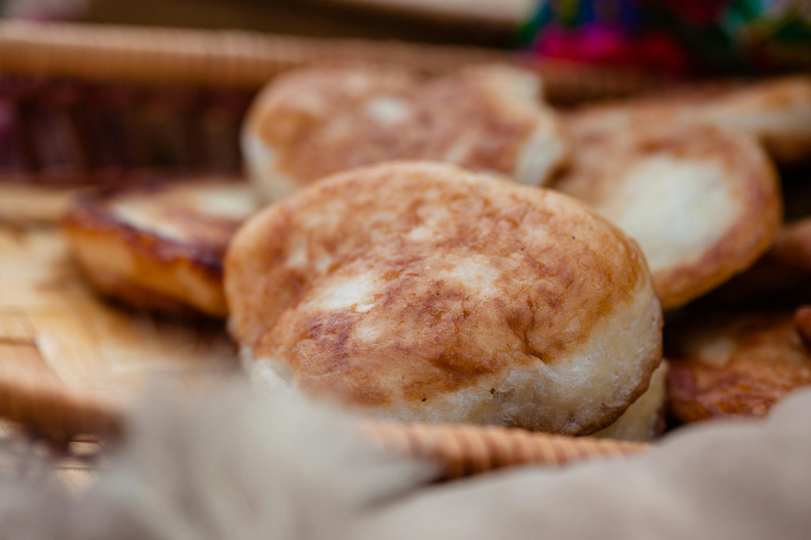

# Frybread with Wojapi

*Indian frybread — pillowy disks of dough fried golden — served warm with wojapi, a thick Lakota berry sauce of chokecherries (or whatever's in season — blueberries, blackberries, saskatoon berries) cooked down with maple syrup and a little water. Frybread has a complex history (it dates from 1864, when Navajo people on the Long Walk were rationed flour and sugar instead of traditional foods); it's now an icon of Native American cuisine, eaten at powwows, family gatherings and any chance to gather. The sweet version with wojapi is a dessert; savoury versions ("Indian tacos") build on it.*

**Serves:** 6

**Prep Time:** 25 minutes (plus 30 min resting)

**Cook Time:** 30 minutes

## Overview
A simple yeasted dough — flour, baking powder, milk, salt, a touch of sugar — rests until soft and pliable. Each portion stretches by hand into a 15 cm disc, then drops into hot oil for 90 seconds per side. Wojapi simmers berries, water and maple syrup to a thick sauce; thickens slightly with a small amount of cornflour. The hot frybread piles on a plate; warm wojapi spoons over.

## Ingredients

### Frybread
- 500 g plain flour (plus more for dusting)
- 1 tablespoon baking powder
- 1 teaspoon salt
- 2 teaspoons caster sugar
- 350 ml warm milk (or water)
- Vegetable oil for shallow frying

### Wojapi
- 600 g mixed berries (blueberries, blackberries, raspberries — fresh or frozen)
- 200 ml water
- 4 tablespoons pure maple syrup
- 2 tablespoons brown sugar (adjust to fruit's natural sweetness)
- 1 tablespoon cornflour (mixed with 2 tablespoons cold water)
- ½ teaspoon vanilla extract
- A small pinch of salt

### To finish
- Icing sugar for dusting
- Whipped cream or vanilla ice cream (optional)

## Method

### Stage 1 – Wojapi
1. Combine the berries, water, maple syrup, brown sugar and salt in a heavy saucepan.
1. Bring to the boil; reduce to a steady simmer.
1. Cook 12-15 minutes, mashing occasionally with a wooden spoon, until the berries break down and the mixture is jammy.
1. Stir the cornflour slurry; pour in slowly, stirring constantly. The sauce thickens within seconds.
1. Cook 1 minute more; off the heat, stir in the vanilla.
1. Keep warm.

### Stage 2 – Frybread dough
1. Whisk the flour, baking powder, salt and sugar in a wide bowl.
1. Add the warm milk gradually; mix to a soft, slightly tacky dough.
1. Knead briefly — 2-3 minutes — until smooth.
1. Cover; rest 30 minutes (lets the gluten relax for easier shaping).

### Stage 3 – Heat the oil
1. Pour 2 cm of oil into a wide heavy pan.
1. Heat to 180°C (a small piece of dough should sizzle vigorously and float).

### Stage 4 – Shape and fry
1. Divide the dough into 6 equal pieces.
1. On a floured surface, flatten each into a 15 cm disc, about 6 mm thick.
1. Make a small hole in the centre with your finger (helps the bread cook evenly).
1. Slide carefully into the hot oil; cook 60-90 seconds per side until each is deep golden and puffed.
1. Lift onto kitchen paper.

### Stage 5 – Serve
1. Place each frybread on a plate; spoon warm wojapi generously on top.
1. Dust with icing sugar.
1. Add a scoop of whipped cream or ice cream if liked.
1. Eat immediately while the frybread is still hot.

## Notes
- **Frybread's history:** Worth knowing. It comes from a period of forced relocation and rationing — many Native cooks have a complicated relationship with it. Today it stands as a symbol of resilience and community.
- **Hot oil, fast cook:** Soft, undercooked frybread is heavy. Pull when it's deep golden; it cooks fast.
- **Wojapi traditions:** Lakota chokecherries are the original ingredient; the sauce was originally thickened with chokecherry pits or a cornflour-like starch. Modern recipes use whatever berries are available.

## Storage
- Frybread is best fresh; reheat at 200°C for 4 minutes if needed.
- Wojapi keeps 5 days refrigerated; reheats gently.
