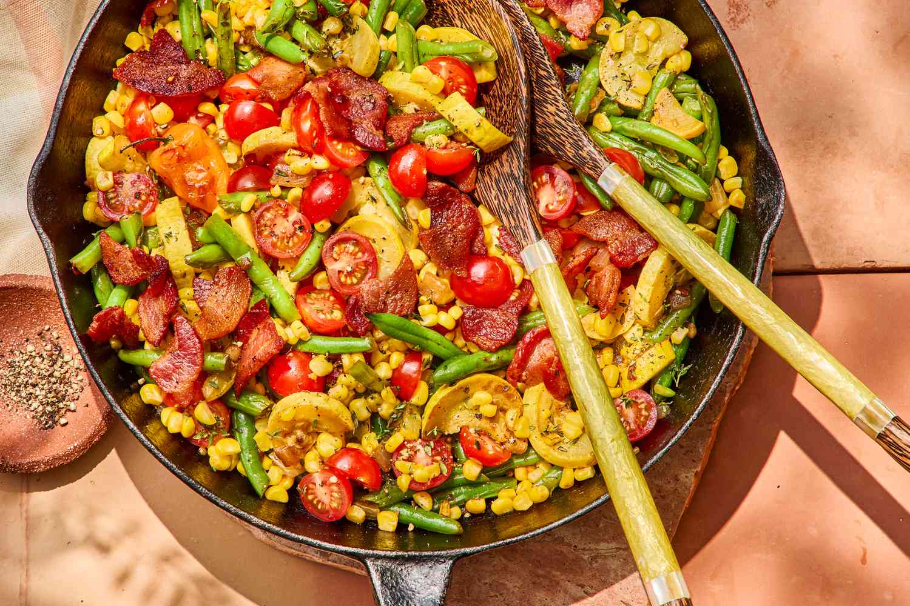

# Three Sisters Succotash

*A side built on the indigenous trio that defined eastern-woodland and Plains agriculture for centuries — corn, beans and squash, planted together because they grow in symbiosis. Stewed gently with butter, onion and a pinch of sage, lifted with sweet maple syrup and finished with cider vinegar. Eats next to roast meat, fish, or stands alone with bread.*

**Serves:** 6 as a side

**Prep Time:** 15 minutes

**Cook Time:** 30 minutes

## Overview
A small dice of butternut squash softens in butter with onion and garlic; corn kernels and pre-cooked beans (kidney, pinto or borlotti) join in. Stock loosens; sage and bay perfume; the lot simmers until the squash is tender and the broth has reduced to a glaze. Maple syrup and cider vinegar balance at the end.

## Ingredients

- 2 tablespoons unsalted butter (or oil)
- 1 medium onion (chopped)
- 3 garlic cloves (crushed)
- 600 g butternut or kabocha squash (peeled, deseeded; cut into 1.5 cm cubes)
- 400 g corn kernels (fresh from 4 cobs, or thawed frozen)
- 1 x 400 g tin red kidney or pinto beans (drained) — or 250 g cooked from dried
- 350 ml vegetable stock or water
- 1 bay leaf
- 4 sage leaves (chopped) or 1 teaspoon dried
- 1 teaspoon dried thyme
- 2 tablespoons maple syrup
- 1 tablespoon cider vinegar
- 1 teaspoon salt (or to taste)
- ½ teaspoon black pepper
- A small bunch flat-leaf parsley (chopped)

## Method

### Stage 1 – Aromatics
1. Melt the butter in a wide heavy pan over medium heat.
1. Cook the onion 6 minutes until soft.
1. Add the garlic; cook 1 minute.

### Stage 2 – Squash
1. Add the squash; toss to coat.
1. Cook 5 minutes, stirring, until starting to colour at edges.

### Stage 3 – Stew
1. Add the corn, beans, stock, bay, sage and thyme.
1. Season with salt and pepper.
1. Bring to a simmer; reduce the heat to medium-low.
1. Cook 18-22 minutes uncovered, stirring occasionally, until the squash is tender and most of the liquid has reduced.

### Stage 4 – Balance
1. Stir in the maple syrup and cider vinegar.
1. Cook 2 more minutes; the broth should glaze, not pool.
1. Discard the bay; taste; adjust salt and vinegar.

### Stage 5 – Serve
1. Top with parsley.
1. Serve warm alongside roast meat, grilled fish, or with cornbread.

## Notes
- **Three Sisters:** The Iroquois name for corn, beans and squash, planted together — the corn gives the beans something to climb, the beans fix nitrogen, the squash shades the soil. This dish honours that combination as a single bowl.
- **Squash holds shape:** Kabocha and butternut are best — they soften without dissolving. Avoid acorn or hubbard, which break down.
- **Vinegar at the end:** Brings the dish into focus. Without it the succotash tastes muddy-sweet.

## Storage
- Keeps 4 days refrigerated; reheats well.
- Freezes 2 months.
