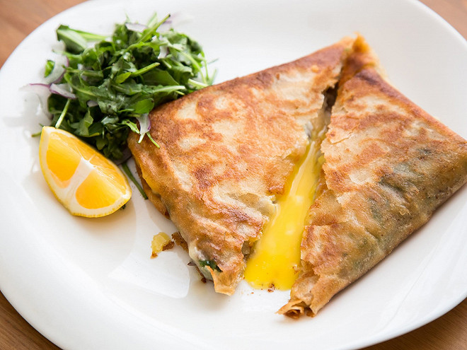

# Brik à l'Œuf

*Tunisia's signature street food: a thin sheet of malsouka (or filo) wrapped around tuna, capers, parsley and a whole egg, then deep-fried fast — long enough to crisp the pastry and barely set the white, leaving the yolk runny. Eats by hand; the first bite breaks the yolk and floods the filling. Squeezed with lemon and dipped in harissa.*

**Serves:** 4

**Prep Time:** 15 minutes

**Cook Time:** 8 minutes

## Overview
Filling builds in a small bowl: drained tinned tuna, finely-chopped onion, parsley, capers, harissa, salt. A square of malsouka (or two stacked sheets of filo) lays flat. Half the filling spreads on one half of the sheet; an egg cracks into a small well on top; the other half folds over. The seam pinches; the brik slides into hot oil for 90 seconds — out crisp and golden, yolk still soft.

## Ingredients

### Filling
- 1 x 160 g tin tuna (in olive oil, drained)
- 1 medium onion (very finely chopped)
- A small bunch flat-leaf parsley (chopped)
- 2 tablespoons capers (rinsed, chopped)
- 2 tablespoons grated parmesan or aged gouda (optional)
- 1 teaspoon harissa
- ½ teaspoon ground cumin
- Salt and black pepper

### Brik
- 4 sheets malsouka pastry (or 8 sheets filo, kept under a damp cloth)
- 4 large eggs
- Vegetable oil for shallow frying

### To serve
- 2 lemons (cut into wedges)
- Harissa
- A simple salad

## Method

### Stage 1 – Filling
1. Mix the tuna, onion, parsley, capers, cheese (if using), harissa, cumin, salt and pepper in a bowl with a fork — keep the texture chunky.

### Stage 2 – Heat the oil
1. Pour 1 cm of oil into a wide heavy pan; heat to 180°C (a piece of pastry should sizzle vigorously).

### Stage 3 – Assemble (one at a time)
1. Lay one malsouka sheet flat (or 2 stacked filo).
1. Spread a quarter of the filling on one half of the sheet, leaving a 2 cm border. Press to flatten.
1. Make a well in the centre of the filling.
1. Crack an egg into the well — try not to break the yolk.
1. Salt and pepper lightly.
1. Fold the empty half over the filling to form a triangle or rectangle.
1. Press the edges with a fork to seal.

### Stage 4 – Fry
1. Slide the brik into the hot oil immediately (don't let it sit; the egg leaks).
1. Fry 60-90 seconds per side until each side is deep gold and crisp.
1. Lift onto kitchen paper.

### Stage 5 – Serve
1. Repeat for the remaining 3 brik (the oil will need a moment to come back to temperature between each).
1. Serve immediately with lemon wedges, a smear of harissa and a green salad.
1. Eat by hand — bite a corner; let the yolk run.

## Notes
- **Yolk soft is the point:** A brik with a fully-set yolk is overcooked. 90 seconds per side at proper heat keeps the white just-set and the yolk runny.
- **Malsouka vs filo:** Malsouka (warqa) is a thinner, more pliable Tunisian pastry sheet. Filo works as a substitute — use 2 sheets stacked and brushed lightly with oil between.
- **Don't overstuff:** Too much filling makes a soggy brik that splits in the oil.

## Storage
- Eat immediately. Brik don't keep — the pastry softens and the yolk overcooks on reheat.
