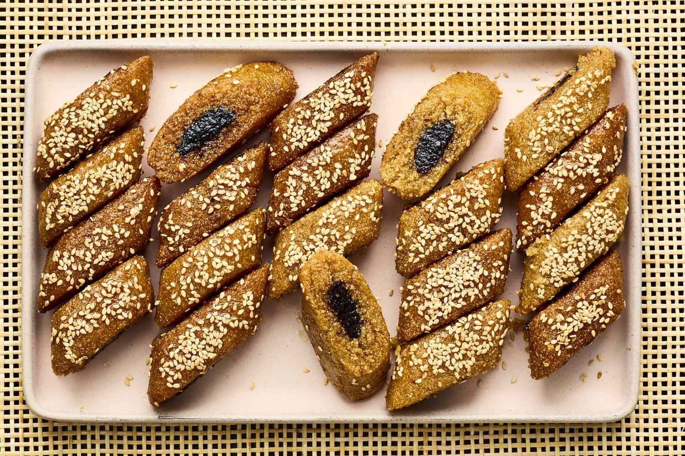

# Makroud

*North African date-and-semolina diamonds: a buttery, lightly-spiced semolina dough wrapped around a softened date paste, cut into diamonds, fried until golden, then dipped in honey-orange syrup. Algerian, Tunisian and Libyan kitchens all claim some version; the dough's slightly grainy texture against the soft date filling is what makes them. Eaten across Eid and at any tea-table moment.*

**Makes:** 30 diamonds

**Prep Time:** 45 minutes (plus 30 minutes resting)

**Cook Time:** 25 minutes

## Overview
Semolina mixes with melted butter and rests so it absorbs fully — the result is a fragrant, buttery, slightly grainy dough. Dates soften with butter, cinnamon and rosewater into a smooth filling. The dough rolls into a long log; the date paste extrudes into the centre; the cylinder rolls together and slices into diamonds. Fried briefly and dipped hot into orange-blossom syrup.

## Ingredients

### Dough
- 500 g coarse semolina
- 250 g unsalted butter (melted)
- ½ teaspoon salt
- 1 teaspoon ground cinnamon
- 2 tablespoons orange blossom water
- 100 ml warm water (approximately)

### Filling
- 400 g pitted dates (chopped)
- 30 g unsalted butter
- 1 teaspoon ground cinnamon
- ½ teaspoon ground cloves
- 1 tablespoon rosewater

### Syrup
- 300 g caster sugar
- 200 ml water
- 4 tablespoons honey
- 2 tablespoons orange blossom water
- Juice of half a lemon

### Frying
- Vegetable oil for shallow-frying

### Topping (optional)
- Sesame seeds (toasted)

## Method

### Stage 1 – Dough
1. Place the semolina, salt and cinnamon in a wide bowl.
1. Pour over the melted butter; mix with hands until every grain is coated.
1. Cover; rest 30 minutes (the semolina absorbs the butter fully).
1. Sprinkle in the orange blossom water and warm water gradually; mix to a soft, slightly tacky dough that just holds together.
1. Knead briefly to combine; rest 15 minutes more.

### Stage 2 – Filling
1. Combine the dates, butter, cinnamon and cloves in a small heavy pan.
1. Cook over low heat 5-8 minutes, mashing with a fork, until smooth.
1. Stir in the rosewater. Cool to lukewarm.

### Stage 3 – Syrup
1. Combine the sugar, water and lemon juice in a small pan.
1. Simmer 8-10 minutes until slightly thickened.
1. Off the heat, stir in the honey and orange blossom water.
1. Keep warm but not boiling.

### Stage 4 – Shape
1. Divide the dough into 4 equal pieces.
1. Roll each into a log about 3 cm thick on a lightly oiled surface.
1. Press a deep groove down the centre of each log with the side of a wooden spoon.
1. Pipe or spoon the date paste along the groove (a piping bag works well; or use your fingers).
1. Fold the dough over the date filling; pinch the seam closed; roll smooth.

### Stage 5 – Cut
1. Flatten each log slightly to about 2 cm thick.
1. Cut on the diagonal into 4 cm diamonds.

### Stage 6 – Fry
1. Heat 2 cm of oil in a wide pan to 170°C.
1. Fry the diamonds in batches 90 seconds per side until pale gold (don't take them dark).
1. Lift onto kitchen paper to drain briefly.

### Stage 7 – Dip in syrup
1. While still hot, dip each makroud in the warm syrup for 5 seconds; lift onto a serving platter.

### Stage 8 – Finish
1. Sprinkle with toasted sesame seeds if using.
1. Cool fully so the syrup soaks in and the dough firms.

## Notes
- **Soak time matters:** The dough rest is what makes the texture right — semolina takes 30 minutes to fully hydrate. Skip this step and the dough is gritty.
- **Pale, not deep golden:** Makroud are fried fast and dipped while still pale; the syrup gives the final colour. Dark-fried makroud taste burnt against the sweet syrup.
- **Pipe the date paste:** Easier than spooning; gives a cleaner cylinder when you fold.

## Storage
- Keeps 2 weeks in an airtight tin; flavour deepens.
- Freezes 2 months.
