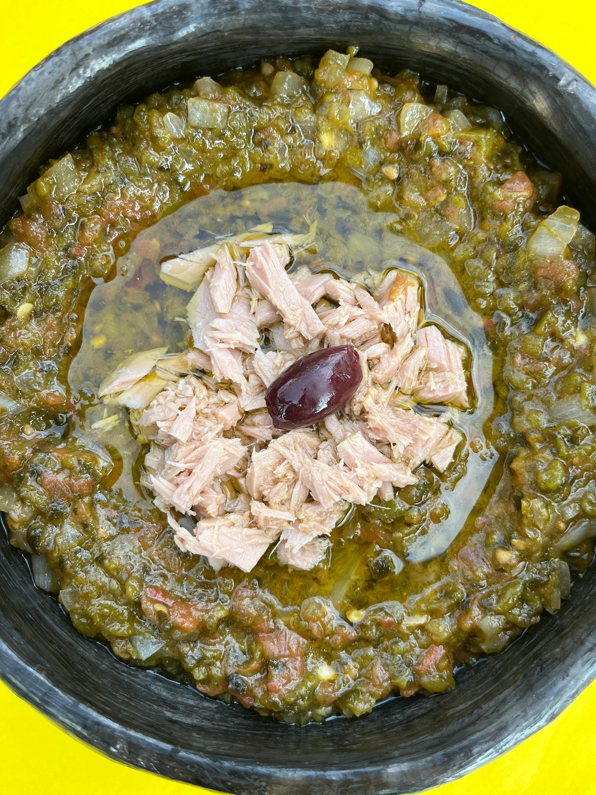

# Slata Mechouia

*Tunisia's roasted-pepper salad: peppers, tomatoes, garlic and chillies charred over flame until blistered black, then peeled and chopped to a coarse, smoky relish. Olive oil, lemon, capers and a tin of tuna often join; eats with bread for scooping. The signature smoke is from open-flame char.*

**Serves:** 4 as a starter or side

**Prep Time:** 15 minutes

**Cook Time:** 25 minutes

## Overview
Peppers, tomatoes and chillies char whole on a gas flame (or under a fierce grill) until blackened and collapsed; the skins peel away and the flesh chops to a rough paste. Garlic chars too, mellowing as it does. Lemon, olive oil, capers and salt fold through; tuna and hard-boiled eggs sometimes top.

## Ingredients

- 4 large red peppers
- 2 large green peppers
- 4 ripe tomatoes
- 4 long red chillies (or 2 jalapeños, deseed for less heat)
- 6 garlic cloves (skin on)
- 4 tablespoons extra-virgin olive oil
- Juice of 1 lemon
- 1 teaspoon ground caraway (or cumin)
- 1 teaspoon salt
- 2 tablespoons capers (rinsed)
- A small bunch of flat-leaf parsley (chopped)

### To serve (optional)
- 1 x 160 g tin tuna (in olive oil, drained)
- 2 hard-boiled eggs (quartered)
- 8 black olives
- Crusty bread or flatbread

## Method

### Stage 1 – Char
1. Place the peppers, tomatoes, chillies and garlic (in skin) directly on a gas flame or under a fierce grill.
1. Char each, turning, until the skins are blackened all over and the flesh feels collapsed:
1. Tomatoes: 4-5 minutes.
1. Chillies: 4-5 minutes.
1. Garlic (skin on): 4-5 minutes.
1. Peppers: 8-10 minutes.

### Stage 2 – Steam
1. Place the charred peppers, tomatoes and chillies in a bowl; cover with cling film or a plate; rest 10 minutes (the steam loosens the skins).

### Stage 3 – Peel and chop
1. Peel off the blackened skins; discard.
1. Remove pepper and chilli seeds and stems.
1. Squeeze the garlic cloves out of their skins.
1. Chop everything roughly with a knife on a board — the salad should be coarse, not pureed.

### Stage 4 – Combine
1. Tip into a bowl; toss with the olive oil, lemon juice, caraway, salt, capers and half the parsley.
1. Taste; adjust salt and lemon.

### Stage 5 – Serve
1. Spread on a flat plate; create a swirl with the back of a spoon.
1. Top with chunks of tuna, hard-boiled egg and olives if using.
1. Drizzle with extra olive oil; scatter the rest of the parsley.
1. Serve with crusty bread for scooping.

## Notes
- **Char over flame for the smoke:** The flame-roasted character is what defines slata mechouia. Roasting in the oven works but lacks the smoky depth.
- **Don't blend:** A food processor turns this into a bland purée. Knife-chopping keeps the texture coarse and the colours visible.
- **Caraway, not cumin:** Tunisian cooking uses caraway widely; it gives the salad its authentic note. Cumin works as a substitute.

## Storage
- Keeps 4 days refrigerated; deepens overnight. Bring to room temperature before serving.
