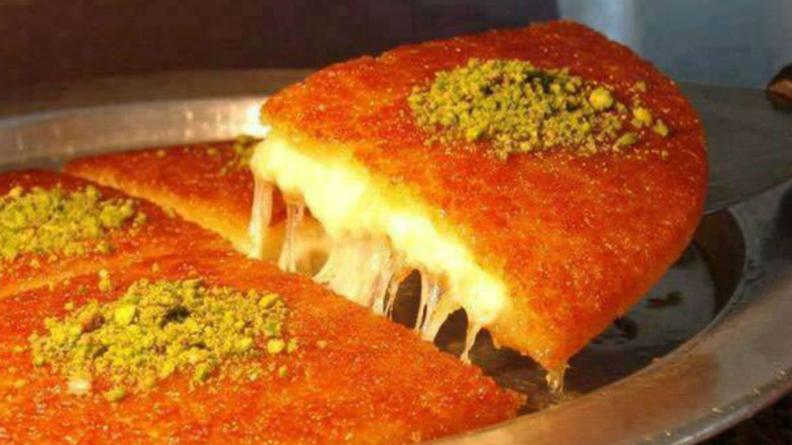

# Knafeh Nabulsiya

*The Nablus-style cheese knafeh: a layer of fine semolina pastry threads (kataifi) tinted bright orange, baked over melted unsalted akkawi cheese, then drowned in cold rosewater syrup and topped with crushed pistachios. Hot, gooey, sweet-salty, and very Palestinian. Eats in a flat tray, cut into squares, eaten while the cheese still pulls in long strings.*

**Serves:** 8

**Prep Time:** 30 minutes

**Cook Time:** 30 minutes

## Overview
Kataifi pastry shreds blitz to a coarse rubble; mixes with melted ghee and a pinch of orange food colouring; spreads across the bottom of a buttered tin. Akkawi cheese (rinsed of salt) lays on top. Bakes hot until the pastry browns. Cold rosewater syrup pours over hot from the oven; the syrup soaks the pastry while the cheese stays soft. Crushed pistachios scatter on top.

## Ingredients

### Pastry
- 500 g kataifi pastry (shredded phyllo, thawed if frozen)
- 250 g unsalted butter (or ghee), melted
- ¼ teaspoon orange food colouring paste (or 1 teaspoon liquid)

### Cheese
- 800 g akkawi cheese (rinsed) or low-salt halloumi (rinsed and grated) or a mix of mozzarella and ricotta

### Syrup
- 400 g caster sugar
- 250 ml water
- 1 tablespoon lemon juice
- 1 tablespoon rosewater
- 1 tablespoon orange blossom water

### Topping
- 80 g shelled pistachios (finely chopped)

## Method

### Stage 1 – Syrup
1. Combine the sugar, water and lemon juice in a small pan.
1. Bring to a boil; simmer 8-10 minutes until slightly thickened.
1. Off the heat, stir in the rosewater and orange blossom water.
1. Cool fully — must be cold when poured.

### Stage 2 – Soak the cheese
1. If using akkawi: rinse under cold running water 30 minutes (or soak in cold water with several changes) to remove excess salt; drain; chop into 1 cm pieces.
1. If using halloumi: rinse 30 minutes; grate.
1. The cheese must be unsalted-tasting — that's the difference between a great knafeh and a salty mess.

### Stage 3 – Prepare the pastry
1. Heat the oven to 200°C (180°C fan).
1. Pulse the kataifi in a food processor to a coarse rubble (or chop with a knife).
1. Whisk the orange colouring into the melted butter.
1. Pour over the pastry; toss thoroughly to coat every strand.

### Stage 4 – Layer
1. Butter a 28 x 22 cm round or rectangular baking tin.
1. Press half the pastry firmly into the bottom in an even layer (a glass works well as a press).
1. Spread the cheese evenly across.
1. Top with the remaining pastry; press firmly.

### Stage 5 – Bake
1. Bake 25-30 minutes until the top is deep orange-gold and the edges are crisp.

### Stage 6 – Drown and invert
1. Pull from the oven; immediately pour the cold syrup all over — slowly, evenly. Listen for the sizzle.
1. Rest 2 minutes (lets the syrup penetrate without softening too far).
1. Run a knife around the edges; invert onto a serving platter — the bright orange pastry should be on top.

### Stage 7 – Top and serve
1. Scatter the chopped pistachios across the surface.
1. Cut into squares while still hot; serve immediately so the cheese pulls in strings.

## Notes
- **Cheese desalting is essential:** Akkawi straight from the package is salty; eaten in knafeh untreated, the dish is inedible. Rinse hard.
- **Cold syrup, hot pastry:** Reverse and the kataifi goes mushy. Standard rule for Levantine sweets; doesn't change here.
- **Eat hot:** Knafeh's whole pleasure is the cheese pull. Cool knafeh is fine but sliced; warm it back up before serving (4 minutes at 180°C).

## Storage
- Best fresh; reheat at 180°C for 5-6 minutes covered to restore the cheese pull.
