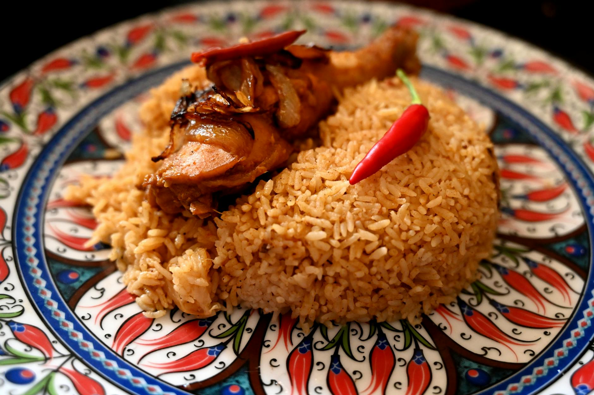

# Maklouba

*"Upside-down" rice with chicken and aubergine: layered in a pot, cooked together, then flipped onto a platter — the layers become a striped tower. Aubergine, cauliflower and tomato sit on top of golden rice; chicken pieces tuck in between; spices perfume everything. Served as a side at a feast or a centrepiece for family dinner.*

**Serves:** 6

**Prep Time:** 30 minutes

**Cook Time:** 1¼ hours

## Overview
Aubergines fry first to soften and develop colour. Cauliflower fries to gold. Chicken cooks in a spiced stock. The pot layers from bottom up: tomato slices, aubergine, cauliflower, chicken, parboiled rice. Stock pours over; everything steams together. Inverted onto a platter, the layers stack into a multicoloured cake.

## Ingredients

### Chicken stock
- 8 bone-in chicken thighs and drumsticks
- 1 onion (quartered)
- 4 cardamom pods (bashed)
- 1 cinnamon stick
- 4 cloves
- 2 bay leaves
- 1 teaspoon black peppercorns
- 1.2 litres water
- 1½ teaspoons salt

### Vegetables
- 2 medium aubergines (sliced 1 cm rounds)
- 1 medium cauliflower (small florets)
- Vegetable oil for frying
- 2 medium tomatoes (sliced)

### Rice
- 500 g basmati rice (rinsed, soaked 30 min)
- 2 tablespoons baharat (or 1 tsp each cumin, coriander, cinnamon, allspice + ½ tsp cardamom)
- 1 teaspoon ground turmeric

### Topping
- 50 g pine nuts (toasted)
- 50 g flaked almonds (toasted)
- A small bunch of parsley (chopped)
- Plain yogurt and a tomato-cucumber salad (to serve)

## Method

### Stage 1 – Cook the chicken
1. Place the chicken in a large pot with the onion, cardamom, cinnamon, cloves, bay, peppercorns, water and salt.
1. Bring to a simmer; cook 25 minutes; remove the chicken and reserve.
1. Strain the stock; you should have about 1 litre — top up with hot water if less.

### Stage 2 – Fry the aubergines
1. Heat 1 cm of oil in a frying pan over medium-high heat.
1. Salt the aubergine slices; fry in batches 2 minutes per side until golden.
1. Drain on kitchen paper.

### Stage 3 – Fry the cauliflower
1. In the same pan, fry the cauliflower florets 4-5 minutes until golden.
1. Drain.

### Stage 4 – Layer
1. Drain the rice; mix with the baharat and turmeric.
1. In a wide heavy-based pot (about 24 cm diameter), spread the tomato slices to cover the bottom.
1. Cover with the fried aubergine in a single layer.
1. Cover with the fried cauliflower.
1. Lay the chicken pieces on top, packing them in.
1. Pile the spiced rice over.

### Stage 5 – Cook
1. Pour the strained stock over slowly so the layers don't disturb (the rice should be just-covered).
1. Drizzle with 2 tablespoons olive oil.
1. Bring to a steady simmer; cover with a tea towel under the lid.
1. Reduce to lowest heat; cook 35-40 minutes.
1. Off the heat, rest covered 15 minutes.

### Stage 6 – Invert
1. Run a spatula around the edges.
1. Place a wide platter over the pot; flip in one steady motion.
1. Lift the pot off carefully — the layers should stack neatly: rice on the bottom, then chicken, cauliflower, aubergine, tomato on top.

### Stage 7 – Serve
1. Scatter pine nuts, almonds and parsley on top.
1. Serve with cold yogurt and a chopped salad.

## Notes
- **The flip is the moment:** Use a wide platter; commit to the motion. If pieces stick, rest a minute longer in the pot first.
- **Fry the vegetables properly:** Pale aubergine and cauliflower don't have the colour or flavour for the layers. Fry until truly golden.
- **Tomato on the bottom:** When inverted, the tomato is on top — it gives colour and a juicy contrast to the rice base.

## Storage
- Best fresh; reheat covered with a splash of water.
- Keeps 3 days refrigerated.
