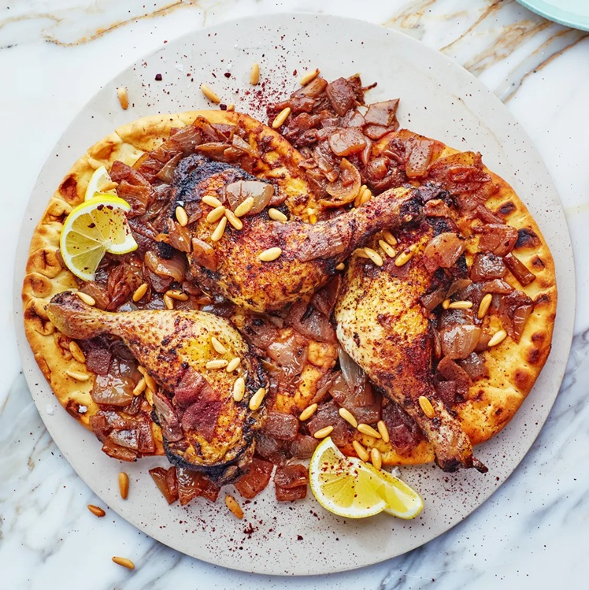

# Musakhan

*Palestine's national dish: chicken roasted on a bed of slow-cooked, sumac-stained sweet onions, served on flatbread (taboon) with toasted pine nuts. The chicken juices and the onion's sweet-tartness soak into the bread; eaten communally, torn from the same platter.*

**Serves:** 4

**Prep Time:** 20 minutes

**Cook Time:** 1¼ hours

## Overview
A whole chicken or chicken pieces marinate in olive oil, sumac, allspice and lemon. Onions cook slowly in olive oil until completely soft and sweet, then turn deep red-purple from a generous shake of sumac. The chicken roasts on top of the onions; the bread layers under at the end to catch the juices. Pine nuts toast separately.

## Ingredients

- 1 whole chicken (around 1.6 kg, jointed) or 8 bone-in chicken thighs and drumsticks

### Marinade
- 4 tablespoons olive oil
- 2 tablespoons sumac
- 1 tablespoon ground allspice
- 1 teaspoon ground cinnamon
- 1 teaspoon ground cardamom
- 1½ teaspoons salt
- ½ teaspoon black pepper
- Juice of 1 lemon

### Onions
- 6 large onions (around 1.2 kg; sliced thin)
- 150 ml olive oil
- 4 tablespoons sumac (plus more for sprinkling)
- 1 teaspoon salt

### To assemble
- 2 large taboon breads or 4 flatbreads (around 30 cm; or pita rounds)
- 100 g pine nuts (toasted in a dry pan)
- A small bunch of flat-leaf parsley (chopped)

## Method

### Stage 1 – Marinate the chicken
1. Mix all the marinade ingredients in a wide dish.
1. Add the chicken; turn to coat all over.
1. Refrigerate at least 1 hour (or overnight).

### Stage 2 – Cook the onions
1. Heat the 150 ml olive oil in a wide heavy pan over medium-low heat.
1. Add the sliced onions and the salt.
1. Cook 25-30 minutes, stirring occasionally, until completely soft, sweet and just turning golden — not browned.
1. Stir in the sumac; cook 2 minutes more — the onions will go deep red-purple.
1. Set aside.

### Stage 3 – Roast the chicken
1. Heat the oven to 200°C (180°C fan).
1. Spread half the onions across a wide oven dish.
1. Lay the chicken pieces skin-side up on top.
1. Roast 35-40 minutes until the chicken is cooked through (juices run clear from the thickest part) and the skin is golden.
1. Pour any pan juices into a bowl.

### Stage 4 – Assemble
1. Lay the flatbreads on a wide platter (cut to fit if needed).
1. Drizzle with some of the chicken pan juices.
1. Spread the remaining onions over the bread.
1. Place the chicken pieces on top.
1. Drizzle with the rest of the pan juices.

### Stage 5 – Finish
1. Scatter the toasted pine nuts and parsley.
1. Sprinkle with extra sumac.
1. Serve hot, torn into pieces.

## Notes
- **Sumac is the dish:** Without it, this is just onion chicken. The lemony, fruity tartness of sumac is what makes musakhan recognisably Palestinian.
- **Cook the onions properly:** Pale, undercooked onions taste sharp; over-browned ones taste burnt. The right colour is deep gold, before browning.
- **Taboon bread:** A traditional Palestinian flatbread with characteristic dimples from being baked on hot stones. Lavash, naan or large pitas all work as substitutes.

## Storage
- Best fresh; the bread softens. Keeps 2 days refrigerated; reheat covered.
