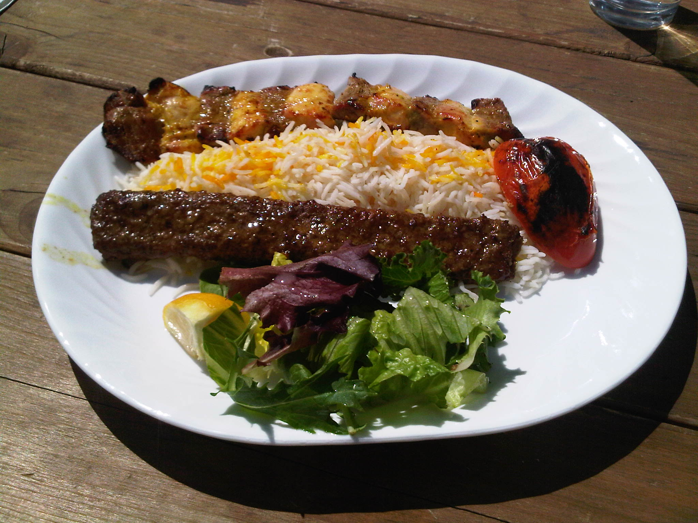

# Chelo Kabab Koobideh

*Iran's national dish: minced lamb (or a lamb-and-beef mix) seasoned with grated onion, sumac and saffron, formed long around flat metal skewers, and grilled hard over charcoal until charred outside and juicy inside. Served on saffron-rice (chelo) with a fire-roasted tomato, raw onion, sumac, fresh basil, and a wide pat of butter melting into the rice.*

**Serves:** 4

**Prep Time:** 30 minutes (plus 1 hour chilling)

**Cook Time:** 15 minutes

## Overview
Mince mixes with very finely-grated onion (squeezed dry), salt, pepper, turmeric and a hit of saffron-water. The mixture chills, then forms onto wide flat skewers in long sausage shapes. Charcoal grills are traditional; a hot grill pan or barbecue works at home. The kababs grill 3-4 minutes per side; whole tomatoes char alongside; rice piles on the plate; everything assembles together.

## Ingredients

### Kababs
- 700 g minced lamb (or 500 g lamb + 200 g beef; 20% fat)
- 1 large onion (finely grated; squeezed hard to remove all liquid)
- 1½ teaspoons salt
- 1 teaspoon black pepper
- ½ teaspoon ground turmeric
- ½ teaspoon ground sumac (plus more for sprinkling)
- A pinch of saffron (steeped in 2 tablespoons hot water 10 min)
- ½ teaspoon bicarbonate of soda (helps the meat stick to the skewer)

### To grill
- 4 ripe tomatoes (whole, on stems if possible)
- 2 long red chillies (whole)
- 50 g unsalted butter

### To serve
- Chelo (saffron rice; cooked separately with tahdig)
- Fresh basil
- Mint
- Spring onions (whole)
- Sumac (for sprinkling)
- 4 lavash flatbreads
- Yogurt and cucumber dip (mast-o khiar)

## Method

### Stage 1 – Mix
1. Place the mince in a large bowl.
1. Squeeze the grated onion in a clean tea towel — wring out as much liquid as possible.
1. Add the onion to the mince with the salt, pepper, turmeric, sumac, half the saffron-water and the bicarb.
1. Knead with your hands for 5-7 minutes — really work it. The mixture should become slightly sticky and tight; this is what makes it stick to the skewer.

### Stage 2 – Chill
1. Cover and refrigerate at least 1 hour, ideally 3.

### Stage 3 – Shape
1. If using flat metal skewers (the wide-bladed Persian style — the only kind that holds koobideh): wet your hands.
1. Take a fistful of the mince mixture (about 150 g) and press onto the centre of the skewer.
1. Working from the centre outward, press the meat thinly along the skewer in a long sausage shape (about 20 cm).
1. Pinch ridges at intervals along the length with damp fingers — gives the classic ridged koobideh look.
1. Repeat for 8 skewers total.

### Stage 4 – Heat the grill
1. Preheat a charcoal grill to high (or gas barbecue, or a heavy grill pan over high heat).
1. Brush grates with oil.

### Stage 5 – Grill
1. Lay the skewers across the grill (not directly on the grates — suspended between two bricks or rails so air circulates beneath; this is how Persians do it).
1. Don't disturb for 90 seconds; rotate 180°; cook another 90 seconds; flip; cook the other side similarly.
1. Total time 5-6 minutes — the meat should be just cooked through, with deep char on both sides.
1. Grill the tomatoes and chillies alongside, turning, until blistered.

### Stage 6 – Plate
1. Lay 1-2 grilled tomatoes on each plate, alongside a chilli.
1. Pile rice next to it, top with a generous knob of butter and the remaining saffron-water.
1. Slide the koobideh off the skewer onto the plate.
1. Drizzle butter over the kababs.
1. Sprinkle sumac over everything.

### Stage 7 – Eat
1. Tear lavash; wrap kabab pieces in bread with a smashed tomato, fresh herbs and onion. Or eat with a fork over the rice. Both are correct.

## Notes
- **Wide flat skewers are the tool:** Round skewers don't work — the meat slips and cracks off. Persian-style flat skewers (about 1.5 cm wide blade) are sold at Middle Eastern grocers and online.
- **Squeeze the onion dry:** Wet onion makes wet mince that won't stay on the skewer.
- **Bicarb in the mix:** Untraditional in Iran but a reliable home-cook trick — it tenderises the surface and helps the meat grip the skewer. Skip if you'd rather; just knead longer.

## Storage
- Best fresh from the grill. Freezes well shaped and uncooked on the skewer (3 months).
