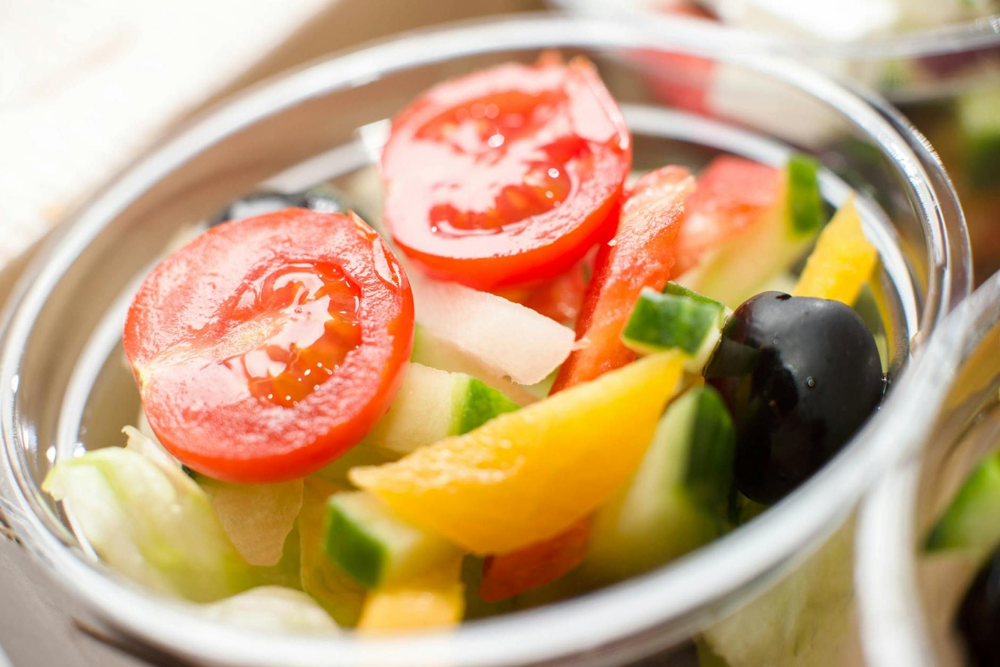

# Salad Shirazi

*Persia's everyday cucumber-and-tomato salad, named for the city of Shiraz: tomato, cucumber and onion finely diced, dressed with lime juice, olive oil and dried mint. Eats next to kabab, fesenjan, ghormeh sabzi — anything from the Persian table. The dice is small, almost like a relish; the dried mint is the signature.*

**Serves:** 4

**Prep Time:** 15 minutes

**Cook Time:** 0 minutes

## Overview
Tomato and cucumber are deseeded and diced into 5 mm cubes. Onion (preferably purple/red) dices to match. Lime juice, olive oil, dried mint, salt and pepper dress; the salad rests 10 minutes for the flavours to mingle. Doesn't keep — the cucumbers weep within an hour.

## Ingredients

- 4 medium tomatoes (around 400 g)
- 2 medium cucumbers (around 300 g)
- 1 small red onion
- 4 tablespoons extra-virgin olive oil
- Juice of 2 limes
- 1 tablespoon dried mint
- A small bunch fresh mint (chopped)
- 1 teaspoon salt
- ½ teaspoon black pepper
- ¼ teaspoon ground sumac (optional)

## Method

### Stage 1 – Dice
1. Halve the tomatoes; squeeze out and discard the seeds and watery cores.
1. Dice the flesh into 5 mm cubes.
1. Peel the cucumbers; halve lengthwise; scoop out the seeds; dice to match.
1. Dice the onion to match.

### Stage 2 – Combine
1. Tip everything into a wide bowl.
1. Add the olive oil, lime juice, dried mint, fresh mint, salt and pepper.
1. Toss gently.

### Stage 3 – Rest
1. Cover and rest 10 minutes at room temperature.
1. Stir; taste; adjust salt and lime.

### Stage 4 – Serve
1. Sprinkle with sumac if using.
1. Serve at room temperature alongside any Persian main: chelo kabab, fesenjan, ghormeh sabzi.

## Notes
- **Dried mint, not fresh alone:** Dried mint is what gives the salad its signature flavour. Fresh mint adds, but isn't a substitute.
- **Small dice:** Salad Shirazi is finer than Western chopped salads — small cubes coat in the dressing properly. Knife work matters.
- **Eat fresh:** Won't keep beyond 2 hours; the cucumbers and tomatoes weep and the salad goes watery.

## Storage
- Best within 2 hours of mixing.
