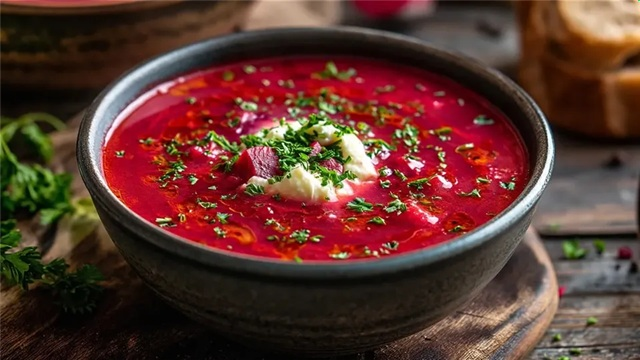

# Barszcz Czerwony

*Polish red beetroot broth, clear and brilliant, served at Christmas Eve and many other occasions. A classic Polish barszcz is more refined than Russian borscht — a strained, almost consommé-like broth, often poured over uszka (tiny dumplings) or sipped from a mug. Sour, earthy, lightly sweet.*

**Serves:** 4-6

**Prep Time:** 15 minutes (plus 12-24 hour fermentation for kvas)

**Cook Time:** 1 hour

## Overview
The brightest barszcz uses fermented beetroot kvas — beetroot, garlic and rye bread crust steeped in salted water for 24-48 hours — for the sour edge. Faster: simmer roasted beetroot, root vegetables and dried mushroom in vegetable stock with bay, peppercorns and allspice. Strain to clarity; finish with vinegar and a small amount of sugar to balance. Serve hot from a small bowl or mug.

## Ingredients

### Broth
- 4 medium beetroots (around 600 g; peeled and chopped)
- 1 large onion (quartered)
- 2 carrots (chopped)
- 2 celery sticks (chopped)
- 4 garlic cloves (smashed)
- 20 g dried wild mushrooms or porcini
- 2 bay leaves
- 6 allspice berries
- 6 black peppercorns
- 1.5 litres vegetable stock
- 2 tablespoons cider vinegar
- 1 tablespoon brown sugar
- 1 teaspoon salt
- A small bunch of fresh dill (chopped, to serve)

## Method

### Stage 1 – Build the broth
1. Combine the beetroots, onion, carrots, celery, garlic, dried mushrooms, bay, allspice, peppercorns and stock in a large pot.
1. Bring to the boil; reduce to a steady simmer.
1. Cook 45-50 minutes uncovered until the broth has darkened to deep red and tastes intensely of beetroot.

### Stage 2 – Strain
1. Strain through a fine sieve lined with muslin (or a clean tea towel) into a clean pot.
1. Press the solids gently — don't squeeze them through, you want clarity.
1. Discard the solids.

### Stage 3 – Balance
1. Add the vinegar, sugar and salt.
1. Bring back to a gentle simmer.
1. Taste; adjust — should be sour-sweet with the beet earthiness behind. Add more vinegar for sharpness, more sugar to round out.

### Stage 4 – Serve
1. Ladle into small bowls or mugs (Polish barszcz is often served in a mug with a single dumpling).
1. Top with chopped dill.
1. Serve with uszka (small mushroom-filled dumplings) or pasztecik (savoury pastries) alongside.

## Notes
- **Clarity is the point:** Polish barszcz is a clear broth, not a chunky soup like Russian borscht. Don't squeeze the solids through the sieve; let it drip naturally.
- **Vinegar at the end:** Adding it during the simmer mutes the colour. Add at the finish for the brightest red.
- **Fermented kvas version:** For the most authentic flavour, ferment chopped beetroot in salted water with garlic and a piece of dark rye bread crust for 24-48 hours, then strain and use as the souring liquid in place of vinegar. Worth doing once.

## Storage
- Keeps 5 days refrigerated; freezes 3 months. Reheat to a simmer; don't boil hard.
