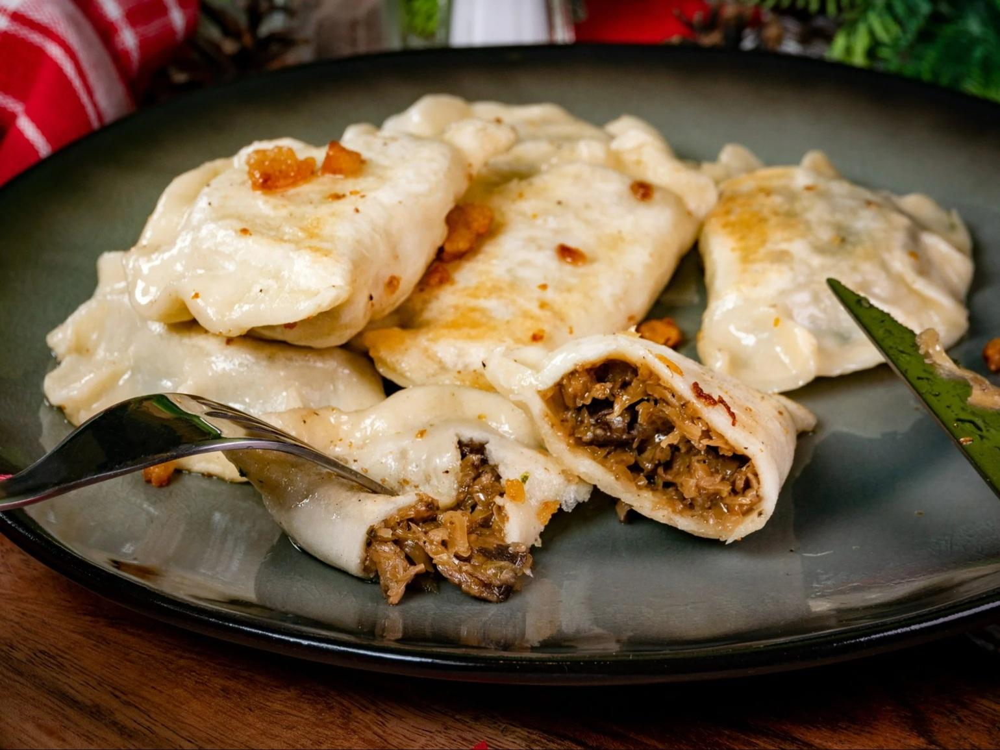

# Pierogi z Kapustą i Grzybami

*Polish dumplings filled with sauerkraut and dried wild mushrooms — Christmas Eve pierogi, and an everyday pierogi the rest of the year. The filling is sour, earthy, deep; the dough is slightly elastic from kneading. Boiled briefly, then often pan-fried in butter for a crisp golden bottom.*

**Makes:** 30-35 pierogi (serves 4-5)

**Prep Time:** 50 minutes

**Cook Time:** 35 minutes

## Overview
Dried wild mushrooms (porcini if you can get them) rehydrate; sauerkraut squeezes dry. Both cook down with onion in butter until reduced and intense. The dough is plain — flour, egg, water, salt, oil — kneaded smooth and rested. Each circle gets a teaspoon of filling, folds, seals. Boiled until they float, then often pan-finished in butter with onions and a spoonful of soured cream on the side.

## Ingredients

### Filling
- 30 g dried porcini or wild mushrooms (rehydrated 30 min in 250 ml hot water)
- 500 g sauerkraut
- 50 g unsalted butter
- 2 medium onions (finely chopped)
- 1 bay leaf
- 5 black peppercorns (lightly cracked)
- 200 g chestnut mushrooms (finely chopped)
- 1 teaspoon dried marjoram
- 1 teaspoon salt (or to taste)
- Black pepper

### Dough
- 500 g plain flour
- 1 large egg
- 1 teaspoon salt
- 1 tablespoon sunflower oil
- 250 ml warm water

### To finish
- 50 g unsalted butter (for pan-frying or tossing)
- 2 onions (sliced; for fried-onion topping)
- Soured cream (to serve)
- Fresh dill (chopped, to garnish)

## Method

### Stage 1 – Filling
1. Squeeze the sauerkraut hard to remove excess liquid; chop roughly.
1. Drain the rehydrated wild mushrooms (save 100 ml of the soaking liquid); chop finely.
1. Melt the butter in a heavy pan over medium-low heat.
1. Cook the onions 10-12 minutes until soft and just golden.
1. Add the chopped chestnut and wild mushrooms; cook 8 minutes until they release and reabsorb their liquid.
1. Add the sauerkraut, bay, peppercorns, marjoram, salt and 100 ml mushroom soaking liquid.
1. Cook 15-20 minutes more, stirring, until the mixture is dry-ish, dark and intensely flavoured.
1. Discard the bay leaf and any peppercorns you can find. Cool fully.

### Stage 2 – Dough
1. Whisk the egg, salt and water; pour into a well in the flour with the oil.
1. Mix to a shaggy dough; knead 8-10 minutes until smooth and elastic.
1. Cover and rest 30 minutes.

### Stage 3 – Shape
1. Divide the dough in half (cover the half you're not using).
1. Roll thin (2 mm) on a floured surface.
1. Cut 8 cm circles.
1. Place a teaspoon of filling on each; fold over to a half-moon; pinch firmly to seal.
1. Lay on a floured tea towel; don't let them touch.
1. Repeat with the second half.

### Stage 4 – Fried onions
1. Cook the sliced onion in 50 g of butter over medium heat 12-15 minutes until deep golden.

### Stage 5 – Boil
1. Bring a large pot of salted water to a steady boil.
1. Drop pierogi in batches of 8-10. They sink, then rise — cook 2-3 minutes from when they float.
1. Lift with a slotted spoon; toss with butter and onions.

### Stage 6 – (Optional) pan-fry
1. For a crisp version: after boiling, fry the pierogi in butter over medium heat 2-3 minutes per side until golden on both sides.

### Stage 7 – Serve
1. Pile onto plates; spoon over fried onions and butter; top with dill.
1. Pass soured cream alongside.

## Notes
- **Squeeze the sauerkraut hard:** Wet sauerkraut makes wet filling makes pierogi that tear in the boil. The drier the better.
- **Two mushrooms:** Dried wild ones for the deep umami flavour; fresh chestnut for body. Either alone is fine; together is better.
- **Make-ahead:** Shape the pierogi and freeze on a floured tray. Once frozen, transfer to a bag. Boil from frozen with 1-2 minutes extra.

## Storage
- Cooked pierogi refrigerate 3 days; reheat in a buttered pan.
- Frozen raw pierogi keep 3 months.
