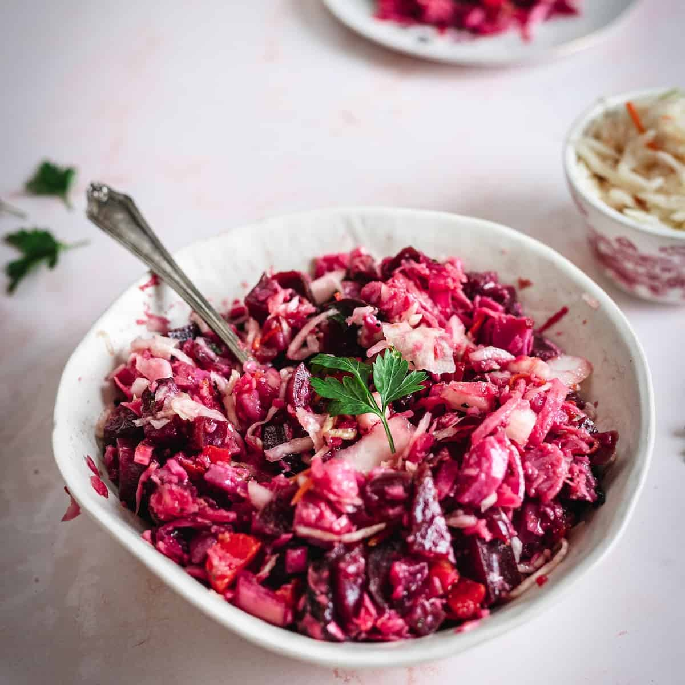

# Vinaigrette Salad

*Russian beetroot salad: cooked beetroot, potatoes, carrots, sauerkraut and pickles diced small and dressed with sunflower oil and vinegar. Earthy, sour, sweet, dressed simply; the colour-bleed of beetroot through everything makes it unmistakable. Eats cold from the fridge for days.*

**Serves:** 6

**Prep Time:** 25 minutes

**Cook Time:** 30 minutes (plus cooling)

## Overview
Beetroot, potatoes and carrots boil in their skins. Once cool, they're peeled and diced into 1 cm cubes. Sauerkraut is squeezed dry; pickled cucumbers are diced; spring onions and dill chopped. Everything tosses with sunflower oil, vinegar, salt and pepper. Best after a few hours' rest in the fridge.

## Ingredients

- 3 medium beetroots (around 400 g)
- 3 medium potatoes (around 500 g)
- 2 medium carrots
- 200 g sauerkraut
- 3 dill pickles (around 150 g)
- 1 x 400 g tin red kidney beans (drained) or 200 g cooked chickpeas
- 5 spring onions (sliced)
- 4 tablespoons sunflower oil (or other neutral oil)
- 2 tablespoons cider vinegar (or white wine vinegar)
- 1 teaspoon salt (or to taste)
- Black pepper
- A small bunch of dill (chopped)

## Method

### Stage 1 – Boil the vegetables
1. Place the beetroots in one pan, the potatoes in another, and the carrots in a third (or share with the carrots and potatoes if your beetroots are small).
1. Cover with cold water; bring to the boil; salt lightly.
1. Beetroot: 30-45 minutes until a knife slides through.
1. Potatoes: 18-22 minutes until tender.
1. Carrots: 15-18 minutes until tender.
1. Drain each; cool fully.

### Stage 2 – Prep the rest
1. Peel and dice the cooled beetroot, potatoes and carrots into 1 cm cubes (wear gloves for the beetroot if you mind the staining).
1. Squeeze the sauerkraut hard to remove excess liquid; chop roughly.
1. Dice the pickles to match.

### Stage 3 – Combine
1. Toss everything together in a large bowl with the spring onions, kidney beans, sunflower oil, vinegar, salt and black pepper.
1. Stir in half the dill.

### Stage 4 – Rest
1. Cover and refrigerate at least 1 hour; ideally 3-4. The flavours meld; the beetroot tints everything pink-purple.

### Stage 5 – Serve
1. Top with the remaining dill.
1. Eat cold straight from the fridge with rye bread.

## Notes
- **Cook the vegetables separately:** They cook at very different rates; combined, the potatoes go to mush before the beetroot is done.
- **Beetroot bleeding:** Add it last and toss gently if you want to keep some non-pink pieces; otherwise it's part of the look.
- **Sauerkraut:** Authentic; gives the salad's acid backbone. If you can't find it, increase the pickles and vinegar.

## Storage
- Keeps 4 days refrigerated; the dressing soaks in further.
