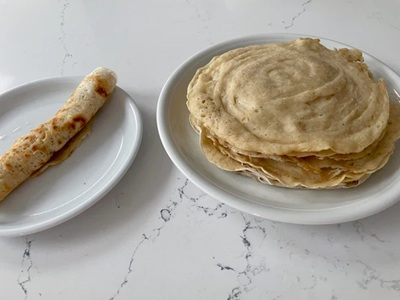

# Anjero

*Somalia's spongy fermented pancake — close cousin to Ethiopian injera, but smaller and softer. Fermented batter of sorghum or wheat flour pours onto a hot pan; bubbles burst across the top as it cooks; one side only, so the surface stays porous and lacy. Eaten with stews, tea and honey, or rolled around suqaar.*

**Makes:** 12 pancakes

**Prep Time:** 10 minutes (plus 12-24 hour fermentation)

**Cook Time:** 25 minutes

## Overview
A simple batter of plain flour, semolina, yeast and warm water is left to ferment overnight; this gives anjero its characteristic sourness and the bubbles that make the texture. The next day, batter ladles onto a hot pan and cooks just on one side — the bottom turns golden, the top sets with a lattice of bubble-craters. Stack between cloths to steam soft.

## Ingredients

- 350 g plain flour
- 100 g semolina (or fine cornmeal)
- 1 teaspoon active dry yeast
- 1 teaspoon sugar
- 1 teaspoon salt
- 700 ml warm water
- 1 tablespoon vegetable oil (for the pan; only the first pancake)

## Method

### Stage 1 – Ferment
1. Whisk the flour, semolina, yeast, sugar and salt together.
1. Whisk in the warm water gradually to a smooth, pourable batter — about the thickness of double cream.
1. Cover with a clean cloth; rest 12-24 hours at room temperature. The batter will rise, fall back, and develop a faintly sour smell.
1. Whisk briefly the next day; if too thick, add warm water to bring back to pancake-batter consistency.

### Stage 2 – First pancake
1. Heat a non-stick frying pan (24-26 cm) over medium heat.
1. Brush with a thin film of oil for the first pancake only.
1. Pour about 100 ml of batter into the centre; tilt the pan to spread (or, traditionally, leave it alone to spread on its own — anjero is poured thicker than crepes).

### Stage 3 – Cook (one side only)
1. Cook 90-120 seconds without flipping. Bubbles will rise across the top and burst, leaving a lattice of holes.
1. The pancake is done when the top has gone from wet to set-but-spongy and the bottom is light golden.
1. Lift onto a plate; cover with a clean tea towel to keep soft.

### Stage 4 – Repeat
1. Cook the rest, no oil needed after the first.
1. Stack as you go, covered.

### Stage 5 – Serve
1. Eat warm with stew (suqaar, maraq), or with ghee and honey for breakfast.

## Notes
- **One side only:** Flipping gives a flat, dense pancake. The whole charm is the lacy bubbled top contrasting with the smooth bottom.
- **Fermentation time:** 12 hours minimum; warmer kitchens are faster (8 hours possible). 24 hours gives more sourness.
- **Sorghum flour:** Traditional Somali anjero uses sorghum flour for some of the wheat. If you can find it, replace 150 g of the plain flour with sorghum.

## Storage
- Best fresh. Stack between paper and refrigerate up to 2 days; reheat covered in a low oven.
- Freezes 2 months; thaw before reheating.
