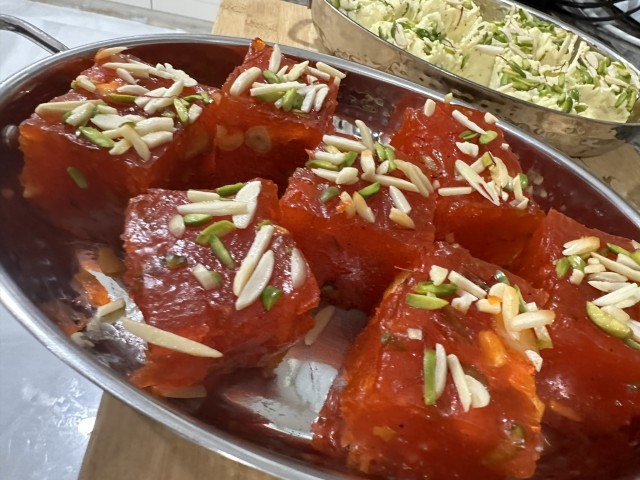

# Halwo

*Somali halva: a deep amber, almost translucent confection of cornflour, sugar, ghee and cardamom, perfumed with saffron and studded with chopped peanuts. Ribbons fold thick over each other as it cools. Sliced into squares and eaten with tea — celebrations, weddings, holidays — across Somalia and the Horn of Africa.*

**Makes:** about 700 g (12 squares)

**Prep Time:** 5 minutes

**Cook Time:** 30 minutes

## Overview
Cornflour is whisked into water; sugar dissolves with saffron; the lot bubbles together with ghee being drizzled in slowly. The mixture goes from opaque to translucent amber over 25 minutes; the texture goes from runny to gooey-thick like soft caramel. Cardamom and peanuts fold in at the end; everything pours into a tray to set.

## Ingredients

- 200 g cornflour
- 700 ml water
- 600 g caster sugar
- A generous pinch of saffron threads (steeped in 2 tablespoons hot water 5 minutes)
- 200 g ghee (or unsalted butter, melted)
- 1 tablespoon ground cardamom
- 100 g unsalted peanuts (or pistachios), roughly chopped
- ½ teaspoon vanilla extract (optional)

## Method

### Stage 1 – Slurry
1. Whisk the cornflour into 300 ml of the cold water in a bowl until completely smooth — no lumps.

### Stage 2 – Sugar syrup
1. Combine the remaining 400 ml water, the sugar and the saffron-water in a wide heavy pan.
1. Bring to the boil over medium heat; stir to dissolve the sugar.

### Stage 3 – Combine
1. Reduce the heat to medium-low.
1. Pour the cornflour slurry slowly into the syrup, whisking constantly. The mixture will thicken in seconds.

### Stage 4 – Cook and add ghee
1. Continue whisking — the mixture will be opaque and gloopy.
1. Drizzle in the ghee a tablespoon at a time, whisking each addition in fully before the next. This takes 8-10 minutes.

### Stage 5 – The colour change
1. After all the ghee is in, switch to a wooden spoon and stir.
1. Continue cooking 10-12 minutes more — the mixture will go from opaque cream to translucent amber, like melted caramel. It thickens dramatically.
1. The halwo is done when a spoon drawn through leaves a clean trail and the colour is even amber.

### Stage 6 – Finish
1. Stir in the cardamom, peanuts and vanilla (if using).
1. Pour into a lightly-greased shallow dish (around 20 x 20 cm) — the layer should be 2-3 cm thick.
1. Cool at room temperature 2-3 hours until set but still slightly chewy.

### Stage 7 – Cut and serve
1. Cut into 4 cm squares with a sharp oiled knife.
1. Serve with strong sweet tea (shaah).

## Notes
- **Don't rush the colour change:** Halwo is judged by colour. Pale halwo tastes flat; deep amber tastes deeply caramelised. Patience.
- **Whisk until ghee is in:** Lumps come from adding ghee too fast or stopping the whisk. Steady, slow drizzle.
- **Saffron is traditional:** Cheaper versions use yellow food colouring but the saffron flavour is part of the dish.

## Storage
- Keeps 2 weeks in an airtight tin at room temperature; eats better as it ages slightly.
- Don't refrigerate — goes hard; let it return to room temperature if you do.
